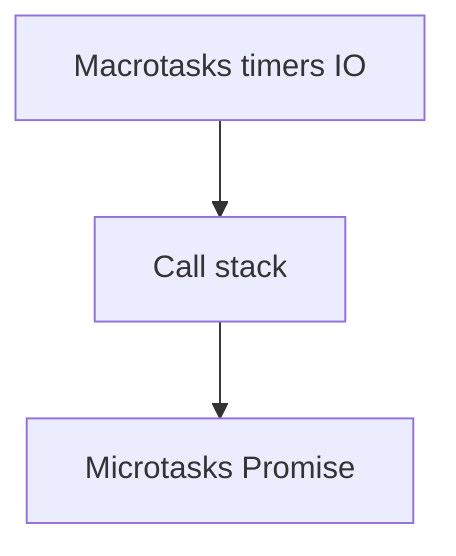

# JavaScript — módulos, DOM, async e armadilhas em produção

## Introdução

JavaScript no browser partilha **uma thread principal** com pintura e input. **Parsing**, **compilation** e **long tasks** degradam **INP**. Código modular (`import`/`export`), divisão de bundles e *offloading* para **Web Workers** são respostas comuns em apps grandes.



---

## Problema real: “Promise sem catch derruba o relatório de erros”

**Sintoma:** *Unhandled promise rejection* em produção; Sentry mostra stack inútil.

**Solução:** `await` dentro de `try/catch` ou `.catch()`; em *event handlers* async, envolver corpo.

```javascript
button.addEventListener("click", async () => {
  try {
    await save();
  } catch (e) {
    reportError(e);
    showToast("Não foi possível guardar.");
  }
});
```

---

## Módulos ES e caminhos

```html
<script type="module" src="/app/main.js"></script>
```

```javascript
// main.js
import { init } from "./ui.js";
init();
```

**Problema real:** `file://` aberto localmente e imports falham — CORS em módulos; usar **Vite**/`serve` ou `localhost`.

---

## `fetch`: timeouts, cancelamento e erros HTTP

`fetch` **não falha** em 404/500 — só em rede.

```javascript
async function fetchJson(url, { signal, timeoutMs = 8000 } = {}) {
  const ctrl = new AbortController();
  const t = setTimeout(() => ctrl.abort(), timeoutMs);
  try {
    const res = await fetch(url, { signal: signal ?? ctrl.signal });
    if (!res.ok) {
      const text = await res.text().catch(() => "");
      throw new Error(`HTTP ${res.status} ${text.slice(0, 200)}`);
    }
    return res.json();
  } finally {
    clearTimeout(t);
  }
}
```

**Problema real:** pedidos duplicados ao mudar de rota — passar `AbortSignal` do *router* ou `useEffect` cleanup.

---

## DOM seguro e XSS

| API | Risco |
|-----|--------|
| `textContent` | Baixo — texto escapado |
| `innerHTML` | **Alto** se dados forem do utilizador |
| `insertAdjacentHTML` | Idem |

```javascript
const el = document.createElement("li");
el.textContent = userName;
list.append(el);
```

**Problema real:** *sanitize* com regex — frágil. Preferir **DOMPurify** se HTML rico for inevitável, com CSP estrita.

---

## Eventos: delegação e *passive*

**Delegação** — um *listener* no pai para muitos filhos dinâmicos:

```javascript
document.getElementById("list").addEventListener("click", (e) => {
  const btn = e.target.closest("[data-action]");
  if (!btn) return;
  if (btn.dataset.action === "delete") removeItem(btn.dataset.id);
});
```

**Scroll performance:**

```javascript
window.addEventListener("scroll", onScroll, { passive: true });
```

---

## Armazenamento local (LGPD / segurança)

- **Cookies** — enviados em cada pedido; `HttpOnly` inacessível ao JS (bem para sessão).
- **`sessionStorage`** — aba; perde ao fechar.
- **`localStorage`** — persistente; **não** colocar refresh tokens se XSS for no modelo de ameaça.

**Problema real:** quota excedida — tratar `QuotaExceededError` e não assumir gravação infinita de *telemetry*.

---

## Internacionalização mínima

```javascript
const n = 1234567.89;
console.log(new Intl.NumberFormat("pt-PT", { style: "currency", currency: "EUR" }).format(n));
```

Datas: preferir **ISO 8601** no fio (`2026-04-16T14:00:00Z`) e formatar na UI.

---

## Web Workers (offload CPU)

```javascript
// worker.js
self.onmessage = (e) => {
  const result = heavy(e.data);
  self.postMessage(result);
};
```

**Caso real:** parsing de CSV grande, *diff* de documentos — manter UI responsiva.

---

## Padrão inteligente: *debounce* com *leading edge* (resposta imediata + anti-spam)

**Problema:** só *trailing* debounce — o utilizador clica “Guardar” e nada acontece até o atraso passar.

```javascript
function debounceLeading(fn, ms) {
  let t = null;
  let first = true;
  return (...args) => {
    if (first) {
      first = false;
      fn(...args);
    }
    clearTimeout(t);
    t = setTimeout(() => {
      first = true;
    }, ms);
  };
}
```

Para pesquisa, combine com **cancelamento** do `fetch` anterior.

---

## Nível avançado: `scheduler.postTask` (priorizar trabalho na thread principal)

**Problema:** tarefa baixa prioridade (telemetria, pré-carregamento) bloqueia input.

```javascript
if ("scheduler" in globalThis && "postTask" in globalThis.scheduler) {
  globalThis.scheduler.postTask(() => sendAnalytics(), { priority: "background" });
} else {
  setTimeout(() => sendAnalytics(), 0);
}
```

Referência: [Prioritized Task Scheduling API](https://developer.mozilla.org/en-US/docs/Web/API/Prioritized_Task_Scheduling_API).

---

## Nível avançado: `Result` tipado para `fetch` (sem *exceptions* por controlo de fluxo)

```typescript
type Ok<T> = { ok: true; data: T };
type Err = { ok: false; status: number; body: string };
type Result<T> = Ok<T> | Err;

async function fetchResult<T>(url: string): Promise<Result<T>> {
  const res = await fetch(url);
  const text = await res.text();
  if (!res.ok) return { ok: false, status: res.status, body: text.slice(0, 500) };
  try {
    return { ok: true, data: JSON.parse(text) as T };
  } catch {
    return { ok: false, status: res.status, body: "invalid json" };
  }
}
```

Evita `try/catch` espalhado; o chamador faz `if (!r.ok) showError(r.body)`.

---

## Nível avançado: `structuredClone` e `WeakMap` para *metadata* sem fugas

**Problema:** anexar dados a nós DOM com `expando` — risco de ciclo GC e *memory leaks*.

```javascript
const meta = new WeakMap();

export function attachMeta(el, data) {
  meta.set(el, data);
}
```

`structuredClone` substitui *hacks* de `JSON.parse(JSON.stringify(x))` para objetos com `Date`, `Map`, `Set`.

---

## Referências

- [MDN — JavaScript](https://developer.mozilla.org/en-US/docs/Web/JavaScript)
- [JavaScript.info](https://javascript.info/)
- [web.dev — Fetch priority](https://web.dev/fetch-priority/)
- [AbortController](https://developer.mozilla.org/en-US/docs/Web/API/AbortController)
- [Intl](https://developer.mozilla.org/en-US/docs/Web/JavaScript/Reference/Global_Objects/Intl)
- [OWASP — DOM based XSS](https://owasp.org/www-community/attacks/DOM_Based_XSS)
- [structuredClone](https://developer.mozilla.org/en-US/docs/Web/API/structuredClone)
- [scheduler.postTask](https://developer.chrome.com/blog/priority-hints-scheduler-api/)

---

*JavaScript em produção é **gestão de falhas** e **cancelamento** — não só “happy path”.*
