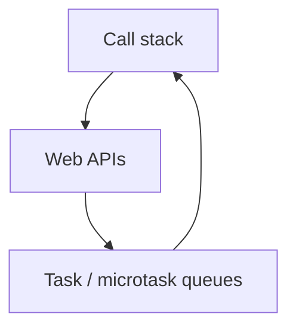

# JavaScript — módulos, DOM assíncrono e fetch

## Introdução

**JavaScript** no browser corre numa **thread** principal com *event loop*: I/O de rede e timers são desbloqueantes; **CPU pesado** bloqueia pintura e input. **ES modules** (`import`/`export`) e **async/await** sobre `fetch` são o padrão moderno.



---

## Módulo ES no browser

```html
<script type="module" src="./app.js"></script>
```

```javascript
// app.js
import { render } from "./ui.js";

document.addEventListener("DOMContentLoaded", () => {
  render(document.getElementById("root"));
});
```

---

## fetch + JSON

```javascript
async function loadUser(id) {
  const res = await fetch(`/api/users/${id}`, {
    headers: { Accept: "application/json" },
  });
  if (!res.ok) throw new Error(`HTTP ${res.status}`);
  return res.json();
}
```

---

## DOM seguro (evitar XSS)

```javascript
// Preferir textContent / createElement
const el = document.createElement("p");
el.textContent = userInput; // escapa como texto
root.append(el);

// Evitar innerHTML com dados não confiáveis
```

---

## Referências

- [MDN — JavaScript](https://developer.mozilla.org/en-US/docs/Web/JavaScript)
- [JavaScript.info](https://javascript.info/)

---

*TypeScript acrescenta **tipos estáticos** — ver documentação do compilador no projeto que usar.*
