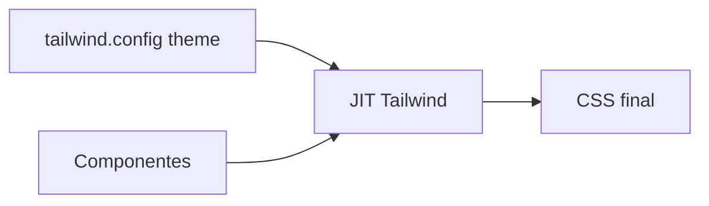

# Tailwind CSS — utility-first em projetos reais

## Introdução

**Tailwind** compõe UI com **classes utilitárias**. Em equipas, o desafio é evitar **strings gigantes** ilegíveis e duplicação — padrão: **componentes** (React/Vue/Svelte), **`@apply`** para padrões repetidos, e **design tokens** no `theme.extend`.



---

## Problema real: “purge removeu classes dinâmicas”

**Sintoma:** botão sem cor em produção; classes construídas por string `bg-${color}-500`.

**Causa:** JIT só vê **strings literais** no código.

**Solução:** *safelist* ou mapa explícito:

```javascript
// tailwind.config.js
export default {
  safelist: [{ pattern: /bg-(red|green|blue)-(500|600)/ }],
};
```

Ou objeto de classes pré-definidas:

```javascript
const variants = { ok: "bg-emerald-600 text-white", err: "bg-rose-600 text-white" };
```

---

## Instalação (Vite + React TS)

```bash
npm create vite@latest demo -- --template react-ts
cd demo && npm i && npm i -D tailwindcss @tailwindcss/vite
```

Seguir [Tailwind v4 + Vite](https://tailwindcss.com/docs/installation/using-vite) (doc oficial evolui — confirme versão).

Configuração típica **v3** (ainda muito usada):

```javascript
// tailwind.config.js
/** @type {import('tailwindcss').Config} */
export default {
  content: ["./index.html", "./src/**/*.{js,ts,jsx,tsx}"],
  theme: {
    extend: {
      fontFamily: { sans: ["Inter", "system-ui", "sans-serif"] },
      colors: { brand: { DEFAULT: "#14532d", muted: "#166534" } },
    },
  },
  // plugins: [require("@tailwindcss/forms")], // CommonJS; em ESM importe o plugin
  plugins: [],
};
```

---

## Componente acessível (foco + estados)

```jsx
export function DestructiveButton({ children, ...props }) {
  return (
    <button
      type="button"
      className="rounded-md bg-rose-600 px-3 py-2 text-sm font-medium text-white hover:bg-rose-700 focus-visible:outline focus-visible:outline-2 focus-visible:outline-offset-2 focus-visible:outline-rose-600 disabled:cursor-not-allowed disabled:opacity-50"
      {...props}
    >
      {children}
    </button>
  );
}
```

**Problema real:** `outline-none` em tudo — utilizadores de teclado perdem-se. Usar **`focus-visible`** em vez de remover foco.

---

## `@apply` em camada de componentes

```css
@tailwind base;
@tailwind components;
@tailwind utilities;

@layer components {
  .input {
    @apply block w-full rounded-md border border-slate-300 px-3 py-2 shadow-sm focus:border-sky-500 focus:ring-sky-500 sm:text-sm;
  }
}
```

Não abuse: se só uma linha, deixe utilitários no JSX.

---

## Dark mode (`class` ou `media`)

```javascript
// tailwind.config.js — strategy
module.exports = { darkMode: "class" };
```

```html
<html class="dark">
  <!-- filhos usam dark:bg-slate-900 -->
</html>
```

**Problema real:** *flash* ao carregar — script mínimo no `<head>` que lê `localStorage` e aplica `class="dark"` antes do paint (padrão conhecido como **FOUC prevention**).

---

## Performance: `@layer` e CSS final

Ordem: `@tailwind base; components; utilities` — *utilities* ganham na cascata.

Medir: **tamanho do CSS** após build; Purge/JIT deve manter **dezenas de KB**, não MB.

---

## Padrão inteligente: valores arbitrários **com token semântico** (não com cor hex solta)

**Problema:** `bg-[#1e293b]` repetido 40 vezes — mudança de marca infernal.

**Inteligente:** estender o tema e usar `bg-surface-900` (nome de *design token*).

```javascript
// tailwind.config.js — theme.extend.colors
colors: {
  surface: { 900: "#0f172a", 700: "#334155" },
}
```

Use `arbitrary value` só para **protótipo** ou exceção documentada.

---

## Nível avançado: *compound variants* com `class-variance-authority` (CVA)

**Problema:** combinações `size` × `variant` × `disabled` explodem em condicionais no JSX.

```bash
npm i class-variance-authority clsx tailwind-merge
```

```typescript
import { cva, type VariantProps } from "class-variance-authority";

export const button = cva("inline-flex items-center rounded-md font-medium", {
  variants: {
    intent: { primary: "bg-emerald-700 text-white hover:bg-emerald-800", ghost: "bg-transparent hover:bg-slate-100" },
    size: { sm: "px-2 py-1 text-sm", md: "px-3 py-2 text-sm" },
  },
  defaultVariants: { intent: "primary", size: "md" },
});
export type ButtonVariants = VariantProps<typeof button>;
```

---

## Referências

- [Tailwind CSS — Documentation](https://tailwindcss.com/docs)
- [Tailwind Forms plugin](https://github.com/tailwindlabs/tailwindcss-forms)
- [Headless UI](https://headlessui.com/) — acessível + composição com Tailwind
- [Radix UI Themes + Tailwind](https://www.radix-ui.com/) — primitivos acessíveis
- [ARIA Authoring Practices](https://www.w3.org/WAI/ARIA/apg/) — padrões de widget
- [class-variance-authority](https://cva.style/docs)
- [tailwind-merge](https://github.com/dcastil/tailwind-merge)

---

*Tailwind acelera **entrega**; *design tokens* e **acessibilidade** evitam dívida visual.*
