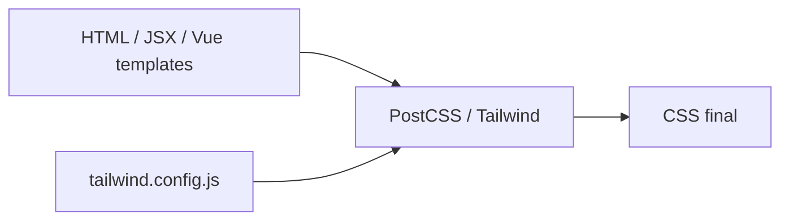

# Tailwind CSS — utility-first e design tokens

## Introdução

**Tailwind** gera CSS a partir de **classes utilitárias** (`flex`, `p-4`, `text-slate-600`) no markup ou via **@apply** em folhas próprias. O *JIT* compila só o que aparece no projeto — bundles pequenos em produção.



---

## Instalação típica (Vite + React)

```bash
npm create vite@latest demo -- --template react-ts
cd demo && npm i && npm i -D tailwindcss postcss autoprefixer
npx tailwindcss init -p
```

`tailwind.config.js` — `content`:

```javascript
export default {
  content: ["./index.html", "./src/**/*.{js,ts,jsx,tsx}"],
  theme: { extend: {} },
  plugins: [],
};
```

`src/index.css`:

```css
@tailwind base;
@tailwind components;
@tailwind utilities;
```

---

## Exemplo de componente

```jsx
export function Card({ title, children }) {
  return (
    <article className="rounded-lg border border-slate-200 bg-white p-4 shadow-sm">
      <h2 className="text-lg font-semibold text-slate-900">{title}</h2>
      <div className="mt-2 text-slate-600">{children}</div>
    </article>
  );
}
```

---

## Camada de componente com `@apply`

```css
@layer components {
  .btn-primary {
    @apply inline-flex items-center justify-center rounded-md bg-emerald-700 px-4 py-2 text-white hover:bg-emerald-800;
  }
}
```

---

## Referências

- [Tailwind CSS — Docs](https://tailwindcss.com/docs)

---

*Combine utilitários no protótipo; extraia **padrões** repetidos para componentes ou `@apply`.*
