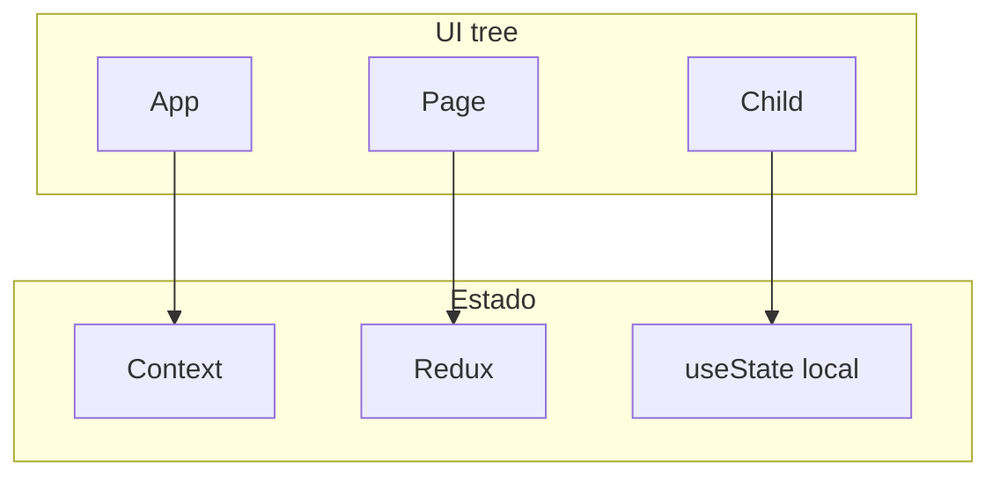

# React — Context API, Redux, Tailwind e WebSockets

## Introdução

**React** compõe interfaces por **funções** que devolvem árvores (`ReactElement`). Estado local (`useState`, `useReducer`), memoização (`useMemo`, `useCallback`) e efeitos (`useEffect`) são o dia-a-dia. **Context** partilha dados sem *prop drilling*; **Redux Toolkit** escala estado transacional e *middleware*; **WebSockets** alimentam dashboards ao vivo.



---

## Problema real: re-renders em cascata

**Sintoma:** digitar num input torna a lista de 5000 linhas lenta.

**Causas:** contexto pai muda a cada tecla; função inline nova a cada render passada como prop; lista sem `key` estável.

**Mitigações:**

- Dividir contexto (**Theme** vs **Session**).
- `React.memo` + props estáveis (`useCallback` só quando medido).
- Virtualização (`@tanstack/react-virtual`, `react-window`).

```tsx
import { memo, useCallback, useState } from "react";

const Row = memo(function Row({ id, title }: { id: string; title: string }) {
  return <li>{title}</li>;
});

export function List({ items }: { items: { id: string; title: string }[] }) {
  const [q, setQ] = useState("");
  const filtered = items.filter((i) => i.title.includes(q));
  return (
    <>
      <input value={q} onChange={(e) => setQ(e.target.value)} aria-label="Filtrar" />
      <ul>
        {filtered.map((i) => (
          <Row key={i.id} id={i.id} title={i.title} />
        ))}
      </ul>
    </>
  );
}
```

---

## Context API — tema + anti-padrão

```tsx
import { createContext, useContext, useMemo, useState, type ReactNode } from "react";

type Theme = "light" | "dark";
type Ctx = { theme: Theme; toggle: () => void };
const ThemeCtx = createContext<Ctx | null>(null);

export function ThemeProvider({ children }: { children: ReactNode }) {
  const [theme, setTheme] = useState<Theme>("light");
  const value = useMemo<Ctx>(
    () => ({ theme, toggle: () => setTheme((t) => (t === "light" ? "dark" : "light")) }),
    [theme],
  );
  return <ThemeCtx.Provider value={value}>{children}</ThemeCtx.Provider>;
}

export function useTheme(): Ctx {
  const v = useContext(ThemeCtx);
  if (!v) throw new Error("useTheme must be used within ThemeProvider");
  return v;
}
```

**Problema real:** *everything* no Context — qualquer `setState` re-renderiza **toda** a árvore sob o provider. Para dados frequentes use **query library** (TanStack Query) ou Redux.

---

## Redux Toolkit — pedido assíncrono com *slice*

```typescript
import { createAsyncThunk, createSlice, configureStore } from "@reduxjs/toolkit";

export const fetchOrder = createAsyncThunk("order/fetch", async (id: string) => {
  const r = await fetch(`/api/orders/${id}`);
  if (!r.ok) throw new Error(String(r.status));
  return r.json();
});

const orderSlice = createSlice({
  name: "order",
  initialState: {
    data: null as Record<string, unknown> | null,
    status: "idle" as "idle" | "loading" | "failed",
    error: null as string | null,
  },
  reducers: {},
  extraReducers: (b) => {
    b.addCase(fetchOrder.pending, (s) => {
      s.status = "loading";
      s.error = null;
    })
      .addCase(fetchOrder.fulfilled, (s, a) => {
        s.status = "idle";
        s.data = a.payload;
      })
      .addCase(fetchOrder.rejected, (s, a) => {
        s.status = "failed";
        s.error = a.error.message ?? "Erro";
      });
  },
});

export const store = configureStore({ reducer: { order: orderSlice.reducer } });
export type RootState = ReturnType<typeof store.getState>;
```

**Quando Redux vs Context:** fluxos com **muitas ações**, *time-travel* útil, *middleware* (logging, analytics), ou estado partilhado por rotas distantes sem prop drilling excessivo.

---

## Tailwind + React (padrão de *layout*)

```tsx
export function PageShell({ title, children }: { title: string; children: React.ReactNode }) {
  return (
    <div className="min-h-dvh bg-slate-50 text-slate-900">
      <header className="border-b border-slate-200 bg-white px-4 py-3">
        <h1 className="text-lg font-semibold">{title}</h1>
      </header>
      <main className="mx-auto max-w-5xl px-4 py-6">{children}</main>
    </div>
  );
}
```

---

## WebSocket — reconexão e *backpressure*

```tsx
import { useEffect, useRef, useState } from "react";

export function useLiveTicker(url: string) {
  const [price, setPrice] = useState<number | null>(null);
  const wsRef = useRef<WebSocket | null>(null);

  useEffect(() => {
    let stopped = false;
    let attempt = 0;

    function connect() {
      const ws = new WebSocket(url);
      wsRef.current = ws;
      ws.onmessage = (ev) => {
        const n = Number(ev.data);
        if (!Number.isFinite(n)) return;
        setPrice(n);
      };
      ws.onclose = () => {
        if (stopped) return;
        const delay = Math.min(30_000, 500 * 2 ** attempt++);
        setTimeout(connect, delay);
      };
      ws.onopen = () => {
        attempt = 0;
      };
    }

    connect();
    return () => {
      stopped = true;
      wsRef.current?.close();
    };
  }, [url]);

  return price;
}
```

**Problema real:** servidor envia 1000 msg/s — UI congela. **Solução:** *throttle* no handler ou agregar no servidor; `requestAnimationFrame` para updates visuais.

---

## Strict Mode e efeitos duplos em dev

Em **React 18 Strict Mode**, efeitos podem montar/desmontar **duas vezes** em desenvolvimento para expor fugas. **Problema real:** `useEffect` sem cleanup que subscreve WebSocket → duas conexões.

```tsx
useEffect(() => {
  const id = setInterval(tick, 1000);
  return () => clearInterval(id);
}, []);
```

---

## Padrão inteligente: pesquisa pesada sem travar o input (`useDeferredValue`)

**Problema:** cada tecla re-filtra 50k linhas — *input lag*.

```tsx
import { useDeferredValue, useMemo, useState } from "react";

export function Search({ items }: { items: { id: string; title: string }[] }) {
  const [q, setQ] = useState("");
  const deferred = useDeferredValue(q);
  const filtered = useMemo(
    () => items.filter((i) => i.title.toLowerCase().includes(deferred.toLowerCase())),
    [items, deferred],
  );
  return (
    <>
      <input value={q} onChange={(e) => setQ(e.target.value)} />
      <p className="text-xs text-slate-500">{deferred !== q ? "A atualizar…" : null}</p>
      {/* Substituir por lista virtualizada (ex. @tanstack/react-virtual) em datasets grandes */}
      <ul>
        {filtered.slice(0, 500).map((r) => (
          <li key={r.id}>{r.title}</li>
        ))}
      </ul>
    </>
  );
}
```

Combine com `startTransition` se a atualização de lista for disparada por outra ação.

---

## Nível avançado: `useSyncExternalStore` (ligar stores não-React)

**Problema:** biblioteca de estado externa (ex.: *nano* store legada) não dispara re-render.

```tsx
import { useSyncExternalStore } from "react";

const subscribe = (cb: () => void) => {
  legacyStore.on("change", cb);
  return () => legacyStore.off("change", cb);
};
const get = () => legacyStore.getSnapshot();

export function useLegacy() {
  return useSyncExternalStore(subscribe, get, get);
}
```

Referência: [useSyncExternalStore](https://react.dev/reference/react/useSyncExternalStore).

---

## Nível avançado: TanStack Query — chave estável e *stale-while-revalidate*

**Problema:** *race* — resposta antiga sobrescreve a nova ao mudar filtros rápido.

```tsx
import { useQuery } from "@tanstack/react-query";

export function useOrder(id: string) {
  return useQuery({
    queryKey: ["order", id],
    queryFn: () => fetch(`/api/orders/${id}`).then((r) => r.json()),
    staleTime: 30_000,
  });
}
```

A `queryKey` inclui **todos** os parâmetros que alteram o resultado.

---

## Referências

- [React — Docs (react.dev)](https://react.dev/)
- [You Might Not Need an Effect](https://react.dev/learn/you-might-not-need-an-effect)
- [Redux Toolkit](https://redux-toolkit.js.org/)
- [TanStack Query](https://tanstack.com/query/latest/docs/framework/react/overview)
- [useWebSocket](https://github.com/robtaussig/react-use-websocket) — alternativa testada (avaliar bundle)
- [useDeferredValue](https://react.dev/reference/react/useDeferredValue)

---

*React não escala sozinho — **arquitetura de estado** e **medição** (Profiler, Web Vitals) escalam.*
