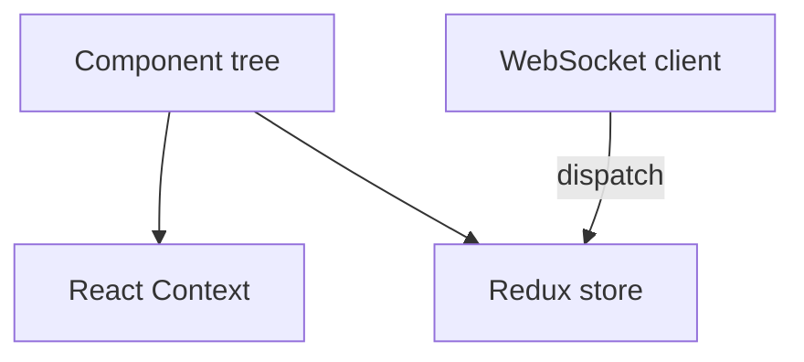
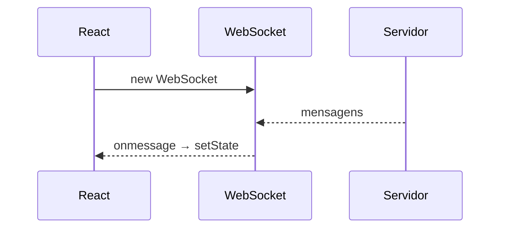

# React — Context API, Redux, Tailwind e WebSockets

## Introdução

**React** modela UI como **funções puras** do estado (`useState`, `useReducer`) ou classes (`Component`). **Context API** evita *prop drilling* para dados raramente mudados (tema, locale). **Redux** (com **Redux Toolkit**) centraliza estado transacional e *middleware* (ex.: async). **Tailwind** integra-se diretamente em JSX. **WebSockets** alimentam estado em tempo real.



---

## Context API — tema

```tsx
import { createContext, useContext, useMemo, useState, type ReactNode } from "react";

type Theme = "light" | "dark";
const ThemeCtx = createContext<{ theme: Theme; toggle: () => void } | null>(null);

export function ThemeProvider({ children }: { children: ReactNode }) {
  const [theme, setTheme] = useState<Theme>("light");
  const value = useMemo(
    () => ({ theme, toggle: () => setTheme((t) => (t === "light" ? "dark" : "light")) }),
    [theme],
  );
  return <ThemeCtx.Provider value={value}>{children}</ThemeCtx.Provider>;
}

export function useTheme() {
  const v = useContext(ThemeCtx);
  if (!v) throw new Error("useTheme outside provider");
  return v;
}
```

---

## Redux Toolkit — slice mínimo

```typescript
import { configureStore, createSlice } from "@reduxjs/toolkit";
import { useSelector, useDispatch, Provider } from "react-redux";

const counterSlice = createSlice({
  name: "counter",
  initialState: { value: 0 },
  reducers: {
    increment: (s) => {
      s.value += 1;
    },
  },
});

export const store = configureStore({ reducer: { counter: counterSlice.reducer } });
export const { increment } = counterSlice.actions;
```

```tsx
function Counter() {
  const n = useSelector((s: ReturnType<typeof store.getState>) => s.counter.value);
  const d = useDispatch();
  return <button onClick={() => d(increment())}>{n}</button>;
}
```

---

## Tailwind + React

```tsx
export function Badge({ children }: { children: React.ReactNode }) {
  return (
    <span className="rounded-full bg-emerald-100 px-2 py-0.5 text-xs font-medium text-emerald-900">
      {children}
    </span>
  );
}
```

---

## WebSocket — hook simples

```tsx
import { useEffect, useState } from "react";

export function usePrices(url: string) {
  const [last, setLast] = useState<number | null>(null);
  useEffect(() => {
    const ws = new WebSocket(url);
    ws.onmessage = (ev) => setLast(Number(ev.data));
    return () => ws.close();
  }, [url]);
  return last;
}
```



---

## Referências

- [React — Docs](https://react.dev/)
- [Redux Toolkit](https://redux-toolkit.js.org/)

---

*Context para **poucas** atualizações globais; Redux quando o fluxo de **ações** precisa de trilho e ferramentas.*
