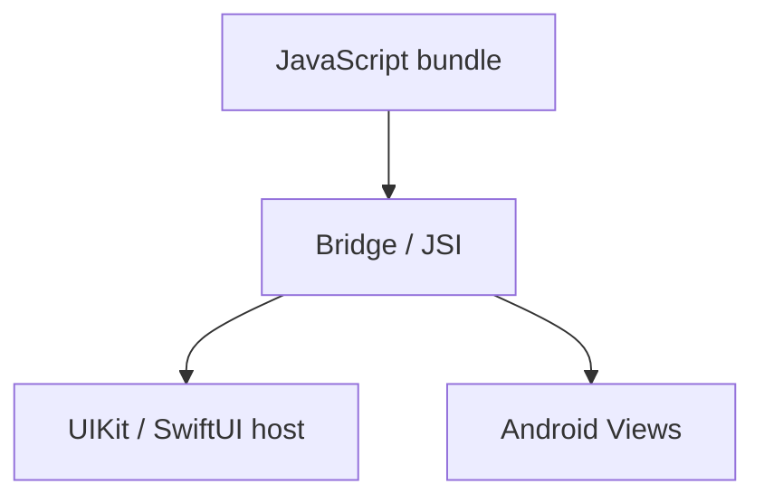

# React Native — UI móvel com React

## Introdução

**React Native** renderiza componentes nativos (**View**, **Text**, **Pressable**) em vez de `<div>`, usando a mesma mentalidade de **hooks** e **JSX** do React web. O *bridge* (ou **JSI** em arquiteturas novas) comunica com código nativo (iOS/Android).



---

## App mínimo (Expo)

```bash
npx create-expo-app@latest MeuApp
cd MeuApp && npx expo start
```

```tsx
import { StatusBar } from "expo-status-bar";
import { StyleSheet, Text, View } from "react-native";

export default function App() {
  return (
    <View style={styles.container}>
      <Text>Olá React Native</Text>
      <StatusBar style="auto" />
    </View>
  );
}

const styles = StyleSheet.create({
  container: { flex: 1, alignItems: "center", justifyContent: "center" },
});
```

---

## Lista com dados remotos

```tsx
import { useEffect, useState } from "react";
import { FlatList, Text } from "react-native";

type Item = { id: string; title: string };

export function Posts() {
  const [items, setItems] = useState<Item[]>([]);
  useEffect(() => {
    fetch("https://jsonplaceholder.typicode.com/posts")
      .then((r) => r.json())
      .then((data: Item[]) => setItems(data.slice(0, 20)));
  }, []);
  return <FlatList data={items} keyExtractor={(i) => i.id} renderItem={({ item }) => <Text>{item.title}</Text>} />;
}
```

---

## Referências

- [React Native — Docs](https://reactnative.dev/)
- [Expo](https://docs.expo.dev/)

---

*Partilhe lógica de **negócio** com monorepo (packages) entre web e mobile; UI continua separada.*
