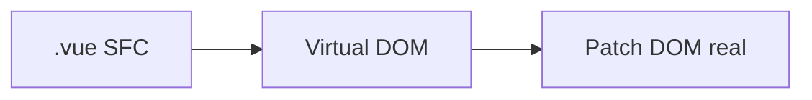

# Vue.js — SFC, Composition API e Pinia

## Introdução

**Vue** usa **Single-File Components** (`.vue`: `<template>`, `<script>`, `<style>`). A **Composition API** (`ref`, `computed`, `watch`) organiza lógica reutilizável em *composables*. **Pinia** é a store oficial (substituto moderno do Vuex).



---

## Projeto com Vite

```bash
npm create vue@latest demo
cd demo && npm i && npm run dev
```

---

## Componente com `<script setup>`

```vue
<script setup lang="ts">
import { ref, computed } from "vue";

const count = ref(0);
const doubled = computed(() => count.value * 2);

function inc() {
  count.value++;
}
</script>

<template>
  <button class="rounded bg-emerald-700 px-3 py-1 text-white" @click="inc">
    {{ count }} (dobro: {{ doubled }})
  </button>
</template>
```

---

## Pinia — store mínima

```typescript
// stores/counter.ts
import { defineStore } from "pinia";

export const useCounterStore = defineStore("counter", {
  state: () => ({ n: 0 }),
  actions: {
    inc() {
      this.n++;
    },
  },
});
```

```vue
<script setup lang="ts">
import { useCounterStore } from "../stores/counter";
const counter = useCounterStore();
</script>

<template>
  <button @click="counter.inc()">{{ counter.n }}</button>
</template>
```

---

## Referências

- [Vue.js — Docs](https://vuejs.org/)
- [Pinia](https://pinia.vuejs.org/)

---

*`computed` e `watch` clarificam dependências de dados — evite efeitos espalhados sem necessidade.*
