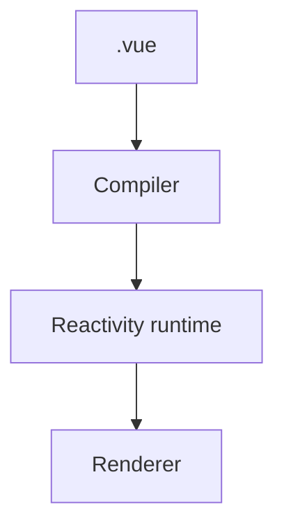

# Vue.js — SFC, Composition API e ecossistema

## Introdução

**Vue 3** combina **SFC** (`.vue`), **Composition API** e **reactividade** baseada em *proxies*. **Pinia** substitui Vuex na maior parte dos projetos novos. Problemas reais: *watchers* em cascata, *stores* gigantes, e **N+1 requests** em páginas com vários `useAsyncData`.



---

## Problema real: `watch` dispara demasiadas vezes

**Sintoma:** cada tecla chama API.

**Solução:** `watchDebounced` (VueUse) ou *debounce* manual; preferir **submit** explícito vs *search-as-you-type* sem limite.

```bash
npm i @vueuse/core
```

```vue
<script setup lang="ts">
import { ref, watch } from "vue";
import { useDebounceFn } from "@vueuse/core";

const q = ref("");
const results = ref<string[]>([]);

const run = useDebounceFn(async () => {
  if (!q.value.trim()) {
    results.value = [];
    return;
  }
  const r = await fetch(`/api/search?q=${encodeURIComponent(q.value)}`);
  results.value = await r.json();
}, 300);

watch(q, () => run());
</script>
```

---

## Pinia — modularização por domínio

**Anti-padrão:** um `useMainStore()` com 200 campos.

**Padrão:** `useCartStore`, `useSessionStore`, *selectors* com `storeToRefs` para manter reatividade.

```typescript
// stores/cart.ts
import { defineStore } from "pinia";

export const useCartStore = defineStore("cart", {
  state: () => ({ items: [] as { sku: string; qty: number }[] }),
  getters: {
    totalQty: (s) => s.items.reduce((n, i) => n + i.qty, 0),
  },
  actions: {
    add(sku: string) {
      const row = this.items.find((i) => i.sku === sku);
      if (row) row.qty += 1;
      else this.items.push({ sku, qty: 1 });
    },
  },
});
```

```vue
<script setup lang="ts">
import { storeToRefs } from "pinia";
import { useCartStore } from "../stores/cart";

const cart = useCartStore();
const { totalQty } = storeToRefs(cart);
</script>

<template>
  <button type="button" @click="cart.add('SKU-1')">Carrinho ({{ totalQty }})</button>
</template>
```

---

## `<script setup>` + TypeScript + props

```vue
<script setup lang="ts">
const props = withDefaults(
  defineProps<{
    title: string;
    dense?: boolean;
  }>(),
  { dense: false },
);

const emit = defineEmits<{
  (e: "save", value: string): void;
}>();
</script>

<template>
  <article :class="dense ? 'p-2' : 'p-4'">
    <h2>{{ title }}</h2>
    <button type="button" @click="emit('save', 'ok')">Guardar</button>
  </article>
</template>
```

---

## Vue + Tailwind (Vite)

```bash
npm create vue@latest demo
# marcar TypeScript + Router + Pinia
cd demo && npm i && npm i -D tailwindcss postcss autoprefixer && npx tailwindcss init -p
```

**Problema real:** Purge remove classes em templates — `content` deve incluir `./src/**/*.vue`.

---

## Nuxt (nota)

Para **SSR**, rotas de servidor e *SEO*, o stack natural é **Nuxt 3** (Vue). Conceitos alinhados a [Next.js](./11-nextjs.md) no ecossistema React.

---

## Padrão inteligente: `defineModel()` (Vue 3.4+) — *two-way binding* tipado sem *boilerplate*

**Problema:** `props` + `emit('update:x')` repetido em cada *input wrapper*.

```vue
<script setup lang="ts">
const model = defineModel<string>({ default: "" });
</script>

<template>
  <input v-model="model" class="input" />
</template>
```

Referência: [defineModel](https://vuejs.org/api/sfc-script-setup.html#definemodel).

---

## Nível avançado: `shallowRef` para estruturas grandes (evitar *deep reactivity*)

**Problema:** *chart* com 100k pontos torna o *proxy* profundo caríssimo.

```typescript
import { shallowRef, triggerRef } from "vue";

const points = shallowRef<Float64Array>(new Float64Array(100_000));

function mutateInPlace() {
  // mutar buffer sem substituir a ref
  points.value[0] = 42;
  triggerRef(points);
}
```

---

## Referências

- [Vue.js — Documentation](https://vuejs.org/)
- [Pinia](https://pinia.vuejs.org/)
- [VueUse](https://vueuse.org/) — utilitários Composition API
- [Vue Router](https://router.vuejs.org/)
- [Nuxt](https://nuxt.com/docs)
- [defineModel](https://vuejs.org/api/sfc-script-setup.html#definemodel)
- [shallowRef](https://vuejs.org/api/reactivity-advanced.html#shallowref)

---

*Composition API brilha quando a lógica é **agrupada por funcionalidade**, não por opção de API.*
