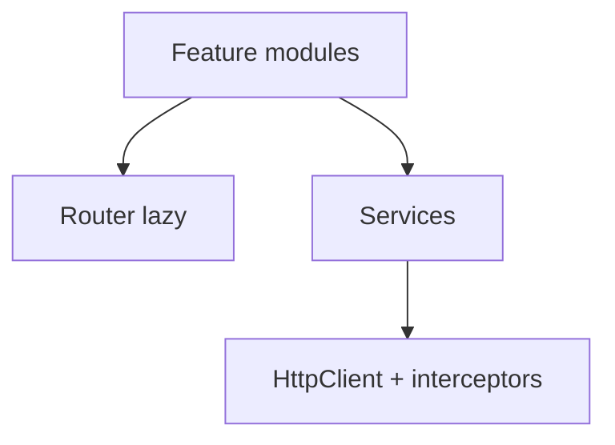

# Angular — aplicações enterprise e RxJS

## Introdução

**Angular** é um **framework opinativo**: CLI, **injeção de dependências**, *router*, formulários reativos ou *template-driven*, HTTP com interceptors, e **RxJS** em todo o lado. Em bancos e *backoffice*, padrões como **feature modules**, **lazy routes** e **guards** são o quotidiano.



---

## Problema real: *memory leaks* em subscrições

**Sintoma:** navegar entre páginas aumenta memória; *listeners* duplicados.

**Causa:** `subscribe()` sem `unsubscribe` ou sem `async` pipe / `takeUntilDestroyed`.

**Solução moderna (Angular 16+):**

```typescript
import { CommonModule } from "@angular/common";
import { Component, inject } from "@angular/core";
import { takeUntilDestroyed } from "@angular/core/rxjs-interop";
import { HttpClient } from "@angular/common/http";

@Component({
  selector: "app-users",
  standalone: true,
  imports: [CommonModule], // *ngFor
  template: `<ul><li *ngFor="let u of users">{{ u.name }}</li></ul>`,
})
export class UsersComponent {
  private http = inject(HttpClient);
  users: { id: number; name: string }[] = [];

  constructor() {
    this.http
      .get<{ id: number; name: string }[]>("https://jsonplaceholder.typicode.com/users")
      .pipe(takeUntilDestroyed())
      .subscribe((u) => (this.users = u.slice(0, 10)));
  }
}
```

Referência: [takeUntilDestroyed](https://angular.dev/api/core/rxjs-interop/takeUntilDestroyed).

---

## Interceptors — auth e erros globais

**Caso real:** 401 deve refrescar token uma vez e repetir pedido; 500 mostrar *toast*.

```typescript
import { HttpInterceptorFn } from "@angular/common/http";
import { catchError, switchMap, throwError } from "rxjs";

export const authInterceptor: HttpInterceptorFn = (req, next) => {
  const token = localStorage.getItem("access"); // em produção: serviço seguro
  const clone = token ? req.clone({ setHeaders: { Authorization: `Bearer ${token}` } }) : req;
  return next(clone).pipe(
    catchError((err) => {
      if (err.status === 401) {
        // refresh + retry (simplificado)
      }
      return throwError(() => err);
    }),
  );
};
```

**Nota segurança:** tokens em `localStorage` são alvo de XSS — preferir **cookies httpOnly** quando a arquitetura permitir.

---

## Formulários reativos e validação

```typescript
import { FormBuilder, Validators } from "@angular/forms";

readonly form = inject(FormBuilder).nonNullable.group({
  email: ["", [Validators.required, Validators.email]],
  password: ["", [Validators.required, Validators.minLength(8)]],
});
```

**Problema real:** validação só no cliente — **sempre** validar no servidor; cliente melhora UX.

---

## Change detection e performance

**Sintoma:** digitar no campo pesado congela tabela.

**Ferramentas:** `ChangeDetectionStrategy.OnPush` + *immutable* inputs; `trackBy` em `*ngFor`; `async` pipe.

```html
<tr *ngFor="let row of rows; trackBy: trackById">
```

---

## CLI e qualidade

```bash
ng new demo --routing --style=scss --strict
ng generate component features/orders/list
ng lint && ng test
```

---

## Padrão inteligente: `computed()` + `signal()` para derivar sem *effect*

**Problema:** `effect()` que recalcula preço com IVA — dispara em loop ou ordem frágil.

**Inteligente:** `computed` puro a partir de *signals* de entrada.

```typescript
import { computed, signal } from "@angular/core";

const net = signal(100);
const vat = signal(0.23);
const gross = computed(() => net() * (1 + vat()));
```

---

## Nível avançado: *control flow* nativo `@if` / `@for` (Angular 17+)

**Problema:** `*ngIf` / `*ngFor` micro-syntax em templates grandes — legibilidade baixa.

```html
@if (user(); as u) {
  <p>{{ u.name }}</p>
} @else {
  <p>A carregar…</p>
}

@for (row of rows(); track row.id) {
  <tr>{{ row.title }}</tr>
}
```

`track` evita re-DOM desnecessário — equivalente moderno ao `trackBy`.

---

## Referências

- [Angular — Docs (angular.dev)](https://angular.dev/)
- [RxJS](https://rxjs.dev/guide/overview)
- [Angular style guide](https://angular.dev/style-guide)
- [Angular security](https://angular.dev/best-practices/security)
- [Angular control flow](https://angular.dev/guide/templates/control-flow)
- [Signals](https://angular.dev/guide/signals)

---

*Angular pune **inconsistência de padrões** — documente decisões de módulos, estado e HTTP.*
