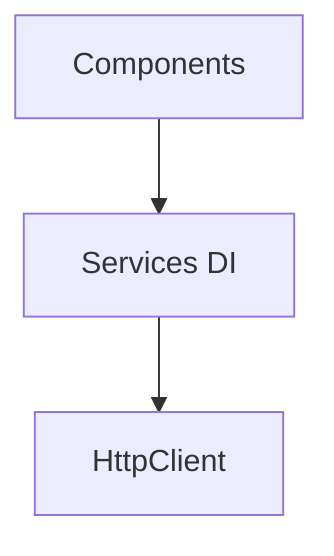

# Angular — TypeScript, módulos e RxJS

## Introdução

**Angular** é um **framework completo** (CLI, *dependency injection*, *router*, formulários, HTTP) orientado a **TypeScript**. Serviços **injectables** partilham estado e chamadas HTTP; **RxJS** modela fluxos assíncronos (*Observables*).



---

## CLI

```bash
npm i -g @angular/cli
ng new demo --routing --style=scss
cd demo && ng serve
```

---

## Componente standalone mínimo

```typescript
// app.component.ts
import { Component, signal } from "@angular/core";

@Component({
  selector: "app-root",
  standalone: true,
  template: `<button (click)="inc()">{{ n() }}</button>`,
})
export class AppComponent {
  readonly n = signal(0);
  inc() {
    this.n.update((v) => v + 1);
  }
}
```

---

## HttpClient + async pipe (padrão clássico)

```typescript
import { HttpClient } from "@angular/common/http";
import { inject } from "@angular/core";
import { map } from "rxjs/operators";

export class UserService {
  private http = inject(HttpClient);

  getUsers() {
    return this.http.get<{ id: number; name: string }[]>("https://jsonplaceholder.typicode.com/users").pipe(map((u) => u.slice(0, 5)));
  }
}
```

---

## Referências

- [Angular — Docs](https://angular.dev/)
- [RxJS](https://rxjs.dev/)

---

*Use **async pipe** ou `toSignal` para ligar Observables ao template sem fugas de subscrição.*
