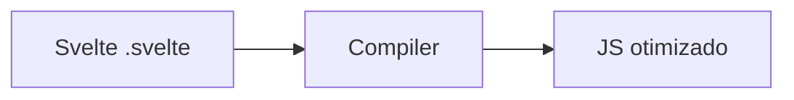

# Svelte — compilador e reatividade fina

## Introdução

**Svelte** (e **SvelteKit** para apps completas) move grande parte do trabalho para **tempo de compilação**: o componente vira JavaScript imperativo otimizado, sem *virtual DOM* pesado em runtime. **Stores** (`writable`, `derived`) partilham estado fora da árvore.



---

## Projeto SvelteKit

```bash
npm create svelte@latest demo
cd demo && npm i && npm run dev
```

---

## Componente com estado reativo

```svelte
<!-- Counter.svelte -->
<script lang="ts">
  let count = 0;
  function inc() {
    count += 1;
  }
</script>

<button class="rounded bg-violet-600 px-3 py-1 text-white" on:click={inc}>
  {count}
</button>
```

---

## Store writable

```typescript
// stores.ts
import { writable, derived } from "svelte/store";

export const cart = writable<{ sku: string; qty: number }[]>([]);
export const totalItems = derived(cart, ($c) => $c.reduce((n, i) => n + i.qty, 0));
```

```svelte
<script lang="ts">
  import { cart, totalItems } from "./stores";
</script>

<p>Itens no carrinho: {$totalItems}</p>
```

---

## Referências

- [Svelte — Docs](https://svelte.dev/docs)
- [SvelteKit](https://kit.svelte.dev/docs)

---

*SvelteKit oferece **rotas**, **load functions** e **adapters** (Node, static, Vercel) num único ecossistema.*
