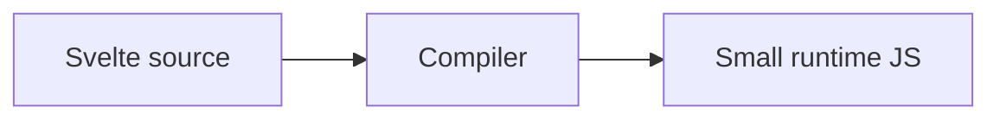

# Svelte — menos runtime, mais compilador

## Introdução

**Svelte** move trabalho para **compile time**: componentes viram JS imperativo otimizado. **Stores** reativas e **SvelteKit** (rotas, `load`, adapters) cobrem SPAs e sites completos. Problemas reais: **stores** globais demais; *hydration* mismatch em Kit; acessibilidade em *transitions*.



---

## Problema real: lógica duplicada entre rotas

**Sintoma:** mesmo `fetch` em `+page.svelte` de `/a` e `/b`.

**Solução:** `+page.ts` com `load` partilhado ou `+layout.ts` para dados hierárquicos.

```typescript
// src/routes/users/+page.ts
import type { PageLoad } from "./$types";

export const load: PageLoad = async ({ fetch }) => {
  const res = await fetch("/api/users");
  if (!res.ok) throw new Error("users");
  return { users: await res.json() };
};
```

```svelte
<!-- +page.svelte -->
<script lang="ts">
  import type { PageData } from "./$types";
  export let data: PageData;
</script>

<ul>
  {#each data.users as u}
    <li>{u.name}</li>
  {/each}
</ul>
```

Referência: [SvelteKit — load](https://kit.svelte.dev/docs/load).

---

## Stores: evitar “Deus global”

```typescript
import { writable, derived } from "svelte/store";

export const cart = writable<{ sku: string; qty: number }[]>([]);
export const cartCount = derived(cart, ($c) => $c.reduce((n, i) => n + i.qty, 0));
```

**Problema real:** dezenas de `writable` sem nomes — agrupe por ficheiro (`stores/cart.ts`) e exponha funções em vez de mutar de fora sem controlo.

---

## Transições e acessibilidade

```svelte
{#if open}
  <div transition:fade={{ duration: 150 }} role="dialog" aria-modal="true">...</div>
{/if}
```

**Problema real:** foco fica “atrás” do modal — mover foco para o primeiro controlo e devolver ao gatilho ao fechar (`use:action` ou biblioteca).

---

## Componente reativo (sem boilerplate)

```svelte
<script lang="ts">
  let count = 0;
  const inc = () => (count += 1);
</script>

<button type="button" class="rounded bg-violet-600 px-3 py-1 text-white" on:click={inc}>
  {count}
</button>
```

---

## Testes e *check*

```bash
npm run check   # svelte-check + a11y hints
npm run test
```

---

## Nível avançado: **Runes** (Svelte 5) — reatividade explícita

**Problema:** em apps grandes, “o que é reativo?” torna-se difícil de seguir só com `let` e `$:`.

**Runes** (`$state`, `$derived`, `$effect`) tornam o comportamento **sintaticamente** explícito (menos *magic* de compilação implícita).

```svelte
<script>
  let count = $state(0);
  const doubled = $derived(count * 2);
</script>

<button onclick={() => count++}>{doubled}</button>
```

Documentação: [Svelte 5 — runes](https://svelte.dev/docs/svelte/what-are-runes).

---

## Padrão inteligente: *snippets* reutilizáveis (Svelte 5) em vez de *slot* anónimo complexo

Use **snippets** nomeados para composição de *layout* (equivalente mais seguro a *slots* nomeados legados).

---

## Referências

- [Svelte — Docs](https://svelte.dev/docs/svelte/overview)
- [SvelteKit — Docs](https://kit.svelte.dev/docs)
- [svelte-accessibility](https://github.com/jonaskruckenberg/svelte-accessibility) — regras e boas práticas
- [Vitest + Svelte](https://vitest.dev/)
- [Svelte 5 runes](https://svelte.dev/docs/svelte/what-are-runes)
- [Snippets](https://svelte.dev/docs/svelte/v5-migration-guide#Snippets-instead-of-slots)

---

*Svelte reduz JS enviado; **disciplina de arquitetura** continua necessária.*
