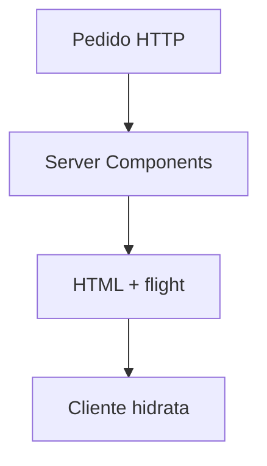

# Next.js — React com servidor e rotas

## Introdução

**Next.js** (App Router atual) combina **React** com **renderização no servidor** (RSC, *Server Components*), **rotas baseadas em ficheiros**, **API Routes / Route Handlers**, otimização de imagens e *streaming*. Ideal para SEO e **TTFB** melhor que SPAs puras.



---

## App Router — página e *fetch* em servidor

```tsx
// app/users/page.tsx
export const revalidate = 60;

export default async function UsersPage() {
  const res = await fetch("https://jsonplaceholder.typicode.com/users", { next: { revalidate: 60 } });
  const users: { id: number; name: string }[] = await res.json();
  return (
    <ul>
      {users.slice(0, 10).map((u) => (
        <li key={u.id}>{u.name}</li>
      ))}
    </ul>
  );
}
```

---

## Client Component explícito

```tsx
"use client";
import { useState } from "react";

export function Counter() {
  const [n, setN] = useState(0);
  return <button onClick={() => setN((x) => x + 1)}>{n}</button>;
}
```

---

## Route Handler (API)

```typescript
// app/api/hello/route.ts
import { NextResponse } from "next/server";

export async function GET() {
  return NextResponse.json({ ok: true });
}
```

---

## Referências

- [Next.js — Docs](https://nextjs.org/docs)

---

*Mantenha **lógica sensível** e *tokens* no servidor — nunca em props serializadas para o cliente sem critério.*
