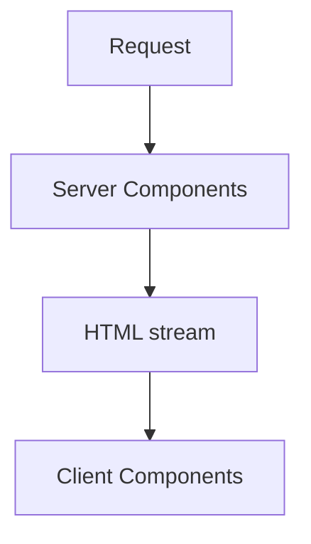

# Next.js — React com servidor, cache e deploy

## Introdução

**Next.js** (App Router) mistura **Server Components** (sem JS no cliente por defeito), **Client Components**, **Route Handlers** e **caching** declarativo (`fetch` com `next.revalidate`). Problemas reais: **hidratação** quebrada, **cache** agressivo mostrando dados velhos, e **secrets** expostos em `NEXT_PUBLIC_*`.



---

## Problema real: “Text content does not match server-rendered HTML”

**Sintoma:** *hydration mismatch* no console.

**Causas comuns:** `new Date()` ou `Math.random()` no render do servidor; extensão do browser que altera DOM; conteúdo dependente de `window` sem `useEffect`.

**Solução:** calcular valores instáveis só no cliente:

```tsx
"use client";
import { useEffect, useState } from "react";

export function ClientClock() {
  const [now, setNow] = useState<string | null>(null);
  useEffect(() => {
    setNow(new Date().toLocaleString());
  }, []);
  if (!now) return null;
  return <time dateTime={new Date().toISOString()}>{now}</time>;
}
```

Referência: [React hydration mismatch](https://react.dev/link/hydration-mismatch).

---

## Cache e dados frescos

```tsx
// revalidação ISR por segmento
export const revalidate = 120;

export default async function Page() {
  const res = await fetch("https://api.exemplo.com/catalogo", { next: { revalidate: 120 } });
  const items = await res.json();
  return <ul>{items.map((x: { id: string }) => <li key={x.id}>...</li>)}</ul>;
}
```

**Problema real:** utilizador não vê atualização após *deploy* — ajustar `revalidate` ou usar `fetch(..., { cache: "no-store" })` em páginas autenticadas.

**Problema oposto:** API externa caiu e build estático falhou — `export const dynamic = "force-dynamic"` ou *error boundary* + *fallback*.

---

## Route Handler com validação

```typescript
// app/api/orders/route.ts
import { NextResponse } from "next/server";
import { z } from "zod";

const Body = z.object({ sku: z.string().min(1), qty: z.number().int().positive() });

export async function POST(req: Request) {
  const json = await req.json().catch(() => null);
  const parsed = Body.safeParse(json);
  if (!parsed.success) {
    return NextResponse.json({ error: parsed.error.flatten() }, { status: 400 });
  }
  // persistir…
  return NextResponse.json({ ok: true });
}
```

---

## Middleware — auth e *redirects*

**Caso real:** todas as rotas `/app/*` exigem cookie de sessão.

```typescript
// middleware.ts
import { NextResponse } from "next/server";
import type { NextRequest } from "next/server";

export function middleware(req: NextRequest) {
  const token = req.cookies.get("session");
  if (!token && req.nextUrl.pathname.startsWith("/app")) {
    return NextResponse.redirect(new URL("/login", req.url));
  }
  return NextResponse.next();
}

export const config = { matcher: ["/app/:path*"] };
```

---

## Variáveis de ambiente

- **`NEXT_PUBLIC_*`** — embutidas no bundle **visível**.
- **Sem prefixo** — só servidor (RSC, Route Handlers, `getServerSideProps` legado).

**Problema real:** API key de terceiros em `NEXT_PUBLIC` — qualquer utilizador extrai do JS.

---

## Imagens otimizadas

```tsx
import Image from "next/image";
import hero from "./hero.jpg";

export default function Banner() {
  return <Image src={hero} alt="Equipa" priority placeholder="blur" />;
}
```

---

## Padrão inteligente: **Server Actions** com validação *server-side* (nunca confiar no cliente)

**Problema:** formulário “bonito” no cliente mas dados inválidos ou maliciosos chegam ao servidor.

```ts
// app/actions.ts
'use server';
import { z } from 'zod';

const schema = z.object({ email: z.string().email() });

export async function subscribe(prev: unknown, formData: FormData) {
  const parsed = schema.safeParse({ email: formData.get('email') });
  if (!parsed.success) return { error: parsed.error.flatten() };
  // … persistir com idempotência / rate-limit …
  return { ok: true };
}
```

Combine com **rate limiting** e **idempotency keys** para *newsletter* / *checkout*.

---

## Nível avançado: **React `cache()`** para deduplicar *fetch* no RSC

```tsx
import { cache } from 'react';

export const getUser = cache(async (id: string) => {
  const res = await fetch(`https://api.example/users/${id}`);
  return res.json();
});
```

Chamado várias vezes na árvore → **uma** execução por *request*.

---

## Nível avançado: **Parallel + Intercepting Routes** (modais profundos)

Use pastas `@modal` + `(.)segment` para abrir *modal* sobre URL profunda sem perder contexto — UX de app nativo.

Guia: [Intercepting Routes](https://nextjs.org/docs/app/building-your-application/routing/intercepting-routes).

---

## Referências

- [Next.js — Documentation](https://nextjs.org/docs)
- [Caching in Next.js](https://nextjs.org/docs/app/building-your-application/caching)
- [Vercel — Examples](https://github.com/vercel/examples)
- [OWASP — Secure headers](https://cheatsheetseries.owasp.org/cheatsheets/HTTP_Headers_Cheat_Sheet.html)
- [Server Actions and mutations](https://nextjs.org/docs/app/building-your-application/data-fetching/server-actions-and-mutations)
- [React — cache()](https://react.dev/reference/react/cache)
- [Intercepting routes](https://nextjs.org/docs/app/building-your-application/routing/intercepting-routes)

---

*Next.js une **SEO** e **DX** — o preço é entender **bem** o modelo de cache e de servidor.*
