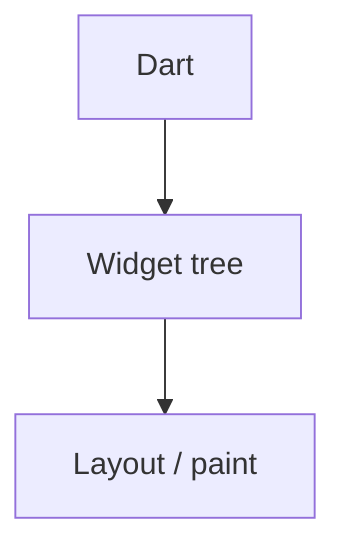

# Flutter — UI declarativa, estado e plataformas

## Introdução

**Flutter** pinta com **Skia/Impeller**; widgets são **imutáveis** e composição é o padrão. Problemas reais: **jank** por rebuilds excessivos, **overflow** `RenderFlex`, e *plugins* nativos mal configurados no CI.



---

## Problema real: `setState` em loop ou rebuild de árvore inteira

**Sintoma:** animação a saltar; profiler mostra muitos `build`.

**Mitigações:** dividir em **widgets menores**; `const` constructors onde possível; `ListView.builder` em vez de `children: [...]` gigante; **Provider/Riverpod/Bloc** para estado bem delimitado.

```dart
class BigList extends StatelessWidget {
  const BigList({super.key, required this.items});
  final List<String> items;

  @override
  Widget build(BuildContext context) {
    return ListView.builder(
      itemCount: items.length,
      itemBuilder: (_, i) => ListTile(title: Text(items[i])),
    );
  }
}
```

---

## `FutureBuilder` vs *Riverpod* / *Bloc*

**Problema real:** `FutureBuilder` sem *cache* refetch a cada rebuild.

Para apps médios/grandes, **Riverpod** ou **Bloc** centralizam *async* e testes.

```dart
// Exemplo conceptual Riverpod — ver documentação oficial
// final userProvider = FutureProvider((ref) async { ... });
```

Documentação: [Riverpod](https://riverpod.dev/), [Bloc library](https://bloclibrary.dev/).

---

## Layout: evitar overflow

**Sintoma:** faixa amarela/preta “BOTTOM OVERFLOWED BY 12 PIXELS”.

**Causas:** `Column` com conteúdo maior que o ecrã sem `Expanded`/`Flexible`/`SingleChildScrollView`.

```dart
return Scaffold(
  body: SafeArea(
    child: SingleChildScrollView(
      child: Column(
        crossAxisAlignment: CrossAxisAlignment.stretch,
        children: const [
          SizedBox(height: 800, child: Placeholder()),
        ],
      ),
    ),
  ),
);
```

---

## Rede: `http` + timeouts

```yaml
# pubspec.yaml
dependencies:
  http: ^1.2.0
```

Ver implementação completa na secção **App mínimo + `FutureBuilder`** abaixo (mesma função `fetchPosts`).

**Problema real:** *timeout* infinito — utilizador fica à espera; combine com **retry** exponencial para APIs instáveis.

---

## App mínimo + `FutureBuilder`

*(Um único ficheiro `main.dart` com `fetchPosts` + UI — adicione `http` ao `pubspec.yaml`.)*

```dart
import 'dart:convert';
import 'package:flutter/material.dart';
import 'package:http/http.dart' as http;

Future<List<dynamic>> fetchPosts() async {
  final res = await http
      .get(Uri.parse('https://jsonplaceholder.typicode.com/posts'))
      .timeout(const Duration(seconds: 8));
  if (res.statusCode != 200) throw Exception('HTTP ${res.statusCode}');
  return json.decode(res.body) as List<dynamic>;
}

void main() => runApp(const MaterialApp(home: PostsPage()));

class PostsPage extends StatelessWidget {
  const PostsPage({super.key});

  @override
  Widget build(BuildContext context) {
    return Scaffold(
      appBar: AppBar(title: const Text('Posts')),
      body: FutureBuilder<List<dynamic>>(
        future: fetchPosts(),
        builder: (context, snap) {
          if (snap.connectionState != ConnectionState.done) {
            return const Center(child: CircularProgressIndicator());
          }
          if (snap.hasError) {
            return Center(child: Text('Erro: ${snap.error}'));
          }
          final items = snap.data!.take(20).toList();
          return ListView.builder(
            itemCount: items.length,
            itemBuilder: (_, i) => ListTile(title: Text(items[i]['title'] as String)),
          );
        },
      ),
    );
  }
}
```

---

## Testes e *golden*

- **Widget tests** — `testWidgets` para interações.
- **Golden tests** — regressões visuais (cuidado com diferenças CI vs local).

---

## Padrão inteligente: **Isolates** para JSON pesado / parsing bloqueante

**Problema:** `jsonDecode` de ficheiros grandes na *main isolate* → *jank*.

```dart
import 'dart:convert';
import 'package:flutter/foundation.dart';

Future<Map<String, dynamic>> parseJsonHeavy(String raw) {
  return compute(_parse, raw);
}

Map<String, dynamic> _parse(String raw) => jsonDecode(raw) as Map<String, dynamic>;
```

---

## Nível avançado: **const constructors** em *widgets* leaf

Marque *widgets* imutáveis como `const` para reduzir rebuilds — especialmente em listas longas.

---

## Nível avançado: **Keys estáveis** em listas mutáveis

Use `ValueKey(entity.id)` — **nunca** índice da lista se a ordem muda.

---

## Referências

- [Flutter — Docs](https://docs.flutter.dev/)
- [Dart — Language tour](https://dart.dev/guides/language/language-tour)
- [Flutter performance best practices](https://docs.flutter.dev/perf/best-practices)
- [Material 3 for Flutter](https://m3.material.io/develop/flutter)
- [compute (Isolates)](https://api.flutter.dev/flutter/foundation/compute.html)

---

*Flutter partilha **lógica** entre plataformas; **UX** ainda deve respeitar guidelines iOS/Android.*
