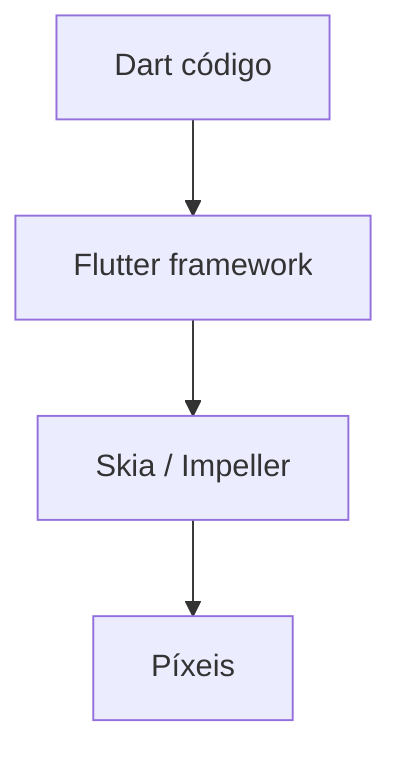

# Flutter — UI declarativa com Dart

## Introdução

**Flutter** desenha UI com **widgets** imutáveis e composição (`Column`, `Row`, `ListView`). O motor **Skia** / **Impeller** pinta píxeis; o mesmo código pode alvo **iOS**, **Android**, **web** e **desktop**. A linguagem é **Dart** (tipada, *sound null safety*).



---

## Instalação

Siga [flutter.dev](https://docs.flutter.dev/get-started/install) para SDK e `flutter doctor`.

```bash
flutter create demo
cd demo && flutter run
```

---

## Widget stateful mínimo

```dart
import 'package:flutter/material.dart';

void main() => runApp(const MaterialApp(home: CounterPage()));

class CounterPage extends StatefulWidget {
  const CounterPage({super.key});

  @override
  State<CounterPage> createState() => _CounterPageState();
}

class _CounterPageState extends State<CounterPage> {
  int _n = 0;

  @override
  Widget build(BuildContext context) {
    return Scaffold(
      appBar: AppBar(title: const Text('Contador')),
      body: Center(
        child: Text('$_n', style: Theme.of(context).textTheme.headlineMedium),
      ),
      floatingActionButton: FloatingActionButton(
        onPressed: () => setState(() => _n++),
        child: const Icon(Icons.add),
      ),
    );
  }
}
```

---

## Lista com `http` + `FutureBuilder`

Adicione em `pubspec.yaml`: `dependencies: http: ^1.2.0`

```dart
import 'dart:convert';
import 'package:flutter/material.dart';
import 'package:http/http.dart' as http;

Future<List<dynamic>> fetchPosts() async {
  final res = await http.get(Uri.parse('https://jsonplaceholder.typicode.com/posts'));
  if (res.statusCode != 200) throw Exception('falha HTTP');
  return json.decode(res.body) as List<dynamic>;
}

class PostsList extends StatelessWidget {
  const PostsList({super.key});

  @override
  Widget build(BuildContext context) {
    return FutureBuilder<List<dynamic>>(
      future: fetchPosts(),
      builder: (context, snap) {
        if (snap.connectionState != ConnectionState.done) {
          return const Center(child: CircularProgressIndicator());
        }
        if (snap.hasError) return Text('Erro: ${snap.error}');
        final items = snap.data!.take(10).toList();
        return ListView(children: [for (final p in items) ListTile(title: Text(p['title'] as String))]);
      },
    );
  }
}
```

---

## Referências

- [Flutter — Docs](https://docs.flutter.dev/)
- [Dart language](https://dart.dev/)

---

*Flutter não é DOM web; partilhe **modelos** com backend via OpenAPI / protobuf, não widgets.*
