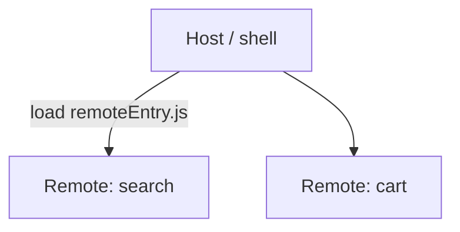
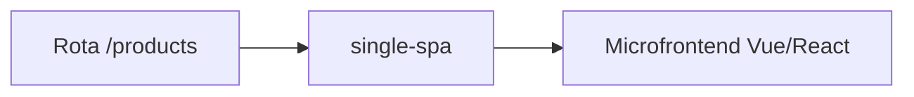

# Microfrontends — Module Federation e single-spa

## Introdução

**Micro frontends** dividem a UI por **domínio de negócio** (equipa A dona do *checkout*, equipa B do *catálogo*), com **deploy independente**. Duas abordagens comuns: **Module Federation** (Webpack 5 / Rspack / Vite plugin) carrega *remotes* em runtime; **single-spa** orquestra **MFEs** como aplicações montáveis por rota.



---

## Module Federation — ideia

O **host** expõe *shared* dependencies (React) e importa módulos do **remote** em tempo de execução.

```javascript
// webpack.config.js (host) — trecho ilustrativo
new ModuleFederationPlugin({
  name: "host",
  remotes: {
    search: "search@https://cdn.exemplo.com/search/remoteEntry.js",
  },
  shared: { react: { singleton: true }, "react-dom": { singleton: true } },
});
```

```tsx
// Host carrega componente remoto
const SearchApp = React.lazy(() => import("search/App"));
```

- **Versões alinhadas** de React entre host e remotes.
- **Contratos** de props e rotas documentados (OpenAPI para APIs, Storybook para UI).

---

## single-spa — registo de aplicações

```javascript
import { registerApplication, start } from "single-spa";

registerApplication({
  name: "@org/nav",
  app: () => System.import("@org/nav"),
  activeWhen: "/",
});

registerApplication({
  name: "@org/products",
  app: () => System.import("@org/products"),
  activeWhen: ["/products", "/products/:id"],
});

start();
```

Cada *microfrontend* pode ser **React**, **Vue** ou **Angular** — o *layout* raiz trata de *mount/unmount*.



---

## Desafios

| Tópico | Mitigação |
|--------|-----------|
| CSS em conflito | **Shadow DOM**, CSS Modules, *design system* |
| Estado partilhado | **URL**, *custom events*, store mínima ou BFF |
| Performance | *Code splitting*, lazy load de remotes |

---

## Referências

- [Module Federation — Webpack](https://webpack.js.org/concepts/module-federation/)
- [single-spa](https://single-spa.js.org/)

---

*Microfrontends resolvem **escala de equipas**; custam em **complexidade de build** e consistência UX.*
