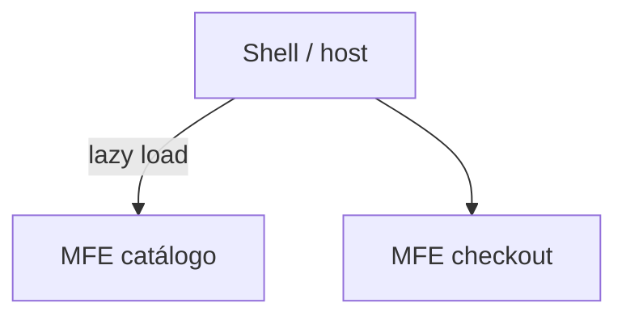

# Microfrontends — Module Federation, single-spa e operações

## Introdução

**Micro frontends** partem o *frontend* por **domínio** (checkout, conta, catálogo) para equipas autónomas. O preço é **complexidade de build**, **duplicação de dependências**, **CSS global**, e **navegação** entre MFEs.



---

## Problema real: duas versões de React no bundle

**Sintoma:** “Invalid hook call”; tamanho de JS duplicado.

**Causa:** *host* e *remote* embutem React sem **singleton shared**.

**Solução (Webpack MF):** `shared: { react: { singleton: true, requiredVersion: false } }` alinhado entre projetos; CI que valida **versões** no `package.json`.

Documentação: [Module Federation — Concept](https://webpack.js.org/concepts/module-federation/).

---

## Module Federation — contrato host ↔ remote

```javascript
// host/webpack.config.cjs (trecho)
new ModuleFederationPlugin({
  name: "host",
  remotes: {
    catalog: "catalog@https://cdn.exemplo.com/catalog/remoteEntry.js",
  },
  shared: {
    react: { singleton: true },
    "react-dom": { singleton: true },
  },
});
```

**Problema real:** *remoteEntry* em cache CDN antigo após deploy — versionar URL (`remoteEntry.v2.js`) ou usar **cache headers** controlados.

---

## single-spa — orquestração por rota

```javascript
import { registerApplication, start } from "single-spa";

registerApplication({
  name: "@org/nav",
  app: () => System.import("@org/nav"),
  activeWhen: "/",
});

registerApplication({
  name: "@org/billing",
  app: () => System.import("@org/billing"),
  activeWhen: (loc) => loc.pathname.startsWith("/billing"),
});

start();
```

**Caso real:** MFE em **Angular** e outro em **React** — single-spa monta/desmonta *lifecycle* de cada um; padronize **comunicação** via eventos customizados ou **URL** em vez de estado global partilhado frágil.

---

## CSS em conflito

| Estratégia | Prós / contras |
|------------|----------------|
| **CSS Modules / scoped (Vue/Svelte)** | Isola por build |
| **Shadow DOM** | Forte, mas styling de *design system* fica mais difícil |
| **Prefixo BEM** por MFE | Simples, exige disciplina |

**Problema real:** *global* `.btn` de dois MFEs — último ganha silenciosamente.

---

## Autenticação entre MFEs

**Problema real:** token só no *host*; *remote* precisa chamar API.

Padrões: **BFF** que emite cookie; **OAuth** + refresh no host; passar **claims** via *props* só se não forem sensíveis. Evitar `postMessage` com tokens sem origem verificada.

---

## Observabilidade

- **Sentry** com `release` por MFE para saber qual *remote* quebrou.
- **RUM** (Datadog, New Relic) com *tags* de rota e nome do MFE.

---

## Padrão inteligente: **detetar *version skew*** (shell vs *remote* desalinhados)

**Problema:** utilizador deixa tab aberta dias; faz *deploy* novo; *remote* antigo chama API incompatível.

**Solução:** expor `buildId` no *shell* (header HTTP ou *meta tag*) e cada *remote* compara com o seu próprio *build*; se diferir → *hard reload* ou *toast* “nova versão disponível”.

---

## Nível avançado: **Module Federation** (Vite / Rspack)

Ferramentas modernas suportam *federation* nativa — avaliar **Rspack** para builds mais rápidos em monorepos grandes.

- [Rspack — Module Federation](https://rspack.dev/guide/features/module-federation)

---

## Referências

- [Webpack — Module Federation](https://webpack.js.org/concepts/module-federation/)
- [single-spa](https://single-spa.js.org/docs/getting-started-overview)
- [Module Federation Examples (Vercel)](https://github.com/module-federation)
- [Martin Fowler — Micro frontends](https://martinfowler.com/articles/micro-frontends.html)
- [Thoughtworks Radar — Micro-frontends](https://www.thoughtworks.com/radar)
- [Rspack — Module Federation](https://rspack.dev/guide/features/module-federation)

---

*Microfrontends resolvem **autonomia de equipa**; não resolvem **modelo de domínio** mal desenhado.*
