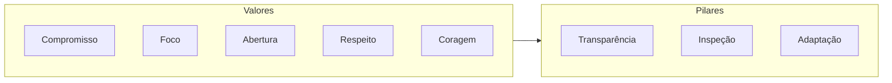
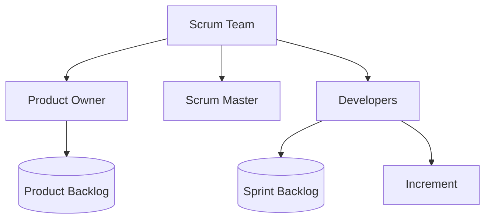
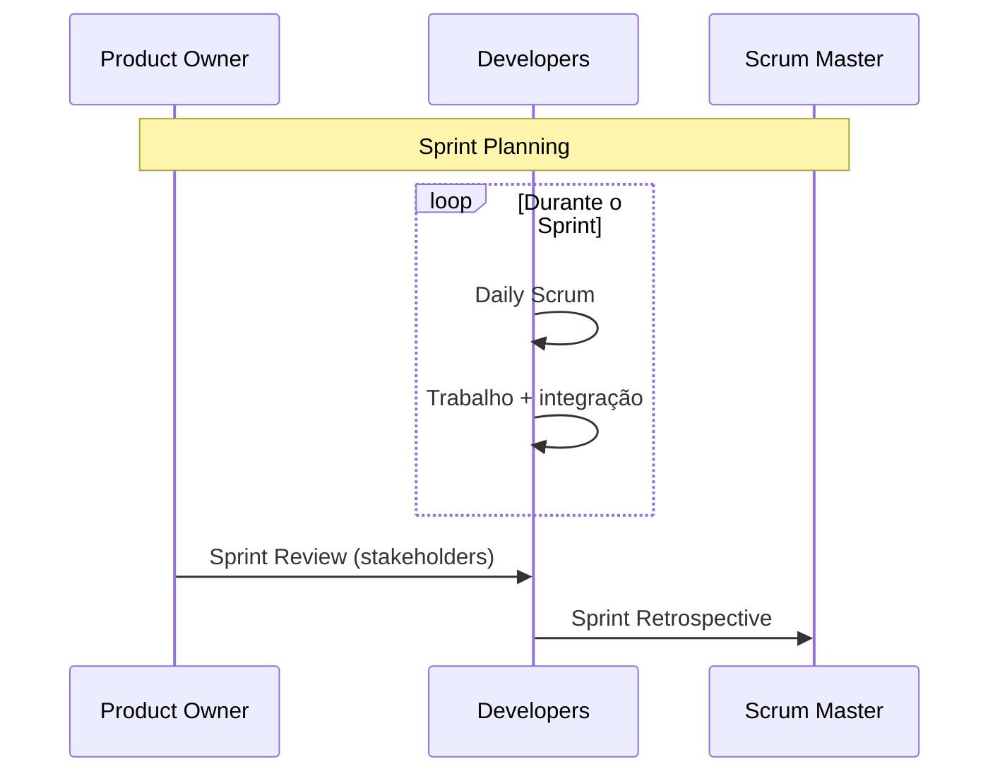
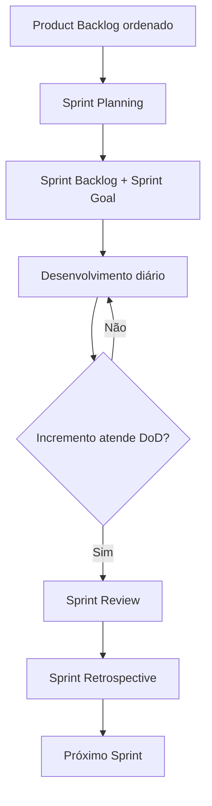

# Scrum — framework ágil para produtos complexos

## Introdução

O **Scrum** é um framework leve para desenvolver, entregar e sustentar **produtos complexos** por meio de trabalho colaborativo, inspeção frequente e adaptação. Não é uma metodologia prescritiva completa: define papéis mínimos, eventos com time-box e artefatos com compromissos explícitos, deixando técnicas de engenharia à escolha do time.

Este artigo resume o modelo mental do Scrum (2020), relações entre eventos e artefatos, métricas comuns e como espelhar conceitos em software — útil para times que automatizam quadros, backlogs e relatórios de sprint.

---

## Valores e pilares

Os **valores** do Scrum são: compromisso, foco, abertura, respeito e coragem. Eles sustentam três **pilares**:

| Pilar | Significado na prática |
|--------|-------------------------|
| **Transparência** | Estado do trabalho e decisões visíveis para quem precisa inspecionar |
| **Inspeção** | Artefatos e progresso revisados com frequência suficiente para detectar desvios |
| **Adaptação** | Ajustes no processo ou no trabalho quando inspeção mostra que limites foram ultrapassados |



---

## Papéis (accountabilities)

No Scrum 2020 existem **três accountabilities** no Scrum Team (sem sub-equipes obrigatórias):

1. **Developers** — quem cria o incremento a cada Sprint; responsáveis pela qualidade, o plano do Sprint e o Daily Scrum.
2. **Product Owner** — maximiza o valor do produto; gerencia o Product Backlog (ordenação, clareza, transparência).
3. **Scrum Master** — estabelece Scrum como definido no Guia; remove impedimentos organizacionais e ajuda o time e a organização a melhorar.



---

## Eventos (time-box)

Todos os eventos são **time-boxed**; a ausência de um evento indica que Scrum não está sendo usado integralmente.

| Evento | Time-box típico | Propósito |
|--------|-----------------|-----------|
| **Sprint** | ≤ 1 mês | Container onde tudo acontece; gera um incremento útil |
| **Sprint Planning** | até 8 h (Sprint de 1 mês); proporcional se menor | Por quê, o quê e como do Sprint |
| **Daily Scrum** | 15 min | Inspecionar progresso em direção à Sprint Goal; adaptar o plano |
| **Sprint Review** | até 4 h (Sprint de 1 mês) | Inspecionar incremento e adaptar backlog |
| **Sprint Retrospective** | até 3 h (Sprint de 1 mês) | Melhorar qualidade e efetividade do time |



---

## Artefatos e compromissos

| Artefato | Compromisso associado |
|----------|------------------------|
| **Product Backlog** | **Product Goal** — meta de longo prazo para o produto |
| **Sprint Backlog** | **Sprint Goal** — meta única do Sprint |
| **Increment** | **Definition of Done** — critério de qualidade comum ao incremento |

O **Increment** deve estar na condição **Done** e ser **utilizável**; múltiplos commits podem existir, mas o incremento é a soma de tudo que atende à DoD ao fim do Sprint.

---

## Fluxo resumido de um Sprint



---

## Métricas comuns (não prescritas pelo Guia)

O Guia não obriga métricas, mas times frequentemente usam:

- **Velocity** (itens ou story points concluídos por Sprint) — apenas para planejamento interno, não como meta de produtividade.
- **Burndown / Burnup** — visão de trabalho restante vs tempo.
- **Lead time e cycle time** — quando combinados com Kanban no mesmo time.

Evite usar velocity como **KPI individual** ou meta fixa: incentiva cortar qualidade e distorce estimativas.

---

## Scrum e Kanban

Times Scrum podem usar um **quadro Kanban** dentro do Sprint (WIP limits, fluxo contínuo) sem deixar de respeitar time-box, Sprint Goal e Definition of Done. O [Kanban Guide for Scrum Teams](https://scrum.org/resources/kanban-guide-scrum-teams) descreve essa integração.

---

## Exemplos de código — modelo mínimo de Sprint e item

Os trechos abaixo são **ilustrativos**: modelam estado de sprint e backlog para APIs ou relatórios, sem acoplamento a uma ferramenta específica (Jira, Azure DevOps, etc.).

### Java — Spring Boot

```java
public enum SprintStatus { PLANNED, ACTIVE, COMPLETED }

public record Sprint(
    String id,
    String sprintGoal,
    SprintStatus status,
    LocalDate start,
    LocalDate end
) {}

public record BacklogItem(
    String id,
    String title,
    int order,
    boolean meetsDefinitionOfDone
) {}
```

### C#

```csharp
public enum SprintStatus { Planned, Active, Completed }

public record Sprint(
    string Id,
    string SprintGoal,
    SprintStatus Status,
    DateOnly Start,
    DateOnly End
);

public record BacklogItem(
    string Id,
    string Title,
    int Order,
    bool MeetsDefinitionOfDone
);
```

### JavaScript

```javascript
/** @typedef {'PLANNED'|'ACTIVE'|'COMPLETED'} SprintStatus */

/**
 * @param {{ id: string, sprintGoal: string, status: SprintStatus, start: string, end: string }} sprint
 */
function isSprintActive(sprint) {
  return sprint.status === "ACTIVE";
}

const sprint = {
  id: "sprint-42",
  sprintGoal: "Checkout com PIX estável em homologação",
  status: "ACTIVE",
  start: "2025-03-01",
  end: "2025-03-14",
};
```

### Python

```python
from dataclasses import dataclass
from enum import Enum
from datetime import date


class SprintStatus(Enum):
    PLANNED = "planned"
    ACTIVE = "active"
    COMPLETED = "completed"


@dataclass(frozen=True)
class Sprint:
    id: str
    sprint_goal: str
    status: SprintStatus
    start: date
    end: date


def increment_ready_for_review(items: list[tuple[str, bool]]) -> bool:
    """Todos os itens planejados para o incremento atendem à DoD."""
    return all(done for _, done in items)
```

---

## Product Backlog refinement

O **refinement** (ou grooming, termo legado) não é um evento formal no Guia, mas é uma atividade contínua em que Developers e Product Owner **detalham, ordenam e estimam** itens futuros. Objetivos típicos:

- Itens no topo do backlog estão **prontos para entrar** em um Sprint Planning (clareza suficiente para discussão de “como”).
- Dependências e riscos aparecem cedo, reduzindo surpresas no planning.
- A ordenação reflete **valor, risco, aprendizado** e restrições (compliance, datas legais).

Boas práticas: time-boxar o refinement (ex.: 1–2 h por semana) para não competir com o trabalho do Sprint; envolver quem realmente implementará.

---

## Escalamento (nota breve)

O Guia descreve um **único** Scrum Team. Em múltiplos times no mesmo produto, frameworks como **Nexus**, **LeSS** ou **SAFe** propõem camadas de coordenação (integração, backlog unificado, eventos de alinhamento). O ponto comum é preservar **um Product Backlog por produto** e **um incremento integrado** por Sprint — a solução exata varia com tamanho e cultura organizacional.

---

## Checklist de transparência para o incremento

| Pergunta | Por que importa |
|----------|-----------------|
| O incremento está em ambiente acessível aos stakeholders? | Inspeção real na Review |
| A build é reproduzível e versionada? | Auditoria e rollback |
| Testes automatizados cobrem a DoD acordada? | Confiança na “Done” |
| Documentação mínima de uso/API foi atualizada? | Reduz suporte e retrabalho |

---

## Erros frequentes

- **Scrum Master como “gerente de tarefas”** ou único removedor de impedimentos operacionais do dia a dia — o papel é facilitar o uso do Scrum e a melhoria organizacional.
- **Sprint como entrega fechada sem incremento utilizável** — quebra o princípio de transparência e inspeção real.
- **Product Owner inacessível** — gera retrabalho e decisões ad hoc pelos desenvolvedores.
- **Daily como status report só para liderança** — o evento é para o time replanejar o trabalho.

---

## Glossário rápido

| Termo | Lembrete |
|-------|----------|
| **Increment** | Soma de tudo “Done” no Sprint; pode incluir trabalhos anteriores ainda utilizáveis |
| **Sprint Backlog** | Planos + itens selecionados + meta; é propriedade dos Developers |
| **Stakeholder** | Pessoas com interesse no produto; participam da Review conforme convite do PO |

---

## Referências

- Schwaber, K. & Sutherland, J. *The Scrum Guide* (2020). https://scrumguides.org/
- Scrum.org — recursos e formação sobre Scrum e Kanban com Scrum.

---

*Última revisão conceitual: alinhada ao Scrum Guide 2020. Ajuste time-boxes e políticas à realidade regulatória e contratual da sua organização.*
