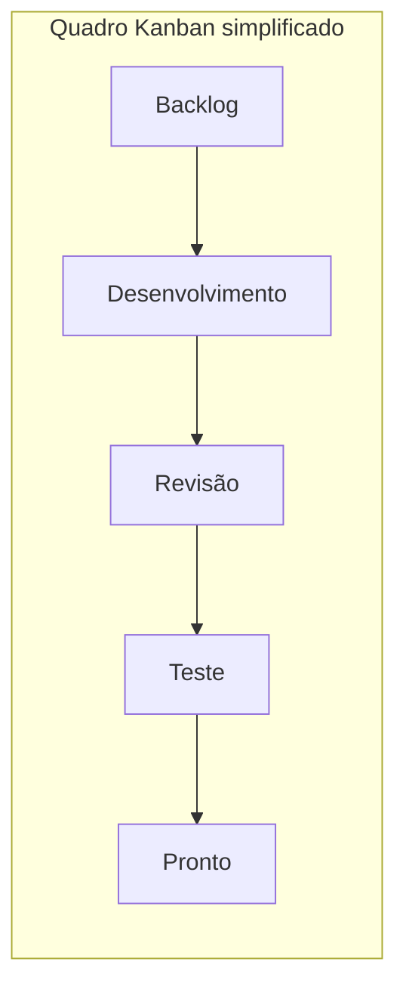
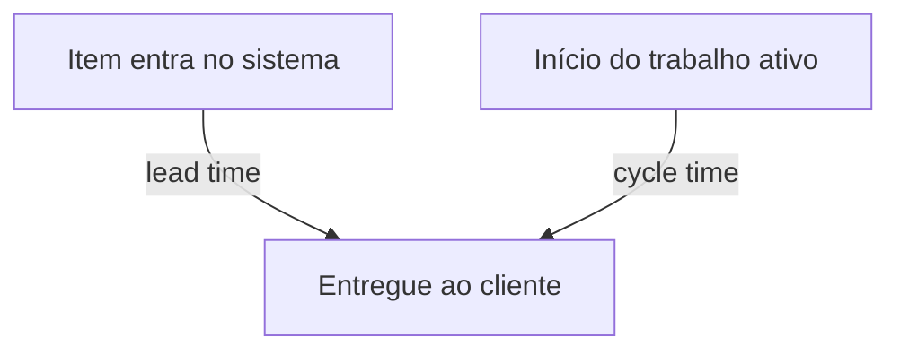
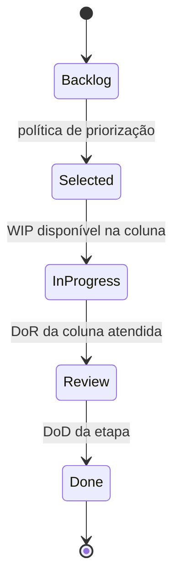
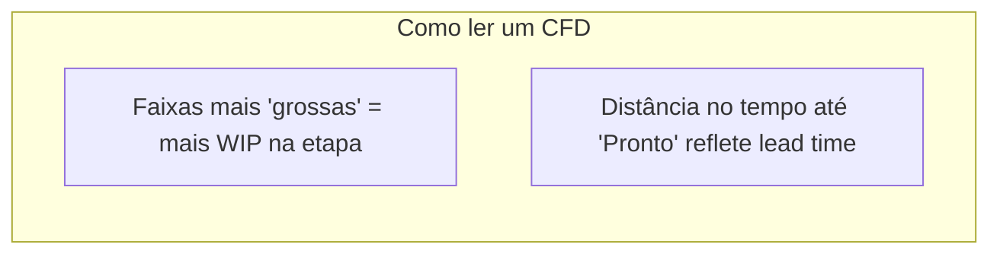

# Kanban — fluxo, WIP e melhoria contínua

## Introdução

**Kanban** (看板, “cartão visual”) é um método para melhorar o fluxo de trabalho por meio de **visualização**, **limitação de trabalho em progresso (WIP)** e **políticas explícitas**. Diferente de um framework com time-box fixo como o Scrum, Kanban enfatiza **fluxo contínuo** e **cadência opcional** de planejamento e entrega.

Historicamente associado à manufatura (Toyota Production System), o Kanban em desenvolvimento de software apareceu com David J. Anderson e a comunidade Kanban Method; hoje convive com Scrum em muitos produtos digitais.

---

## Princípios centrais

1. **Começar com o que você faz agora** — não exige reestruturação radical inicial.
2. **Concordar em buscar mudanças evolucionárias** — pequenos experimentos.
3. **Respeitar processos, papéis e responsabilidades atuais** — evoluir a partir do contexto.
4. **Encorajar liderança em todos os níveis** — melhoria não é só “da gestão”.

Na prática de quadro digital ou físico:

- Cada item de trabalho é um **cartão** que atravessa **colunas** que representam etapas do fluxo de valor.
- **WIP limits** nas colunas (ou por swimlane) impedem acúmulo e expõem gargalos.



---

## Métricas: lead time e cycle time

| Métrica | Definição típica |
|---------|-------------------|
| **Lead time** | Tempo desde o pedido do cliente (ou entrada no sistema) até a entrega ao cliente |
| **Cycle time** | Tempo em que o item esteve **ativamente** em processamento (às vezes do “em desenvolvimento” até “pronto”) |

Equipes estáveis usam **histogramas** e **percentis** (p50, p85, p95) para previsibilidade, não apenas médias — caudas longas são comuns em software.



---

## Classes de serviço (service classes)

Itens com urgências diferentes competem pelo mesmo time sem políticas claras geram **filas imprevisíveis**. Classes de serviço comuns:

- **Expedite** — capacidade reservada; uso raro e visível.
- **Fixed delivery date** — compromisso com data.
- **Standard** — fluxo regular.
- **Intangible** — dívida técnica ou refatoração que reduz custo futuro.

Cada classe pode ter **WIP**, **políticas de pull** e **SLAs** distintos.

---

## Pull system e políticas explícitas

Em **pull**, a próxima etapa “puxa” trabalho quando tem capacidade — em contraste com **push**, onde trabalho é empilhado sem limite. Políticas explícitas respondem perguntas como:

- O que significa “Pronto” em cada coluna?
- Quem pode mover o cartão?
- O que acontece quando WIP está no limite?



---

## Kanban vs Scrum (visão prática)

| Aspecto | Scrum | Kanban |
|---------|-------|--------|
| Ritmo | Sprint com time-box | Fluxo contínuo; cadências opcionais |
| Papéis | PO, SM, Developers (no Guia) | Não prescrito pelo método Kanban |
| Mudança no Sprint | Evitar mudança de escopo comprometido | Mudanças podem entrar conforme política |
| Métricas fortes | Increment, Sprint Goal | Fluxo, WIP, lead/cycle time |

Muitos times usam **Scrum com Kanban** (quadro + WIP dentro do Sprint), alinhado ao guia da Scrum.org.

---

## Exemplos de código — WIP, validação e métricas

### Java — Spring Boot (validação de limite por coluna)

```java
public final class ColumnPolicy {
  private final String name;
  private final int wipLimit;

  public ColumnPolicy(String name, int wipLimit) {
    if (wipLimit < 1) throw new IllegalArgumentException("WIP >= 1");
    this.name = name;
    this.wipLimit = wipLimit;
  }

  public boolean canPull(int currentWip) {
    return currentWip < wipLimit;
  }
}
```

### C# — regra de throughput aproximado (Little’s Law ilustrativo)

```csharp
// L ≈ λ × W  (WIP médio ≈ throughput × tempo médio no sistema) — uso pedagógico
public static double ApproximateAvgWip(double throughputPerDay, double avgLeadTimeDays)
    => throughputPerDay * avgLeadTimeDays;
```

### JavaScript — simulação simples de tempos de ciclo

```javascript
function percentile(sortedAsc, p) {
  if (sortedAsc.length === 0) return null;
  const idx = Math.ceil((p / 100) * sortedAsc.length) - 1;
  return sortedAsc[Math.max(0, idx)];
}

const cycleTimesHours = [2, 3, 4, 5, 8, 12, 24];
cycleTimesHours.sort((a, b) => a - b);
console.log("p85 cycle (h):", percentile(cycleTimesHours, 85));
```

### Python — registro de eventos para cálculo de lead time

```python
from dataclasses import dataclass
from datetime import datetime, timezone


@dataclass
class FlowEvent:
    item_id: str
    column: str
    at: datetime


def lead_time_hours(created: datetime, delivered: datetime) -> float:
    return (delivered - created).total_seconds() / 3600


# Exemplo: UTC explícito evita bugs em servidores multi-região
t0 = datetime(2025, 3, 1, 9, 0, tzinfo=timezone.utc)
t1 = datetime(2025, 3, 5, 17, 30, tzinfo=timezone.utc)
print(round(lead_time_hours(t0, t1), 2))
```

---

## Diagrama cumulativo de fluxo (CFD)

O **CFD** empilha, ao longo do tempo, a quantidade de itens em cada coluna. Visualmente:

- **Largura vertical** entre curvas ≈ WIP naquela etapa.
- **Inclinação** das fronteiras ≈ throughput relativo.
- **Distância** entre “entrada” e “pronto” ao longo do eixo temporal ≈ lead time médio (interpretação simplificada).



*Nota:* em Jira, Azure Boards ou ActionableAgile o CFD é gerado a partir do **histórico de transições** entre colunas — não confunda com burnup de escopo.

---

## Evolução do processo (Kaizen no quadro)

Experimentos saudáveis em Kanban:

1. **Hipótese** — ex.: “Reduzir WIP em Teste de 5 para 3 diminui lead time p85 em 15% em 4 semanas.”
2. **Métrica** — lead time por item, antes/depois.
3. **Janela** — tempo fixo de observação.
4. **Decisão** — manter, reverter ou ajustar política.

Documente políticas no próprio quadro ou wiki ligada ao cartão “como trabalhamos aqui”.

---

## Boas práticas operacionais

- **Limitar WIP antes de “otimizar velocidade”** — sem limite, o sistema mascara atrasos.
- **Revisar o quadro em cadência fixa** (replenishment / stand-up focado em fluxo) — não confundir com relatório hierárquico.
- **Swimlanes** por time, cliente ou risco — desde que não escondam WIP global indevidamente.
- **Mapear valor fim a fim** — colunas devem refletir o fluxo real, não só “To Do / Doing / Done” genérico se isso obscurecer gargalos.

---

## Referências

- Anderson, D. J. *Kanban: Successful Evolutionary Change for Your Technology Business*.
- [Kanban Guide for Scrum Teams](https://scrum.org/resources/kanban-guide-scrum-teams) — Scrum.org.
- Poppendieck, M. & T. *Lean Software Development* — fundamentos de fluxo e desperdício.

---

*Kanban é método de melhoria contínua: métricas e limites devem ser ajustados com base em dados do seu contexto, não em benchmarks genéricos de mercado.*
