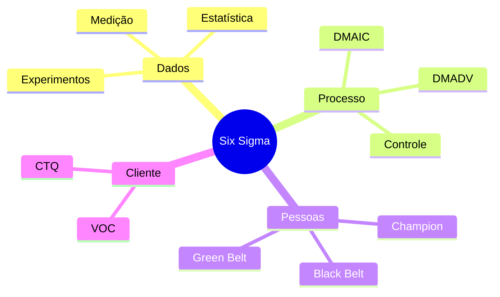
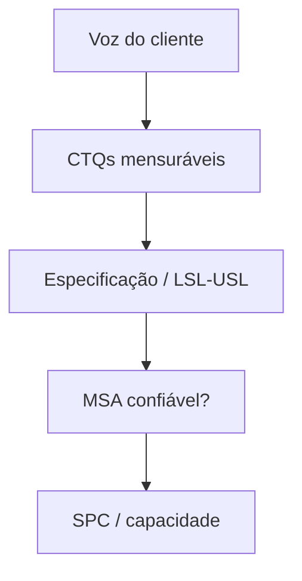

# Six Sigma — redução de variação e melhoria de processos

## Introdução

**Six Sigma** é um conjunto disciplinado de técnicas e papéis voltados a **reduzir defeitos e variação** em processos, usando abordagem **orientada a dados** e **DMAIC** (ou **DMADV** para novos produtos/processos). O nome refere-se ao objetivo estatístico de processos com capacidade tal que a taxa de defeitos seja extremamente baixa (da ordem de 3,4 DPMO em modelos clássicos sob certas premissas).

Em TI e desenvolvimento de software, Six Sigma aparece em **processos repetitivos** (suporte N2/N3, operações de release, data pipelines industriais), muitas vezes **combinado** com Lean (Lean Six Sigma) para eliminar desperdício **e** variação.

---

## Filosofia em uma frase

> Entender a **voz do cliente (VOC)** e a **voz do processo (VOP)**; medir o gap; reduzir variação com experimentos controlados; **sustentar** ganhos com controles estatísticos e governança.



---

## DMAIC — melhoria de processo existente

| Fase | Foco | Entregáveis típicos |
|------|------|---------------------|
| **D**efine | Problema, escopo, VOC, CTQs | Project charter, SIPOC |
| **M**easure | Baseline, sistema de medição | MSA, run charts |
| **A**nalyze | Causas raiz | Ishikawa, hipóteses, ANOVA (quando aplicável) |
| **I**mprove | Soluções e pilotos | DOE, otimização de parâmetros |
| **C**ontrol | Sustentação | SPC, planos de reação, documentação |


---

## DMADV (DFSS) — novo processo ou produto

Usado quando **não basta** melhorar o atual — ex.: novo canal de atendimento, nova linha de produção, novo produto com requisitos de qualidade rígidos.

| Fase | Equivalente conceitual |
|------|-------------------------|
| **D**efine | Metas alinhadas ao negócio e ao cliente |
| **M**easure | CTQs e especificações mensuráveis |
| **A**nalyze | Alternativas de conceito |
| **D**esign | Projeto detalhado e prototipagem |
| **V**erify | Validação em piloto e lançamento controlado |

---

## Papéis (visão corporativa típica)

| Papel | Papel aproximado |
|-------|------------------|
| **Executive / Champion** | Patrocínio, recursos, remoção de barreiras políticas |
| **Master Black Belt** | Mentoria técnica, metodologia, portfólio de projetos |
| **Black Belt** | Lidera projetos em tempo integral (em muitas empresas) |
| **Green Belt** | Contribui em projetos mantendo função operacional |
| **Yellow Belt** | Consciência e apoio em melhorias locais |

*Nota:* títulos e estruturas variam por empresa e certificador (ASQ, IASSC, etc.).

---

## DPMO e níveis Sigma (referência clássica)

**DPMO** = defeitos por milhão de oportunidades. Útil quando o processo tem muitas oportunidades de erro por unidade.

**Fórmula:** `DPMO = (Defeitos / (Unidades × Oportunidades por unidade)) × 1.000.000`

Tabelas de “sigma” em livros didáticos frequentemente assumem **desvio de 1,5σ** de longo prazo e processo centrado — use como **referência de mercado**, não como substituto de análise de capacidade real ($C_p$, $C_{pk}$) no seu processo.

| Sigma (referência didática) | DPMO aproximado |
|----------------------------|-----------------|
| 3σ | ~66 800 |
| 4σ | ~6 200 |
| 5σ | ~233 |
| 6σ | ~3,4 |

---

## Ferramentas frequentes

- **SIPOC** — fornecedores, entradas, processo, saídas, clientes.
- **Diagrama de Ishikawa** — causas agrupadas (6M: método, máquina, material, mão de obra, medição, meio ambiente).
- **SPC** — cartas de controle (Xbar-R, p, c) para distinguir variação **comum** de **especial**.
- **DOE** — experimentos fatoriais para interações entre parâmetros.



---

## Six Sigma e desenvolvimento ágil

Não são excludentes, mas **foco** difere:

- **Ágil** — adaptação rápida, entrega incremental, colaboração com cliente em ciclos curtos.
- **Six Sigma** — rigor estatístico, redução de variação, projetos com fases formais.

Combinações comuns: usar **DMAIC** em **pipelines de build/release** ou **centrais de suporte** enquanto o produto evolui em **Sprints**; **Lean** elimina filas e espera enquanto Six Sigma ataca **causa raiz** de recorrência.

---

## Exemplos de código — DPMO e notas estatísticas

### Python

```python
def dpmo(defects: int, units: int, opportunities_per_unit: int) -> float:
    if units <= 0 or opportunities_per_unit <= 0:
        raise ValueError("units e opportunities devem ser positivos")
    denom = units * opportunities_per_unit
    return (defects / denom) * 1_000_000


print(dpmo(defects=12, units=1000, opportunities_per_unit=5))  # 2400.0 DPMO
```

### C#

```csharp
public static double Dpmo(long defects, long units, long opportunitiesPerUnit)
{
    if (units <= 0 || opportunitiesPerUnit <= 0)
        throw new ArgumentOutOfRangeException();
    return defects * 1_000_000d / (units * opportunitiesPerUnit);
}
```

### Java (Spring Boot — endpoint ilustrativo)

```java
@RestController
@RequestMapping("/api/quality")
public class QualityController {

  @GetMapping("/dpmo")
  public Map<String, Double> dpmo(
      @RequestParam long defects,
      @RequestParam long units,
      @RequestParam long opportunitiesPerUnit) {
    if (units <= 0 || opportunitiesPerUnit <= 0)
      throw new IllegalArgumentException("Parâmetros inválidos");
    double v = defects * 1_000_000.0 / (units * opportunitiesPerUnit);
    return Map.of("dpmo", v);
  }
}
```

### JavaScript

```javascript
export function dpmo(defects, units, opportunitiesPerUnit) {
  if (units < 1 || opportunitiesPerUnit < 1) {
    throw new RangeError("units e opportunities devem ser >= 1");
  }
  return (defects / (units * opportunitiesPerUnit)) * 1e6;
}
```

---

## Cartas de controle (SPC) — intuição

**Cartas de controle** distinguem variação **comum** (inerente ao processo) de variação **especial** (causa atribuível: mudança de ferramenta, turno novo, release que alterou comportamento). Regras clássicas (Western Electric) marcam pontos fora de limites de controle ou sequências tendenciosas. Em **DevOps**, métricas como **taxa de falha de deploy** ou **MTTR** podem ser acompanhadas com o mesmo espírito: reagir a **sinais**, não a cada oscilação aleatória.

Tipos comuns: cartas **Xbar-R** (variáveis contínuas), **p** (fração defeituosa), **c** (contagem de defeitos por unidade fixa). A escolha depende do tipo de dado e do tamanho de subgrupo.

---

## Charter de projeto Six Sigma (esqueleto)

| Campo | Conteúdo |
|-------|----------|
| Problema | O que dói, em linguagem do cliente |
| Objetivo | Meta mensurável (ex.: reduzir retrabalho em X%) |
| Escopo | Onde o projeto começa e termina no fluxo |
| Time | Sponsor, BB/GB, dono do processo |
| Cronograma | Marcos de fase DMAIC |
| Benefício | Estimativa financeira ou operacional |

---

## Armadilhas em contextos de software

- **Forçar DMAIC em descoberta de produto** — discovery beneficia mais de experimentação lean/ágil que de controle estatístico pesado.
- **Medir sem MSA** — métricas de “qualidade de código” ou “bugs” sem definição operacional estável geram decisões erradas.
- **Otimizar sub-processo local** — melhorar uma etapa pode **piorar o sistema** (síndrome do otimizador local); use mapa de valor fim a fim.

---

## Referências

- Pyzdek, T. & Keller, P. *The Six Sigma Handbook*.
- ASQ — corpo de conhecimento e recursos sobre Six Sigma e qualidade.
- George, M. L. *Lean Six Sigma* — integração Lean + Six Sigma.

---

*Six Sigma exige dados confiáveis e alinhamento com estratégia; certificações validam estudo, mas competência se demonstra em projetos reais com resultados sustentados no controle.*
