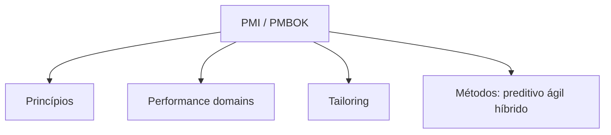
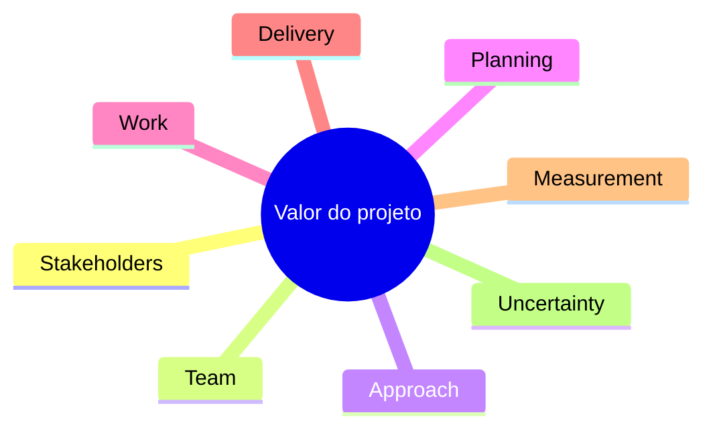
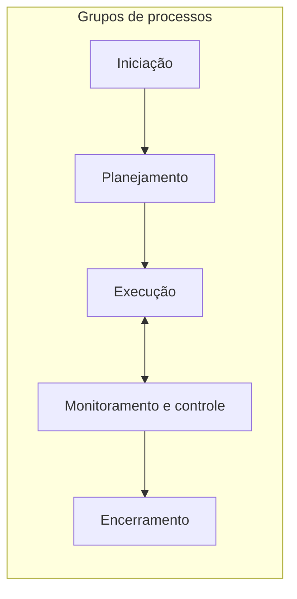

# PMI e PMBOK — gestão de projetos e performance domains

## Introdução

O **Project Management Institute (PMI)** é uma organização profissional que publica padrões, práticas e certificações (como **PMP** e **CAPM**). O **PMBOK Guide** (*A Guide to the Project Management Body of Knowledge*) é um dos documentos de referência mais usados para **gestão de projetos**, hoje organizado em torno de **domínios de desempenho** e **princípios**, especialmente a partir da **7ª edição** (2021), que complementa — sem apagar — a visão por **grupos de processos** e **áreas de conhecimento** das edições anteriores.

Este artigo posiciona o PMBOK como **corpo de conhecimento** a ser **tailored** (adaptado) ao contexto (predativo, ágil, híbrido), útil para líderes técnicos que negociam escopo, risco e stakeholders com PMs e negócio.



---

## Princípios (PMBOK 7 — visão geral)

A 7ª edição enfatiza **12 princípios**, entre eles: stewardship, colaboração, stakeholders, valor, adaptabilidade, qualidade, complexidade, oportunidade/risco, liderança, comportamento, customização (tailoring) e integridade. A ideia é que **princípios** guiam decisões quando não há receita única.

---

## Domínios de desempenho (Performance domains)

Os **domínios** descrevem áreas de atuação que, bem conduzidas, aumentam a probabilidade de entregar **valor**. Exemplos de domínios na linha PMBOK 7 (nomenclatura pode variar ligeiramente por tradução):

| Domínio | Foco resumido |
|---------|----------------|
| **Stakeholders** | Identificar, analisar e engajar partes interessadas |
| **Team** | Cultura, competências, liderança e acordos de trabalho |
| **Development approach** | Preditivo, iterativo, incremental, ágil, híbrido — escolha e ajuste |
| **Planning** | Planos com nível adequado de detalhe ao ambiente |
| **Project work** | Execução, integração do trabalho e aprendizado |
| **Delivery** | Entrega de valor e benefícios |
| **Measurement** | Métricas, KPIs e evidências para decisão |
| **Uncertainty** | Riscos e incertezas (oportunidades e ameaças) |



---

## Edições 6 vs 7 — como navegar

| Aspecto | PMBOK 6 (e anteriores) | PMBOK 7 |
|---------|-------------------------|---------|
| Estrutura forte | 10 áreas de conhecimento × 5 grupos de processos | Princípios + domínios de desempenho |
| ITTOs | Entradas, ferramentas, saídas por processo | Menos prescritivo; referencia práticas em anexos/modelos |
| Uso típico | WBS, cronograma, EVM em projetos preditivos | Tailoring explícito; integração com Agile Practice Guide |

Para certificações e operações corporativas, muitas empresas ainda mapeiam **processos** da 6ª edição em **templates** internos; a 7ª orienta **pensamento sistêmico** e **valor**, não substitui a necessidade de ferramentas de planejamento onde o projeto exige.

---

## Áreas de conhecimento (PMBOK 6 — mapa de estudo)

Referência clássica ainda muito cobrada e usada em documentação:

1. Integração  
2. Escopo  
3. Cronograma (tempo)  
4. Custos  
5. Qualidade  
6. Recursos  
7. Comunicações  
8. Riscos  
9. Aquisições  
10. Stakeholders  

Os **grupos de processos** são: Iniciação, Planejamento, Execução, Monitoramento e Controle, Encerramento.



---

## WBS e caminho crítico (visão preditiva)

A **WBS** (Estrutura Analítica do Projeto) decompõe entregáveis em pacotes de trabalho **mutuamente exclusivos** e **somados ao todo** — evita dupla contagem e facilita estimativa. O **caminho crítico** é a sequência de atividades que determina a **duração mínima** do projeto; atrasos nele atrasam o fim; folgas em atividades fora do caminho crítico absorvem algum deslize. Em projetos ágeis, “WBS” aparece como **épicos → features → histórias**, e o “crítico” é frequentemente **dependência entre times** e **integração**, não só uma rede CPM desenhada no início.

---

## Valor agregado (EVM) — leitura mínima

**EVM** integra escopo, cronograma e custo: **PV** (valor planejado), **EV** (valor agregado — trabalho realmente concluído no valor orçado), **AC** (custo real). Índices como **CPI** (`EV/AC`) e **SPI** (`EV/PV`) ajudam a detectar desvio cedo. Em contextos ágeis, o mapeamento de histórias para valor planejado exige **disciplina de baseline**; sem isso, EVM vira teatro. Use quando contrato ou PMO exigem controle formal; combine com **burndown** do Sprint para dupla visão operacional e de portfólio.

---

## Tailoring (customização)

**Tailoring** é a seleção de abordagem, processos, artefatos e ciclo de vida adequados ao projeto. Fatores comuns:

- Incerteza de requisitos e tecnologia  
- Regulamentação e auditoria  
- Tamanho e distribuição geográfica do time  
- Cultura organizacional e maturidade em ágil  

Projetos de software frequentemente combinam: **roadmap trimestral** (preditivo leve) + **Sprints** (ágil) + **contratos** com marcos de aceite (híbrido).

---

## Papel do tech lead em relação ao PM

| Situação | Colaboração sugerida |
|----------|----------------------|
| Refino de escopo técnico | WBS ou backlog epics alinhados a entregáveis |
| Riscos técnicos | Registro no risk register; probabilidade/impacto honestos |
| Dependências entre times | Matriz RACI ou acordos em PI planning |
| Mudança de requisitos | Processo de change control ou gestão de backlog com PO |

---

## Exemplos de código — modelos mínimos para registro (API / serviços)

Os exemplos modelam **entidades** comuns em ferramentas de gestão de projeto (simplificadas).

### C#

```csharp
public enum RiskCategory { Technical, Schedule, Budget, External }

public record RiskItem(
    string Id,
    string Title,
    RiskCategory Category,
    int Probability1to5,
    int Impact1to5
)
{
    public int Score => Probability1to5 * Impact1to5;
}
```

### Java — Spring Boot

```java
public record RiskItemDto(
    String id,
    String title,
    String category,
    int probability,
    int impact
) {
  public int score() {
    return probability * impact;
  }
}
```

### Python

```python
from dataclasses import dataclass
from enum import Enum


class IssueStatus(Enum):
    OPEN = "open"
    IN_PROGRESS = "in_progress"
    CLOSED = "closed"


@dataclass
class ProjectIssue:
    key: str
    summary: str
    status: IssueStatus


def blocked_issues(issues: list[ProjectIssue]) -> list[ProjectIssue]:
    return [i for i in issues if i.status != IssueStatus.CLOSED]
```

### JavaScript

```javascript
/**
 * @param {{ workPackages: { id: string, estimateHours: number }[] }} wbs
 */
function totalHours(wbs) {
  return wbs.workPackages.reduce((s, w) => s + w.estimateHours, 0);
}

const wbs = {
  workPackages: [
    { id: "1.1", estimateHours: 40 },
    { id: "1.2", estimateHours: 16 },
  ],
};
console.log(totalHours(wbs)); // 56
```

---

## Agile Practice Guide (PMI)

Publicação complementar que descreve **mindset ágil**, frameworks (Scrum, Kanban, XP em referência), **contratos ágeis** e governança. Útil para argumentar **híbrido** com áreas de compliance que ainda pedem baseline de escopo/cronograma.

---

## Referências

- PMI. *A Guide to the Project Management Body of Knowledge (PMBOK Guide)* — 7th ed.
- PMI. *Agile Practice Guide*.
- PMIstandards+ e materiais oficiais para atualização de certificação.

---

*PMBOK descreve o “o quê” e “por quê” da boa gestão de projetos; o “como” detalhado depende da organização, da indústria e do ciclo de vida escolhido — sempre com tailoring explícito.*
