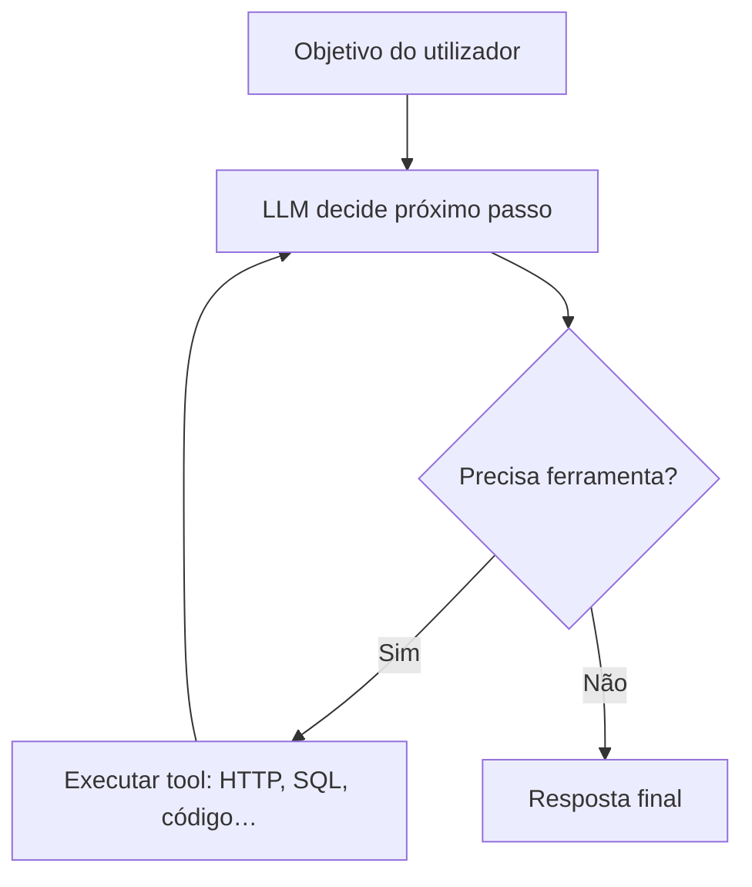

# Construção de agentes de IA

**Agente** (neste contexto) é um programa que usa um **modelo** para **planear**, **invocar ferramentas** (APIs, BD, código) e **iterar** até cumprir um objetivo — ao contrário de um único *completion* estático.

---

## Loop observe → plan → act

**Riscos:** *tool sprawl* (demasiadas funções mal descritas), **alucinação** de parâmetros de API, **custos** e **latência** por voltas ao modelo.

---

## Ferramentas (*tools* / function calling)

O modelo não “chama” HTTP diretamente: o **runtime** regista funções com **nome, descrição e JSON Schema** dos argumentos; o modelo devolve algo como `tool_calls`; o teu código executa e devolve **observação** ao modelo na próxima mensagem.

Boas práticas:

- Descrições **precisas** (“usa `city` ISO, não nome completo”).
- Validar argumentos com **schema** antes de executar (segurança).
- Limitar **tempo** e **escopo** de cada ferramenta (read-only quando possível).

---

## Planeamento simples vs *ReAct*-like

- **Um passo:** “Escolhe uma ferramenta ou responde.”
- **Varios passos:** Mantém histórico curto (*scratchpad*) com observações para não repetir erros.

---

## Memória

| Tipo | Uso |
|------|-----|
| **Curta** (*context window*) | Histórico da sessão atual |
| **Longa** | Vetores + BD, resumos, ou store chave-valor por `user_id` |

Sem política de **TTL** e **privacidade**, agentes gravem dados que não deviam.

---

## Segurança

- **Prompt injection:** texto malicioso no input ou em documentos RAG pode tentar sobrescrever instruções — mitigar com **camadas** (sandbox, permissões por role, não expor secrets ao modelo).
- **Autonomia:** limitar rounds máximos e ações por minuto.

---

## Referências

- [Anthropic — Tool use](https://docs.anthropic.com/en/docs/build-with-claude/tool-use)
- [LangGraph — durable agents](https://langchain-ai.github.io/langgraph/) (padrões de grafo para fluxos multi-passo)

---

*Agente útil = **modelo bom** + **ferramentas bem desenhadas** + **guardrails** — não adicionar ferramentas sem observabilidade.*
