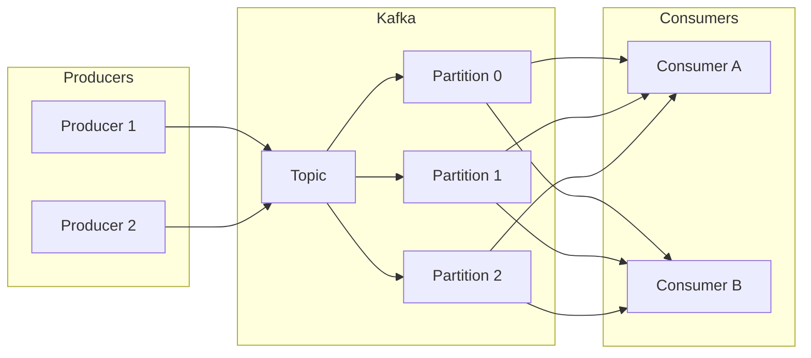

# Conceitos e modelo do Kafka

## O que é o Kafka?

**Apache Kafka** é uma plataforma de **streaming** distribuída: armazena fluxos de registros (mensagens) em tópicos, com persistência em disco e replicação. Producers publicam em tópicos; consumers leem em grupos, com cada partição sendo consumida por um único consumer do grupo. Isso permite alto throughput, retenção configurável e múltiplos consumidores independentes (diferentes grupos) no mesmo fluxo.

## Tópicos e partições

- **Topic** – Fluxo de mensagens com nome; as mensagens são ordenadas e imutáveis dentro de uma partição.
- **Partition** – Cada tópico é dividido em partições; as mensagens são atribuídas a uma partição (por chave ou round-robin). O **paralelismo de consumo** é limitado pelo número de partições: um consumer group pode ter no máximo tantos consumers ativos quanto partições.
- **Offset** – Posição de cada mensagem na partição; o consumer commita o offset para indicar até onde leu (at-least-once, at-most-once ou exactly-once conforme a configuração).

Aumentar partições permite mais consumidores em paralelo, mas também mais metadados e possível rebalanceamento; o número de partições pode ser aumentado, mas não diminuído de forma trivial.

## Broker, cluster e replicação

- **Broker** – Um nó do cluster Kafka; armazena partições (leader e réplicas).
- **Replication factor** – Cada partição tem N réplicas em brokers diferentes; uma é a leader (recebe leituras e escritas), as outras são followers e replicam em background.
- **In-sync replicas (ISR)** – Réplicas que estão “em sync” com a leader; um produce pode ser confirmado quando a mensagem foi replicada para todos os ISRs (ou um subconjunto), conforme `acks`.
- **Durabilidade** – Com `acks=all` e replicas suficientes, o Kafka garante que a mensagem não se perde com a falha de um broker.

## Modelo de entrega (semânticas)

| Semântica | Comportamento | Uso típico |
|-----------|----------------|------------|
| **At-most-once** | Producer não espera confirmação; consumer commita antes de processar. Pode perder ou processar no máximo uma vez. | Métricas onde perda é aceitável. |
| **At-least-once** | Producer espera ack; consumer processa e depois commita. Pode processar mais de uma vez em caso de falha após processar e antes de commitar. | Maioria dos casos; aplicação deve ser idempotente. |
| **Exactly-once** | Transações (producer + consumer) ou idempotent producer + processamento idempotente e commit transacional. Garante uma única entrega e um único processamento. | Quando duplicata é inaceitável (ex.: débito em conta). |

Para **tarefas de alto desempenho** e **comunicação entre serviços**, at-least-once com **idempotência** no consumer é o padrão mais comum; exactly-once exige cuidado com transações e armazenamentos que suportem commit transacional.

## Producers: chave e ordenação

- **Chave (key)** – Opcional; usada para particionar: mensagens com a mesma chave vão para a mesma partição, garantindo **ordem** para essa chave. Útil para ordenar eventos de um mesmo usuário ou entidade.
- **Valor (value)** – Payload da mensagem (bytes); tipicamente JSON, Avro ou Protobuf.
- **Headers** – Metadados (trace-id, tipo de evento) para roteamento ou observabilidade.
- **Compression** – Producer pode comprimir (gzip, snappy, lz4) para reduzir banda e armazenamento.

Configurações importantes: `acks` (0, 1, all), `retries`, `batch.size` e `linger.ms` (para batching e maior throughput).

## Resumo

| Conceito | Papel no alto desempenho e comunicação |
|----------|----------------------------------------|
| **Partições** | Paralelismo de leitura e escrita; mais partições = mais throughput, com cuidado no rebalance. |
| **Replicação** | Durabilidade e disponibilidade; acks=all para não perder mensagens. |
| **Semântica** | At-least-once + idempotência é o padrão; exactly-once quando necessário. |
| **Chave** | Ordenação por entidade; particionamento determinístico. |

No próximo capítulo: particionamento para throughput, consumer groups, lag e backpressure.

---

*Próximo: [Particionamento, throughput e consumidores](./02-particionamento-consumidores.md).*
