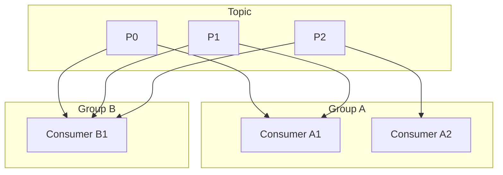

# Particionamento, throughput e consumidores

## Escolha do número de partições

O número de **partições** de um tópico define o paralelismo máximo de consumo (um consumer por partição por group) e influencia a distribuição da carga entre brokers. Fatores:

- **Throughput desejado** – Mais partições permitem mais producers e consumers em paralelo; cada partição tem um throughput prático limitado (ordem de dezenas de MB/s por broker, dependendo de hardware e configuração).
- **Ordenação** – Se a ordenação for por chave (ex.: user_id), todas as mensagens da mesma chave vão para a mesma partição; muitas chaves e poucas partições podem gerar partições “quentes”.
- **Consumer group** – Não adianta ter mais consumers ativos do que partições; o excesso fica ocioso.
- **Rebalance** – Aumentar partições causa rebalanceamento do consumer group; durante o rebalance, há uma pausa no consumo.

Regra prática: começar com um número que suporte o throughput esperado e o número de consumers; monitorar lag e distribuição de mensagens por partição.

## Consumer groups

- **Group id** – Identifica o grupo; todos os consumers com o mesmo group id formam o grupo e dividem as partições entre si.
- **Assignação** – Cada partição do tópico é atribuída a exatamente um consumer do grupo (em cada momento); quando um consumer entra ou sai, a atribuição é refeita (rebalance).
- **Múltiplos grupos** – Grupos diferentes consomem o mesmo tópico de forma independente; cada grupo mantém seu próprio offset. Assim, um mesmo stream pode alimentar um serviço de pedidos e um de analytics.

## Lag e backpressure

- **Lag** – Diferença entre o offset mais recente da partição e o offset commitado pelo consumer; lag alto indica que o consumer não está acompanhando o producer.
- **Causas** – Consumer lento (processamento pesado), poucos consumers para muitas partições, ou broker/network lento.
- **Mitigação** – Aumentar consumers (e partições se necessário), otimizar processamento (batch, paralelismo interno), ou escalar horizontalmente o serviço consumer.
- **Backpressure** – Se o consumer não conseguir acompanhar, o lag cresce; em sistemas bem desenhados, alertas disparam e a equipe escala ou otimiza. Em cenários extremos, pode-se limitar o producer (quota) ou ter um dead-letter para mensagens que falham após retries.

## Processamento em batch e paralelo

- **Batch** – O consumer pode ler um lote de mensagens (poll com timeout e max.poll.records) e processar em batch (ex.: inserir no banco em bulk); reduz round-trips e aumenta throughput, mas aumenta a latência e o tempo entre commits (max.poll.interval).
- **Paralelismo dentro do consumer** – Processar mensagens de uma partição em paralelo (threads ou async) pode aumentar throughput, mas a ordem na partição se perde; só faz sentido quando a ordem não importa para aquela partição.
- **Múltiplas partições por consumer** – Um consumer pode receber várias partições; o processamento pode ser paralelo por partição (uma thread por partição) mantendo ordem dentro de cada partição.

## Commit e exactly-once

- **Commit** – O consumer commita o offset (por partição) para indicar que processou até aquele ponto. Commit automático (periodic) ou manual (após processar com sucesso).
- **Exactly-once** – Possível com Kafka Transactions: o consumer lê, processa e escreve o resultado (e o offset) em uma transação; commit transacional. Exige que o sink (DB, outro tópico) suporte transações e integração com o Kafka (ex.: Kafka Connect, ou aplicação que usa API transacional).

Para a maioria dos casos de “comunicação entre serviços”, **at-least-once + idempotência** (chave de idempotência no evento, deduplicação no consumer) é suficiente e mais simples de operar.

## Resumo

| Tema | Prática |
|------|---------|
| **Partições** | Dimensionar para throughput e número de consumers; monitorar distribuição. |
| **Consumer group** | Um consumer por partição (no máximo); rebalance ao entrar/sair. |
| **Lag** | Monitorar; escalar ou otimizar quando crescer. |
| **Batch** | Aumenta throughput; cuidado com max.poll.interval e latência. |
| **Semântica** | At-least-once + idempotência; exactly-once quando necessário com transações. |

No próximo capítulo: padrões de uso (event sourcing, CQRS, saga) e integração entre microsserviços.

---

*Próximo: [Padrões e integração entre serviços](./03-padroes-integracao.md).*
