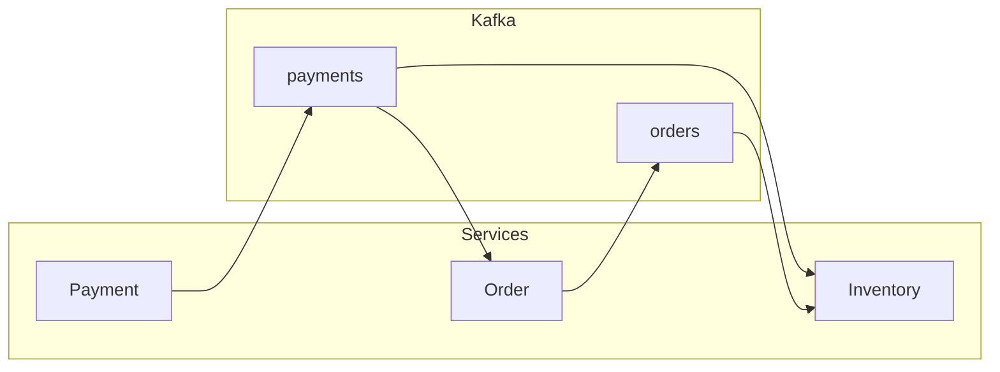

# Padrões e integração entre serviços

## Kafka como backbone de comunicação

Em uma arquitetura de microsserviços, o Kafka pode atuar como **backbone assíncrono**: serviços publicam eventos (ex.: “Pedido criado”, “Pagamento aprovado”) e outros serviços consomem para atualizar suas visões, disparar side effects ou orquestrar fluxos. Vantagens: desacoplamento, retenção (replay), múltiplos consumidores e alto throughput.

## Event-driven e event sourcing

- **Event-driven** – Serviços reagem a eventos publicados por outros; não chamam APIs síncronas para “perguntar” o estado; recebem notificações via tópicos.
- **Event sourcing** – O estado do sistema é derivado de um log de eventos (o tópico ou um event store); “pedido criado”, “item adicionado”, “pagamento recebido”. Projeções (views) são construídas consumindo o stream; novas projeções podem ser criadas reprocessando o log.

Para **tarefas de alto desempenho**, o Kafka suporta milhões de mensagens por segundo em cluster bem dimensionado; a chave é particionamento adequado, serialização eficiente e consumers que processam em batch quando possível.

## CQRS e tópicos por contexto

- **CQRS** – Separação entre escrita (command) e leitura (query); os comandos viram eventos no Kafka; os consumers atualizam modelos de leitura (views em DB ou cache) otimizados para consulta.
- **Tópicos por contexto** – Um tópico por agregado ou contexto (ex.: orders, payments, inventory-events) mantém o contrato estável e permite que cada serviço consuma só o que precisa.

## Saga e consistência eventual

Para fluxos que abrangem vários serviços (ex.: criar pedido → reservar estoque → cobrar pagamento), não há transação distribuída; usa-se **saga**:

- **Orquestração** – Um orquestrador envia comandos (ou eventos) a cada serviço; em caso de falha, envia eventos de compensação (ex.: liberar reserva, reembolsar).
- **Coreografia** – Cada serviço reage a eventos e publica novos eventos; em falha, publica evento de compensação e outros serviços reagem.

O Kafka transporta os eventos; a lógica de saga e compensação fica nos consumers. **Consistência eventual**: em algum momento o sistema converge; durante a propagação pode haver inconsistência temporária.

## Schemas e evolução

- **Schema registry** – Centralizar schemas (Avro, JSON Schema, Protobuf) e versionar; producers e consumers validam compatibilidade (backward/forward). Evita que mudança de contrato quebre consumidores.
- **Evolução** – Adicionar campos opcionais é backward compatible; remover ou mudar tipo exige estratégia (nova versão de tópico, ou compatibilidade configurada).

## Boas práticas para comunicação entre serviços

- **Idempotência** – Consumers devem ser idempotentes (chave de idempotência no evento; deduplicar antes de aplicar efeito).
- **Dead letter** – Mensagens que falham após retries vão para um tópico ou fila de dead letter para análise e reprocessamento manual.
- **Correlation/trace id** – Incluir em headers para rastrear uma requisição ou fluxo entre serviços (observabilidade).
- **Monitoramento** – Lag, throughput, taxa de erro e latência de processamento; alertas para degradação.

Com isso, o Kafka serve tanto para **alto desempenho** (throughput, particionamento, batch) quanto para **comunicação entre serviços** (eventos, desacoplamento, múltiplos consumidores).

---

*Voltar ao [índice](./README.md).*
