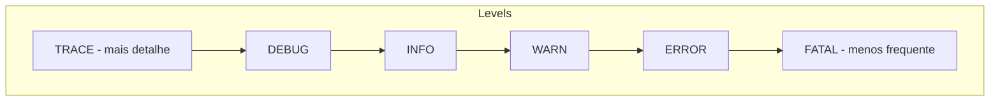
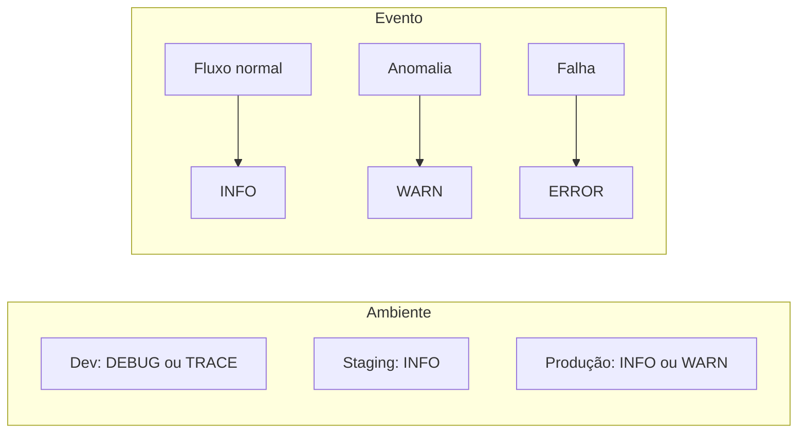
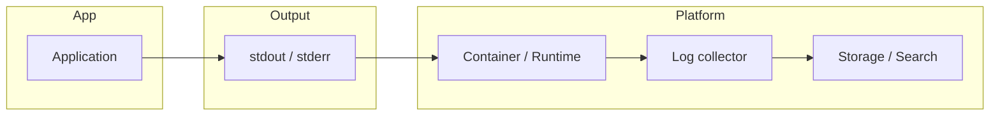

# Logs de aplicação – Níveis e melhores práticas

## Por que logar?

Logs permitem **diagnosticar falhas**, **entender o comportamento** da aplicação em produção e **auditar** ações importantes. Bem usados, reduzem tempo de investigação e suportam alertas e dashboards.

## Níveis de log (severidade)

A maioria dos frameworks segue uma hierarquia de níveis: quanto mais “grave”, menos frequente costuma ser o evento. O nível configurado na aplicação (ex.: `INFO`) determina qual severidade mínima é escrita; níveis abaixo são ignorados.



| Nível   | Uso típico |
|--------|------------|
| **TRACE** | Rastreio muito detalhado (ex.: entrada/saída de funções); em produção costuma ficar desligado. |
| **DEBUG** | Informação para depuração (valores de variáveis, fluxos); útil em dev/staging, em produção só se necessário. |
| **INFO**  | Eventos normais do fluxo: request recebido, job iniciado, operação concluída. |
| **WARN**  | Situação anormal mas recuperável: retry, fallback, dado ausente que tem default. |
| **ERROR** | Erro que precisa atenção: exceção, falha em operação crítica; geralmente dispara alerta. |
| **FATAL** | Erro que inviabiliza o processo (ex.: falha ao carregar configuração essencial); aplicação pode encerrar. |

### Quando usar cada nível



- **Produção** – Em geral `INFO` como mínimo; `DEBUG`/`TRACE` só para troubleshooting pontual (aumenta volume e pode expor dados).
- **Staging/Dev** – `DEBUG` ou `TRACE` para investigar problemas.
- **WARN** – Use quando a aplicação se recuperou (retry, fallback); se não se recuperou, prefira **ERROR**.

## Melhores práticas

### Conteúdo da mensagem

- **Objetivo e contextualizado** – O que aconteceu, em qual entidade (ID, tipo) e, se fizer sentido, o motivo.
- **Evite apenas “Erro”** – Inclua exceção (stack trace em ERROR), código de erro ou identificador que permita buscar no código.
- **Estruturado** – Prefira campos (JSON, key-value) em vez de texto livre; facilita busca e agregação em ferramentas (ELK, Loki, CloudWatch).

Exemplo conceitual (estruturado):

```json
{"level":"ERROR","ts":"2025-02-06T10:00:00Z","msg":"payment failed","user_id":"u123","order_id":"o456","error_code":"CARD_DECLINED","trace_id":"abc-123"}
```

### O que não logar

- **Dados sensíveis** – Senhas, tokens, números completos de cartão, CPF não mascarado, saúde (LGPD/GDPR).
- **Volume desnecessário** – Evite logar em loop (ex.: cada item de uma lista grande); resuma ou logue em nível DEBUG.
- **Informação duplicada** – Stack trace uma vez no ERROR; não repita o mesmo em vários níveis.

### Consistência e operação

- **Níveis consistentes** – Defina convenção no time (ex.: “request iniciado” = INFO, “timeout” = WARN, “exceção não tratada” = ERROR).
- **Stream para stdout** – Aplicação escreve em stdout/stderr; o ambiente (container, orchestrator) captura e envia para o sistema de log; evite escrever arquivos locais dentro do container.
- **Correlação** – Use `trace_id`, `request_id` ou `correlation_id` em todos os logs de uma mesma requisição ou job para rastrear o fluxo ponta a ponta.

## Fluxo típico em produção



A aplicação não precisa saber para onde os logs vão; ela apenas emite eventos em stdout. O coletor (Fluentd, Promtail, CloudWatch agent, etc.) lê e envia para armazenamento e busca.

## Resumo

| Prática | Benefício |
|---------|-----------|
| Níveis corretos (INFO/WARN/ERROR) | Filtros e alertas precisos; menos ruído. |
| Logs estruturados | Busca e agregação; integração com ferramentas. |
| Sem dados sensíveis | Conformidade e segurança. |
| trace_id / request_id | Rastreio de requisição ou job. |
| Log para stdout | Compatível com containers e 12-factor; plataforma decide destino. |

---

*Voltar ao [índice](./README.md).*
