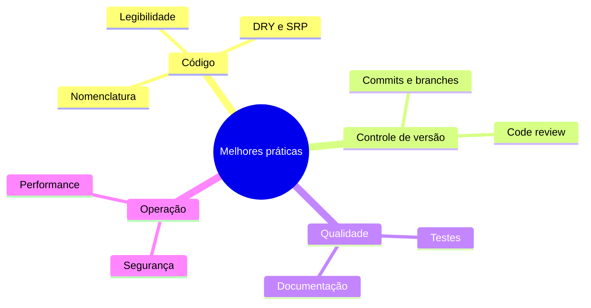

# Visão geral – Melhores práticas de desenvolvimento

## O que são melhores práticas?

Melhores práticas são **convenções e abordagens** que a comunidade e a indústria adotam para escrever software mais **mantível**, **seguro** e **colaborativo**. Não são regras rígidas: variam por linguagem, stack e contexto, mas os princípios gerais se repetem.

## Por que importam?

- **Manutenção** – Código organizado é mais fácil de corrigir e evoluir.
- **Colaboração** – Padrões comuns permitem que qualquer pessoa entenda e altere o código.
- **Qualidade** – Menos bugs, menos retrabalho e entregas mais previsíveis.
- **Segurança e performance** – Evitam armadilhas conhecidas e desperdício de recursos.

## Eixos deste estudo

| Eixo | Foco |
|------|------|
| **Código** | Legibilidade, funções pequenas, nomes claros, evitação de duplicação |
| **Controle de versão** | Git, branches, commits semânticos, pull requests e revisão |
| **Qualidade** | Testes automatizados, documentação útil, revisão de código |
| **Segurança e performance** | Princípios gerais para não introduzir riscos ou gargalos |

Nos próximos capítulos cada tema é detalhado com exemplos e referências.
