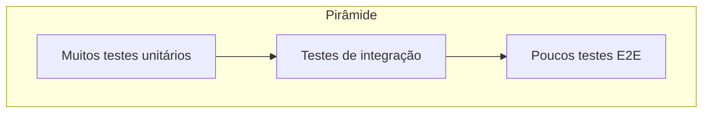

# Testes e qualidade

## Por que testar?

- **Regressão** – Garantir que mudanças não quebrem comportamento já existente.
- **Documentação viva** – Testes mostram como o código deve ser usado.
- **Refatoração segura** – Permitem alterar implementação com confiança.
- **Design** – Código testável tende a ser mais desacoplado e com responsabilidades claras.

## Pirâmide de testes

- **Unitários** – Rápidos, isolados (mocks/stubs), cobrem lógica e edge cases; maioria dos testes.
- **Integração** – Validam componentes juntos (API + DB, serviços); quantidade moderada.
- **E2E** – Poucos; cobrem fluxos críticos de ponta a ponta (UI ou API completa).

## Boas práticas

- **Determinísticos** – Sem ordem aleatória ou dependência de hora/data que quebre em outro ambiente.
- **Nomes descritivos** – O nome do teste descreve o cenário e o resultado esperado.
- **Um conceito por teste** – Facilita localizar a causa quando um teste falha.
- **Arrange, Act, Assert** – Organize: preparar dados, executar ação, verificar resultado.
- **Manutenção** – Remova ou atualize testes obsoletos; evite testes frágeis que quebram por detalhes de implementação.

## TDD (opcional)

Test-Driven Development: escrever o teste que falha, implementar o mínimo para passar, refatorar. Ajuda a focar em comportamento e a manter boa cobertura; pode ser adotado em partes do código (ex.: regras de negócio).

Para ferramentas e exemplos (unitários, integrados, Playwright, Cypress etc.), consulte o estudo de [Testes](../README.md) no índice do repositório.
