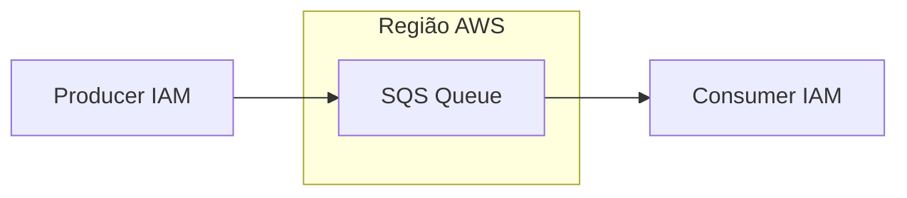
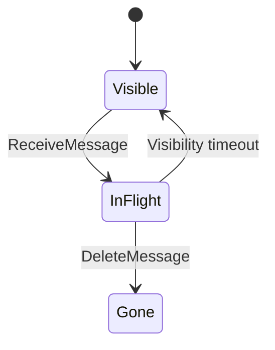

# Amazon SQS — filas geridas na AWS

## Introdução

**Amazon Simple Queue Service (SQS)** oferece filas **totalmente geridas** com redundância e escalabilidade da AWS. Dois modelos principais: **Standard** (melhor esforço na ordenação, pelo menos uma entrega) e **FIFO** (ordem global e deduplicação, throughput limitado por nome de fila). Ideal quando você **não** quer operar RabbitMQ ou Kafka.



---

## Conceitos

| Conceito | Descrição |
|----------|-----------|
| **Visibility timeout** | Após receber, a mensagem fica invisível para outros consumidores até timeout ou *delete* |
| **Long polling** | `WaitTimeSeconds` reduz chamadas vazias e latência |
| **DLQ** | *Dead-letter queue* para mensagens que falharam após `maxReceiveCount` |
| **FIFO** | `MessageGroupId` para paralelismo por grupo |



---

## Criar fila (AWS CLI)

```bash
aws sqs create-queue --queue-name pedidos-dev --attributes VisibilityTimeout=30
aws sqs get-queue-url --queue-name pedidos-dev
```

---

## Enviar e receber

### AWS CLI

```bash
QUEUE_URL=$(aws sqs get-queue-url --queue-name pedidos-dev --query QueueUrl --output text)
aws sqs send-message --queue-url "$QUEUE_URL" --message-body '{"orderId":42}'
aws sqs receive-message --queue-url "$QUEUE_URL" --wait-time-seconds 10
aws sqs delete-message --queue-url "$QUEUE_URL" --receipt-handle "<handle>"
```

### Python (boto3)

```python
import boto3
import json

def main() -> None:
    c = boto3.client("sqs", region_name="us-east-1")
    url = c.get_queue_url(QueueName="pedidos-dev")["QueueUrl"]
    c.send_message(QueueUrl=url, MessageBody=json.dumps({"orderId": 42}))
    msgs = c.receive_message(QueueUrl=url, WaitTimeSeconds=10, MaxNumberOfMessages=1)
    for m in msgs.get("Messages", []):
        print(m["Body"])
        c.delete_message(QueueUrl=url, ReceiptHandle=m["ReceiptHandle"])

if __name__ == "__main__":
    main()
```

### Node.js (@aws-sdk/client-sqs)

```javascript
import {
  SQSClient,
  SendMessageCommand,
  ReceiveMessageCommand,
  DeleteMessageCommand,
  GetQueueUrlCommand,
} from "@aws-sdk/client-sqs";

const client = new SQSClient({ region: "us-east-1" });
const url = (await client.send(new GetQueueUrlCommand({ QueueName: "pedidos-dev" }))).QueueUrl;

await client.send(new SendMessageCommand({ QueueUrl: url, MessageBody: JSON.stringify({ orderId: 42 }) }));
const out = await client.send(
  new ReceiveMessageCommand({ QueueUrl: url, WaitTimeSeconds: 10, MaxNumberOfMessages: 1 }),
);
for (const m of out.Messages ?? []) {
  console.log(m.Body);
  await client.send(new DeleteMessageCommand({ QueueUrl: url, ReceiptHandle: m.ReceiptHandle }));
}
```

### Go

```go
package main

import (
	"context"
	"fmt"

	"github.com/aws/aws-sdk-go-v2/aws"
	"github.com/aws/aws-sdk-go-v2/config"
	"github.com/aws/aws-sdk-go-v2/service/sqs"
)

func main() {
	cfg, _ := config.LoadDefaultConfig(context.TODO())
	c := sqs.NewFromConfig(cfg)
	urlOut, _ := c.GetQueueUrl(context.TODO(), &sqs.GetQueueUrlInput{QueueName: aws.String("pedidos-dev")})
	_, _ = c.SendMessage(context.TODO(), &sqs.SendMessageInput{QueueUrl: urlOut.QueueUrl, MessageBody: aws.String(`{"orderId":42}`)})
	recv, _ := c.ReceiveMessage(context.TODO(), &sqs.ReceiveMessageInput{QueueUrl: urlOut.QueueUrl, WaitTimeSeconds: 10})
	for _, m := range recv.Messages {
		fmt.Println(*m.Body)
		_, _ = c.DeleteMessage(context.TODO(), &sqs.DeleteMessageInput{QueueUrl: urlOut.QueueUrl, ReceiptHandle: m.ReceiptHandle})
	}
}
```

### Java

```java
import software.amazon.awssdk.regions.Region;
import software.amazon.awssdk.services.sqs.SqsClient;
import software.amazon.awssdk.services.sqs.model.*;

try (var sqs = SqsClient.builder().region(Region.US_EAST_1).build()) {
  var url = sqs.getQueueUrl(GetQueueUrlRequest.builder().queueName("pedidos-dev").build()).queueUrl();
  sqs.sendMessage(SendMessageRequest.builder().queueUrl(url).messageBody("{\"orderId\":42}").build());
  var recv = sqs.receiveMessage(ReceiveMessageRequest.builder().queueUrl(url).waitTimeSeconds(10).maxNumberOfMessages(1).build());
  for (var m : recv.messages()) {
    System.out.println(m.body());
    sqs.deleteMessage(DeleteMessageRequest.builder().queueUrl(url).receiptHandle(m.receiptHandle()).build());
  }
}
```

### C#

```csharp
using Amazon;
using Amazon.SQS;
using Amazon.SQS.Model;

var sqs = new AmazonSQSClient(RegionEndpoint.USEast1);
var url = (await sqs.GetQueueUrlAsync(new GetQueueUrlRequest { QueueName = "pedidos-dev" })).QueueUrl;
await sqs.SendMessageAsync(new SendMessageRequest { QueueUrl = url, MessageBody = """{"orderId":42}""" });
var recv = await sqs.ReceiveMessageAsync(new ReceiveMessageRequest { QueueUrl = url, WaitTimeSeconds = 10, MaxNumberOfMessages = 1 });
foreach (var m in recv.Messages)
{
    Console.WriteLine(m.Body);
    await sqs.DeleteMessageAsync(url, m.ReceiptHandle);
}
```

---

## Idempotência e *at-least-once*

SQS Standard pode entregar **mais de uma vez**. O consumidor deve usar **idempotency key** (ex.: `orderId` + estado no banco) ou **locks** distribuídos.

---

## Referências

- [Amazon SQS Developer Guide](https://docs.aws.amazon.com/AWSSimpleQueueService/latest/SQSDeveloperGuide/)
- [FIFO queues](https://docs.aws.amazon.com/AWSSimpleQueueService/latest/SQSDeveloperGuide/FIFO-queues.html)

---

*SQS troca **controle fino** por **simplicidade operacional** — excelente default para filas internas na AWS.*
