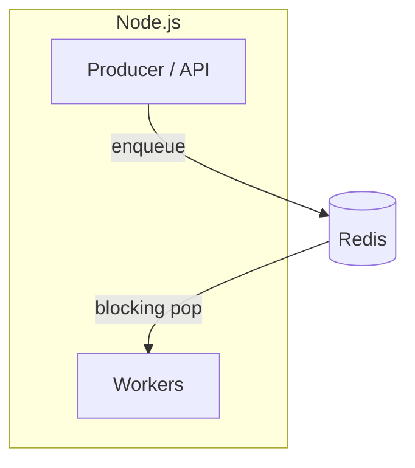
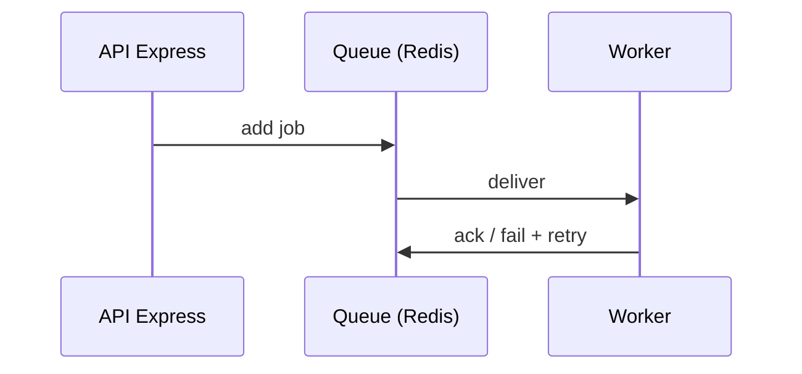
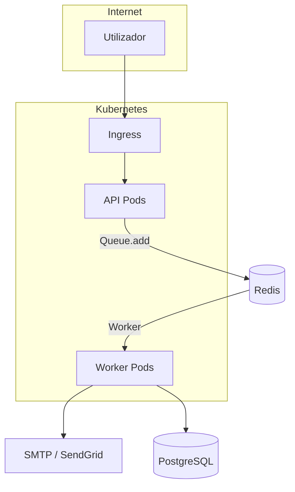

# BullMQ — filas e jobs em Node.js sobre Redis

## Introdução

**BullMQ** é uma biblioteca **Node.js/TypeScript** para **filas de jobs** assíncronos, construída sobre **Redis**. Oferece **workers** concorrentes, **retries** com backoff, **prioridades**, **cron** (*repeatable jobs*), **rate limiting** e **dashboard** (Bull Board). É o sucessor espiritual do **Bull** v3, com melhor uso de **Redis Streams** internamente.



> **Requisito:** instância Redis acessível (local, ElastiCache, Redis Cloud).

---

## Instalação

```bash
npm install bullmq ioredis
```

---

## Laboratório: Redis com Docker

```yaml
services:
  redis:
    image: redis:7-alpine
    ports:
      - "6379:6379"
```

---

## Producer mínimo

```javascript
import { Queue } from "bullmq";

const connection = { host: "127.0.0.1", port: 6379 };

const emailQueue = new Queue("email", { connection });

await emailQueue.add("send-welcome", { to: "user@example.com" }, { attempts: 3, backoff: { type: "exponential", delay: 1000 } });
```

---

## Worker mínimo

```javascript
import { Worker } from "bullmq";

const connection = { host: "127.0.0.1", port: 6379 };

const worker = new Worker(
  "email",
  async (job) => {
    console.log("processando", job.name, job.data);
    // await sendMail(job.data);
  },
  { connection },
);

worker.on("failed", (job, err) => console.error(job?.id, err));
```



---

## Arquitetura de microsserviços (Node + BullMQ)

O **BFF/API** apenas valida e **enfileira**; **workers** horizontáveis processam e chamam SMTP, APIs externas ou base de dados. Redis é o **backbone** da fila (ElastiCache em produção).



- **Produção:** handlers HTTP chamam `emailQueue.add(...)` sem bloquear resposta.
- **Consumo:** `Worker` em processo separado (outro `Deployment`) com réplicas > 1.

### API — apenas produção (`src/producer-api.mjs`)

```javascript
import express from "express";
import { Queue } from "bullmq";

const app = express();
app.use(express.json());
const connection = { host: process.env.REDIS_HOST ?? "127.0.0.1", port: 6379 };
const emailQueue = new Queue("email", { connection });

app.post("/welcome", async (req, res) => {
  const { to } = req.body;
  await emailQueue.add("send-welcome", { to }, { attempts: 3, backoff: { type: "exponential", delay: 2000 } });
  res.status(202).json({ status: "queued", to });
});

app.listen(3000, () => console.log("API :3000"));
```

### Worker — apenas consumo (`src/worker.mjs`)

```javascript
import { Worker } from "bullmq";

const connection = { host: process.env.REDIS_HOST ?? "127.0.0.1", port: 6379 };

new Worker(
  "email",
  async (job) => {
    const { to } = job.data;
    console.log(`[${job.id}] enviar welcome para`, to);
    // await transporter.sendMail({ to, subject: "Bem-vindo", html: "..." });
  },
  { connection, concurrency: 5 },
);
```

---

## Equivalente em Python (Celery) — produtor e consumidor

Quando o ecossistema é **Python**, o papel análogo é **Celery** com broker Redis ou RabbitMQ.

**Definição da task + app (`celery_app.py`):**

```python
from celery import Celery

celery_app = Celery("demo", broker="redis://localhost:6379/0", backend="redis://localhost:6379/1")

@celery_app.task(name="email.send_welcome")
def send_welcome(to: str) -> None:
    print("enviar welcome", to)
```

**Produtor (outro processo ou view HTTP):**

```python
# producer.py
from celery_app import send_welcome

send_welcome.delay("user@example.com")
```

**Consumidor:** `celery -A celery_app worker -l info` — o worker executa `send_welcome` quando a mensagem chega ao broker.

---

## Boas práticas

- **Separar processos** — API só enfileira; workers em pods/processos dedicados.
- **Idempotência** — jobs podem rodar mais de uma vez após falha parcial.
- **Serialização** — payloads JSON pequenos; blobs vão para S3 + referência.
- **Conexão Redis** — reutilizar `connection` com pool adequado em alta carga.

---

## TypeScript (tipagem do payload)

```typescript
import { Queue, Worker, Job } from "bullmq";

type WelcomeEmail = { to: string };

const connection = { host: "127.0.0.1", port: 6379 };
const q = new Queue<WelcomeEmail>("email", { connection });

new Worker<WelcomeEmail>(
  "email",
  async (job: Job<WelcomeEmail>) => {
    const { to } = job.data;
    console.log("send to", to);
  },
  { connection },
);

await q.add("send-welcome", { to: "a@b.com" });
```

---

## Alternativas em outros ecossistemas

| Stack | Biblioteca / serviço |
|-------|----------------------|
| Python | **Celery** + Redis/RabbitMQ, **RQ**, **Dramatiq** |
| Java | **Spring @Async** + DB, **JMS**, **Kafka** |
| Go | **Asynq**, **Machinery** |

BullMQ é a escolha natural quando o runtime já é **Node** e há **Redis** disponível.

---

## Referências

- [BullMQ Guide](https://docs.bullmq.io/)
- [Redis](https://redis.io/docs/)

---

*BullMQ transforma Redis em **motor de workflow** — sem Redis estável e backup, a fila vira ponto único de falha.*
