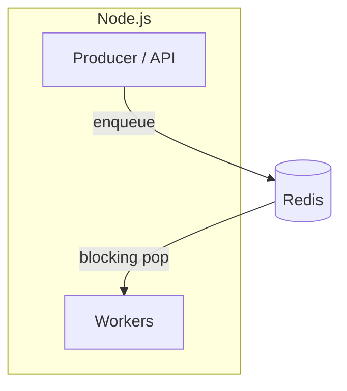
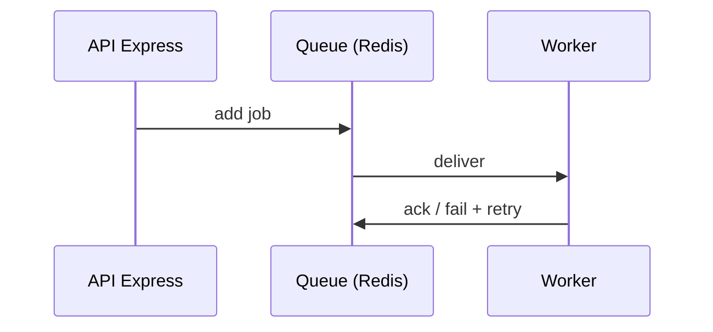

# BullMQ — filas e jobs em Node.js sobre Redis

## Introdução

**BullMQ** é uma biblioteca **Node.js/TypeScript** para **filas de jobs** assíncronos, construída sobre **Redis**. Oferece **workers** concorrentes, **retries** com backoff, **prioridades**, **cron** (*repeatable jobs*), **rate limiting** e **dashboard** (Bull Board). É o sucessor espiritual do **Bull** v3, com melhor uso de **Redis Streams** internamente.



> **Requisito:** instância Redis acessível (local, ElastiCache, Redis Cloud).

---

## Instalação

```bash
npm install bullmq ioredis
```

---

## Laboratório: Redis com Docker

```yaml
services:
  redis:
    image: redis:7-alpine
    ports:
      - "6379:6379"
```

---

## Producer mínimo

```javascript
import { Queue } from "bullmq";

const connection = { host: "127.0.0.1", port: 6379 };

const emailQueue = new Queue("email", { connection });

await emailQueue.add("send-welcome", { to: "user@example.com" }, { attempts: 3, backoff: { type: "exponential", delay: 1000 } });
```

---

## Worker mínimo

```javascript
import { Worker } from "bullmq";

const connection = { host: "127.0.0.1", port: 6379 };

const worker = new Worker(
  "email",
  async (job) => {
    console.log("processando", job.name, job.data);
    // await sendMail(job.data);
  },
  { connection },
);

worker.on("failed", (job, err) => console.error(job?.id, err));
```



---

## Boas práticas

- **Separar processos** — API só enfileira; workers em pods/processos dedicados.
- **Idempotência** — jobs podem rodar mais de uma vez após falha parcial.
- **Serialização** — payloads JSON pequenos; blobs vão para S3 + referência.
- **Conexão Redis** — reutilizar `connection` com pool adequado em alta carga.

---

## TypeScript (tipagem do payload)

```typescript
import { Queue, Worker, Job } from "bullmq";

type WelcomeEmail = { to: string };

const connection = { host: "127.0.0.1", port: 6379 };
const q = new Queue<WelcomeEmail>("email", { connection });

new Worker<WelcomeEmail>(
  "email",
  async (job: Job<WelcomeEmail>) => {
    const { to } = job.data;
    console.log("send to", to);
  },
  { connection },
);

await q.add("send-welcome", { to: "a@b.com" });
```

---

## Alternativas em outros ecossistemas

| Stack | Biblioteca / serviço |
|-------|----------------------|
| Python | **Celery** + Redis/RabbitMQ, **RQ**, **Dramatiq** |
| Java | **Spring @Async** + DB, **JMS**, **Kafka** |
| Go | **Asynq**, **Machinery** |

BullMQ é a escolha natural quando o runtime já é **Node** e há **Redis** disponível.

---

## Referências

- [BullMQ Guide](https://docs.bullmq.io/)
- [Redis](https://redis.io/docs/)

---

*BullMQ transforma Redis em **motor de workflow** — sem Redis estável e backup, a fila vira ponto único de falha.*
