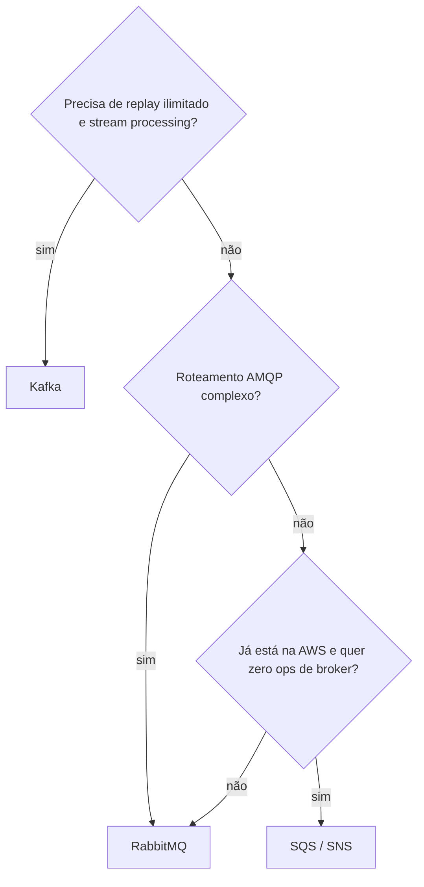
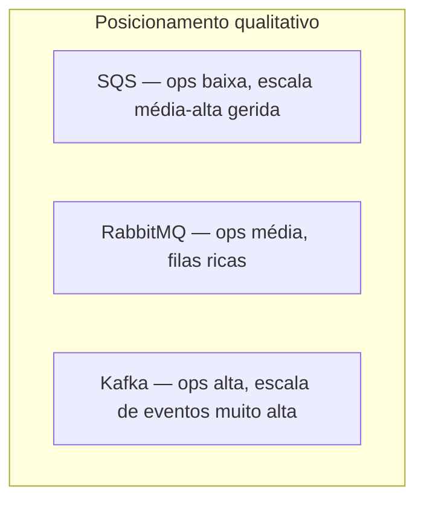
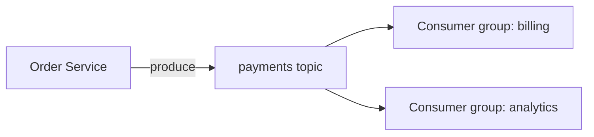
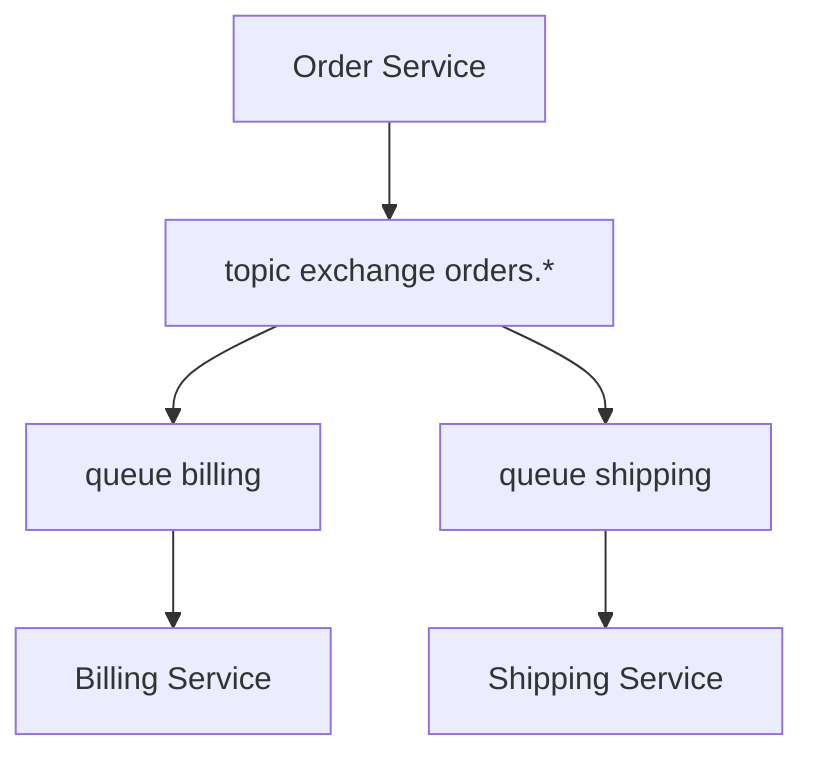
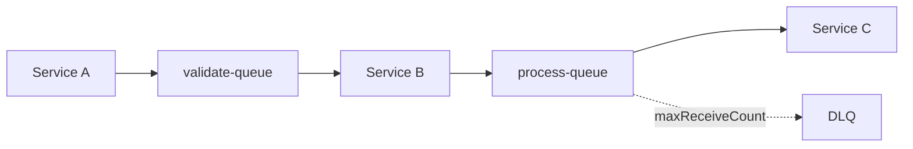

# Kafka, RabbitMQ e SQS — comparativo para arquitetura

## Introdução

As três opções resolvem **comunicação assíncrona**, mas com **modelos de dados**, **garantias** e **custos operacionais** diferentes. Este capítulo resume **quando preferir cada uma** e aponta para o [estudo detalhado de Kafka](../kafka-alto-desempenho/README.md).

---

## Tabela resumo

| Critério | Apache Kafka | RabbitMQ | Amazon SQS |
|----------|--------------|----------|------------|
| **Modelo** | *Log* particionado, retenção configurável | *Broker* com exchanges/queues | Fila gerida (Standard / FIFO) |
| **Ordenação** | Por partição | Por fila / consumer | FIFO por grupo; Standard best-effort |
| **Consumo** | Múltiplos *consumer groups* leem o mesmo log | Mensagem removida após ack | Delete após processamento |
| **Replay** | Nativo (offset) | Não é caso de uso principal | Não (após delete, fim) |
| **Throughput** | Muito alto em *append-only* | Alto com tuning | Escalável gerido |
| **Operação** | Cluster ZooKeeper/KRaft, upgrades | Cluster + discos + mirrors | AWS gerida |
| **Latência sub-ms** | Possível com tuning | Comum em LAN | Milissegundos típicos |
| **Custo fixo** | Infra própria / MSK / Confluent | Infra própria / AMQP gerido | Pay-per-use + requests |

---

## Casos de uso típicos

### Kafka

- **Event sourcing** e **CQRS** com log de domínio.
- **Pipelines** de dados (ingestão → transformação → lake).
- **Microsserviços** com necessidade de **vários leitores** do mesmo stream.
- **Reprocessamento** por alteração de lógica ou *backfill*.

### RabbitMQ

- **Task queues** com roteamento (*topic*, *direct*).
- **RPC assíncrono** (com *reply-to* e *correlation id*).
- Integração **polyglot** com bibliotecas AMQP maduras.
- **TTL** e **DLX** por fila sem montar *streaming stack*.

### SQS (+ SNS quando pub/sub)

- **Desacoplamento** entre serviços **AWS** (Lambda, ECS, EC2).
- **Spikes** sem dimensionar broker manualmente.
- **Filas de integração** com DLQ nativa e IAM.

> Posições são **qualitativas** — calibração depende da equipa e do fornecedor.

---

## Semântica de entrega

| Ferramenta | Padrão típico |
|------------|----------------|
| Kafka | *At-least-once* (com idempotência / transactions quando necessário) |
| RabbitMQ | Configurável; ack manual → *at-least-once* |
| SQS Standard | *At-least-once* |
| SQS FIFO | *Exactly-once* **processing** (com dedup e FIFO por grupo) — ainda assim idempotência nas side-effects |

---

## Desenho de microsserviços (visão por tecnologia)

Os capítulos [RabbitMQ](./01-rabbitmq.md), [SQS](./02-amazon-sqs.md), [BullMQ](./03-bullmq.md) e [Kafka](../kafka-alto-desempenho/README.md) incluem **exemplos separados de produtor e consumidor** em várias linguagens. Abaixo, topologias típicas.

### Kafka — vários consumidores do mesmo tópico

Cada **consumer group** avança o seu offset; billing e analytics leem **o mesmo stream** de forma independente.

### RabbitMQ — fan-out com filas por serviço

Cada fila recebe **cópia** da mensagem conforme *binding*; um serviço lento não consome a fila do outro.

### SQS — pipeline linear + DLQ

**Produtor** em cada etapa publica na fila seguinte; falhas repetidas vão para **DLQ** para inspeção manual.

---

## Ponte com MQTT e IoT

**MQTT** (capítulo [MQTT](./05-mqtt.md)) alimenta pipelines **MQTT → Kafka** em fábricas e cidades inteligentes: edge publica telemetria; Kafka agrega para analytics. **RabbitMQ** também pode receber MQTT via plugin, mas Kafka domina **volume histórico**.

---

## Leitura recomendada neste repositório

1. [Kafka – alto desempenho](../kafka-alto-desempenho/01-conceitos-modelo.md)
2. [RabbitMQ](./01-rabbitmq.md)
3. [Amazon SQS](./02-amazon-sqs.md)
4. [Saga — padrões com filas](../apis-arquitetura/06-saga.md)

---

## Referências externas

- [AWS — Choosing between messaging services](https://aws.amazon.com/blogs/compute/choosing-between-messaging-services-for-serverless-applications/)
- [RabbitMQ vs Kafka (blog oficial RabbitMQ)](https://www.rabbitmq.com/blog/)

---

*Comece com **SQS** ou **RabbitMQ** se a pergunta for “fila entre dois serviços”; escolha **Kafka** quando a pergunta for “**log** de eventos compartilhado no tempo”.*
