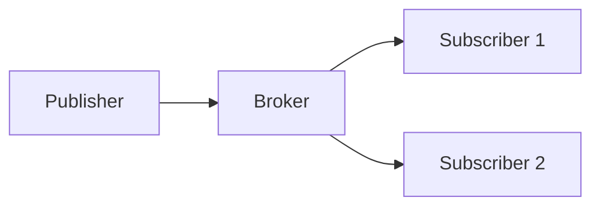

# MQTT — pub/sub leve para IoT e edge

> Parte da sessão [Mensageria](./README.md). Para comparar com Kafka e filas geridas, ver [Kafka, RabbitMQ e SQS — comparativo](./04-kafka-rabbitmq-sqs-comparativo.md).

## Introdução

**MQTT** (*Message Queuing Telemetry Transport*) é um protocolo **pub/sub** binário, pensado para **baixa largura de banda** e **conexões instáveis**. Um **broker** (Mosquitto, AWS IoT Core, HiveMQ) roteia mensagens por **tópicos** hierárquicos (`factory/line1/sensor/temp`).



---

## QoS (Quality of Service)

| Nível | Significado |
|-------|-------------|
| **0** | *At most once* — *fire and forget* |
| **1** | *At least once* — pode duplicar |
| **2** | *Exactly once* — mais overhead |

Na aplicação, **idempotência** ainda importa para QoS 1 e 2 em falhas de rede.

---

## Tópicos e wildcards

- `+` — um nível (`a/+/c`).
- `#` — sufixo multi-nível (`a/#`).

Evitar tópicos **dinâmicos demais** sem política de ACL — explode superfície de segurança.

---

## Segurança

- **TLS** (porta 8883 comum).
- **Autenticação** por usuário/senha ou certificados X.509.
- **ACL** por cliente no broker.

---

## Exemplos — publicar e inscrever

### JavaScript (mqtt.js)

```javascript
import mqtt from "mqtt";
const c = mqtt.connect("mqtts://broker.example.com", { username: "u", password: "p" });
c.on("connect", () => {
  c.subscribe("sensors/+/temp");
  c.publish("sensors/room1/temp", "22.5", { qos: 1 });
});
c.on("message", (topic, msg) => console.log(topic, msg.toString()));
```

### Python (paho-mqtt)

```python
import paho.mqtt.client as mqtt

def on_connect(client, _u, _f, rc):
    client.subscribe("sensors/+/temp")

def on_message(_c, _u, msg):
    print(msg.topic, msg.payload.decode())

c = mqtt.Client()
c.on_connect = on_connect
c.on_message = on_message
c.connect("broker.example.com", 1883)
c.loop_forever()
```

### Java (Eclipse Paho — ideia)

```java
// MqttClient connect, subscribe, publish com MqttMessage e qos
```

### C#

```csharp
// MQTTnet: MqttClient.ConnectAsync + SubscribeAsync + PublishAsync
```

---

## Tópicos compartilhados e payload

Evite mensagens **não estruturadas** (string livre) em produção: use **JSON** ou **Protobuf** com schema versionado. Para **comandos** vs **eventos**, convenções de nome (`cmd/...` vs `evt/...`) ajudam ACLs e monitoração. **Retained messages** em MQTT permitem que novos assinantes recebam último estado — útil para telemetria, perigoso se o payload for grande ou sensível sem rotação.

## MQTT vs Kafka

- **MQTT** — milhões de conexões pequenas, mensagens curtas, edge.
- **Kafka** — log durável, *replay*, *stream processing* em data centers.

Pontes **MQTT → Kafka** são comuns em pipelines IoT. Aprofundamento em Kafka: [Kafka – alto desempenho](../kafka-alto-desempenho/README.md).

---

## Referências

- OASIS MQTT v3.1.1 / v5.0 especificação.
- Eclipse Paho, mqtt.js, MQTTnet.

---

*MQTT minimiza bytes na rede; o **broker** é o ponto crítico de **escala e segurança**.*
