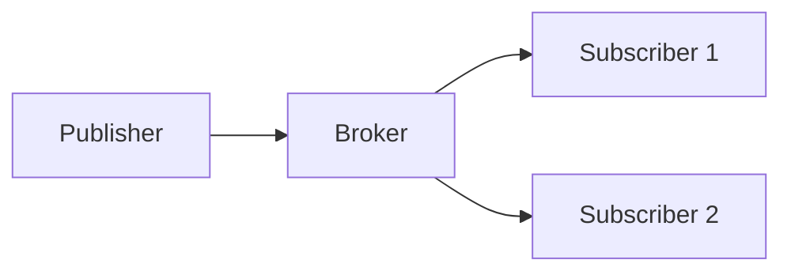
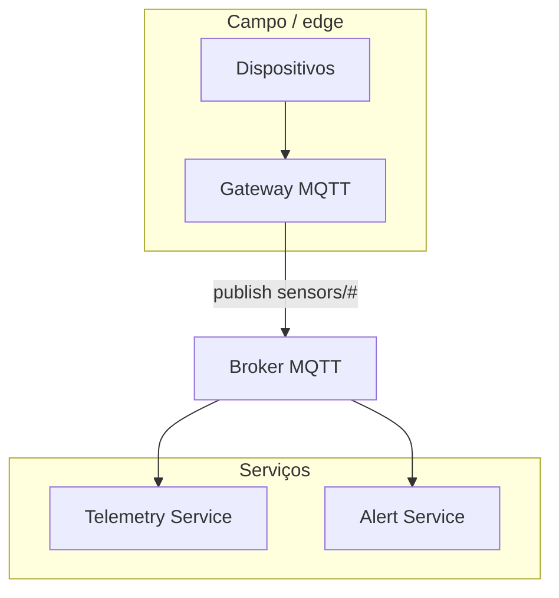

# MQTT — pub/sub leve para IoT e edge

> Parte da sessão [Mensageria](./README.md). Para comparar com Kafka e filas geridas, ver [Kafka, RabbitMQ e SQS — comparativo](./04-kafka-rabbitmq-sqs-comparativo.md).

## Introdução

**MQTT** (*Message Queuing Telemetry Transport*) é um protocolo **pub/sub** binário, pensado para **baixa largura de banda** e **conexões instáveis**. Um **broker** (Mosquitto, AWS IoT Core, HiveMQ) roteia mensagens por **tópicos** hierárquicos (`factory/line1/sensor/temp`).



---

## QoS (Quality of Service)

| Nível | Significado |
|-------|-------------|
| **0** | *At most once* — *fire and forget* |
| **1** | *At least once* — pode duplicar |
| **2** | *Exactly once* — mais overhead |

Na aplicação, **idempotência** ainda importa para QoS 1 e 2 em falhas de rede.

---

## Tópicos e wildcards

- `+` — um nível (`a/+/c`).
- `#` — sufixo multi-nível (`a/#`).

Evitar tópicos **dinâmicos demais** sem política de ACL — explode superfície de segurança.

---

## Segurança

- **TLS** (porta 8883 comum).
- **Autenticação** por usuário/senha ou certificados X.509.
- **ACL** por cliente no broker.

---

## Arquitetura microsserviços + IoT (exemplo)

Sensores ou **gateway edge** publicam telemetria; **Telemetry Service** subscreve e grava em time-series; **Alert Service** subscreve ao mesmo tópico ou a um derivado `alerts/#`.



- **Produção:** dispositivo ou gateway com credencial limitada (só `publish` em `factory/line1/#`).
- **Consumo:** microsserviços com subscrições distintas e **QoS 1** quando perda não é aceitável.

---

## Publicação e consumo (por linguagem)

### JavaScript (`mqtt.js`) — publicador

```javascript
// publisher.mjs
import mqtt from "mqtt";

const c = mqtt.connect("mqtt://localhost:1883");
c.on("connect", () => {
  const payload = JSON.stringify({ deviceId: "room1", celsius: 22.5, ts: Date.now() });
  c.publish("sensors/room1/temp", payload, { qos: 1 }, () => {
    console.log("publicado");
    c.end();
  });
});
```

### JavaScript — subscritor (consumidor)

```javascript
// subscriber.mjs
import mqtt from "mqtt";

const c = mqtt.connect("mqtt://localhost:1883");
c.on("connect", () => c.subscribe("sensors/+/temp", { qos: 1 }));
c.on("message", (topic, msg) => {
  const data = JSON.parse(msg.toString());
  console.log(topic, data);
});
```

### Python (`paho-mqtt`) — publicador

```python
# publisher.py
import json
import time
import paho.mqtt.client as mqtt

def main() -> None:
    c = mqtt.Client()
    c.connect("localhost", 1883, 60)
    c.loop_start()
    payload = json.dumps({"deviceId": "room1", "celsius": 22.5, "ts": int(time.time() * 1000)})
    c.publish("sensors/room1/temp", payload, qos=1)
    time.sleep(0.5)
    c.loop_stop()
    c.disconnect()

if __name__ == "__main__":
    main()
```

### Python — subscritor

```python
# subscriber.py
import json
import paho.mqtt.client as mqtt

def on_message(_c, _u, msg):
    data = json.loads(msg.payload.decode())
    print(msg.topic, data)

def main() -> None:
    c = mqtt.Client()
    c.on_connect = lambda cl, *_: cl.subscribe("sensors/+/temp", qos=1)
    c.on_message = on_message
    c.connect("localhost", 1883, 60)
    c.loop_forever()

if __name__ == "__main__":
    main()
```

### Java (Eclipse Paho) — publicador

```java
import org.eclipse.paho.client.mqttv3.*;

public class MqttPublish {
  public static void main(String[] args) throws MqttException {
    var client = new MqttClient("tcp://localhost:1883", "publisher-1");
    client.connect();
    var msg = new MqttMessage("{\"celsius\":22.5}".getBytes());
    msg.setQos(1);
    client.publish("sensors/room1/temp", msg);
    client.disconnect();
  }
}
```

### Java — subscritor

```java
import org.eclipse.paho.client.mqttv3.*;

public class MqttSubscribe {
  public static void main(String[] args) throws Exception {
    var client = new MqttClient("tcp://localhost:1883", "subscriber-1");
    client.setCallback(new MqttCallback() {
      public void messageArrived(String topic, MqttMessage message) {
        System.out.println(topic + " " + new String(message.getPayload()));
      }
      public void connectionLost(Throwable cause) {}
      public void deliveryComplete(IMqttDeliveryToken token) {}
    });
    client.connect();
    client.subscribe("sensors/+/temp", 1);
    System.out.println("A aguardar mensagens… Enter para sair.");
    System.in.read();
    client.disconnect();
  }
}
```

### C# (`MQTTnet`) — publicador

```csharp
using MQTTnet;
using MQTTnet.Client;

var factory = new MqttFactory();
using var client = factory.CreateMqttClient();
await client.ConnectAsync(new MqttClientOptionsBuilder().WithTcpServer("localhost", 1883).Build());
await client.PublishAsync(new MqttApplicationMessageBuilder()
    .WithTopic("sensors/room1/temp")
    .WithPayload("""{"celsius":22.5}""")
    .WithQualityOfServiceLevel(MQTTnet.Protocol.MqttQualityOfServiceLevel.AtLeastOnce)
    .Build());
await client.DisconnectAsync();
```

### C# — subscritor

```csharp
using MQTTnet;
using MQTTnet.Client;

var factory = new MqttFactory();
using var client = factory.CreateMqttClient();
client.ApplicationMessageReceivedAsync += e =>
{
    Console.WriteLine(e.ApplicationMessage.Topic + " " + System.Text.Encoding.UTF8.GetString(e.ApplicationMessage.Payload));
    return Task.CompletedTask;
};
await client.ConnectAsync(new MqttClientOptionsBuilder().WithTcpServer("localhost", 1883).Build());
await client.SubscribeAsync("sensors/+/temp", MQTTnet.Protocol.MqttQualityOfServiceLevel.AtLeastOnce);
Console.ReadLine();
```

### Go (`paho.mqtt.golang`) — publicador

```go
package main

import (
	"fmt"
	mqtt "github.com/eclipse/paho.mqtt.golang"
)

func main() {
	opts := mqtt.NewClientOptions().AddBroker("tcp://localhost:1883").SetClientID("publisher-go")
	c := mqtt.NewClient(opts)
	if t := c.Connect(); t.Wait() && t.Error() != nil {
		panic(t.Error())
	}
	tok := c.Publish("sensors/room1/temp", 1, false, `{"celsius":22.5}`)
	tok.Wait()
	c.Disconnect(250)
	fmt.Println("ok")
}
```

### Go — subscritor

```go
package main

import (
	"fmt"
	mqtt "github.com/eclipse/paho.mqtt.golang"
)

func main() {
	opts := mqtt.NewClientOptions().AddBroker("tcp://localhost:1883").SetClientID("subscriber-go")
	c := mqtt.NewClient(opts)
	if t := c.Connect(); t.Wait() && t.Error() != nil {
		panic(t.Error())
	}
	_ = c.Subscribe("sensors/+/temp", 1, func(_ mqtt.Client, m mqtt.Message) {
		fmt.Println(m.Topic(), string(m.Payload()))
	})
	select {} // laboratório: bloqueia para sempre; em produção use contexto cancelável
}
```

---

## Tópicos compartilhados e payload

Evite mensagens **não estruturadas** (string livre) em produção: use **JSON** ou **Protobuf** com schema versionado. Para **comandos** vs **eventos**, convenções de nome (`cmd/...` vs `evt/...`) ajudam ACLs e monitoração. **Retained messages** em MQTT permitem que novos assinantes recebam último estado — útil para telemetria, perigoso se o payload for grande ou sensível sem rotação.

## MQTT vs Kafka

- **MQTT** — milhões de conexões pequenas, mensagens curtas, edge.
- **Kafka** — log durável, *replay*, *stream processing* em data centers.

Pontes **MQTT → Kafka** são comuns em pipelines IoT. Aprofundamento em Kafka: [Kafka – alto desempenho](../kafka-alto-desempenho/README.md).

---

## Referências

- OASIS MQTT v3.1.1 / v5.0 especificação.
- Eclipse Paho, mqtt.js, MQTTnet.

---

*MQTT minimiza bytes na rede; o **broker** é o ponto crítico de **escala e segurança**.*
