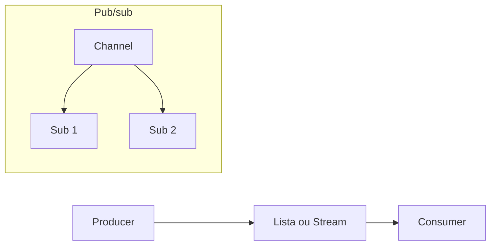
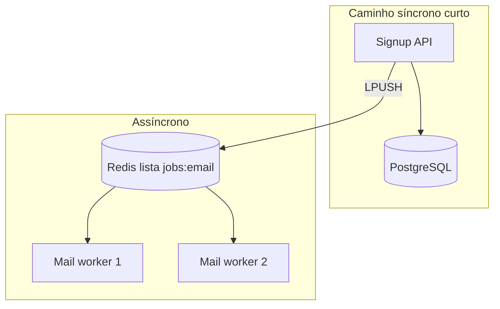
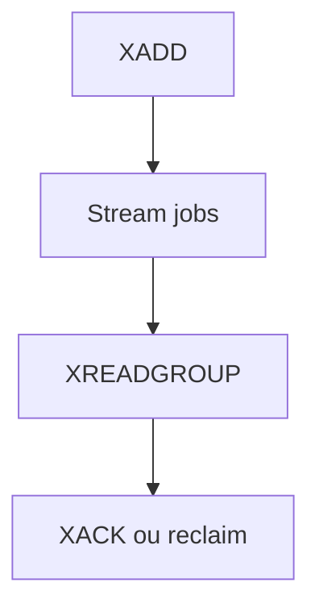

# Redis — filas leves e pub/sub

## Introdução

**Redis** é frequentemente usado como **cache**, mas também suporta **filas** (listas `LPUSH`/`BRPOP`, **Streams** com grupos de consumidores) e **pub/sub** canais simples (*fire-and-forget*). É uma opção **baixa latência** quando a perda de mensagens em crash extremo é aceitável ou quando há **persistência AOF/RDB** e desenho cuidadoso — muitas equipas preferem **BullMQ** (ver [BullMQ](./03-bullmq.md)) ou um **broker** dedicado para workloads críticos.



---

## Arquitetura de microsserviços com fila Redis (lista)

Dois serviços partilham **uma lista** `jobs:email`: o **Signup Service** faz `LPUSH` após registo; **N** réplicas do **Mail Worker** fazem `BRPOP` em loop (competição saudável). Sem broker externo — ideal para MVP ou baixo volume.



---

## Fila com lista (padrão simples)

```bash
redis-cli LPUSH fila:tarefas '{"id":1}'
redis-cli BRPOP fila:tarefas 30
```

- **BRPOP** bloqueia até timeout — eficiente para workers.
- Sem **ack** explícito como RabbitMQ; se o worker morrer após `BRPOP`, a mensagem já saiu da lista — use **RPOPLPUSH** para *reliable queue* pattern ou **Streams**.

### Node.js (`ioredis`) — produtor

```javascript
// producer.mjs
import Redis from "ioredis";
const redis = new Redis();
await redis.lpush("fila:tarefas", JSON.stringify({ type: "email", to: "user@example.com" }));
console.log("enfileirado");
await redis.quit();
```

### Node.js — consumidor (loop)

```javascript
// consumer.mjs
import Redis from "ioredis";
const redis = new Redis();
while (true) {
  const out = await redis.brpop("fila:tarefas", 30);
  if (!out) continue;
  const [, payload] = out;
  const job = JSON.parse(payload);
  console.log("processar", job);
}
```

### Python (`redis-py`) — produtor

```python
# producer.py
import json
import redis

r = redis.Redis(host="localhost", port=6379, decode_responses=True)
r.lpush("fila:tarefas", json.dumps({"type": "email", "to": "user@example.com"}))
```

### Python — consumidor

```python
# consumer.py
import json
import redis

r = redis.Redis(host="localhost", port=6379, decode_responses=True)
while True:
    item = r.brpop("fila:tarefas", timeout=30)
    if not item:
        continue
    _, raw = item
    print("processar", json.loads(raw))
```

### Go (`go-redis/redis`) — produtor

```go
// producer.go
package main

import (
	"context"
	"fmt"
	"github.com/redis/go-redis/v9"
)

func main() {
	r := redis.NewClient(&redis.Options{Addr: "localhost:6379"})
	ctx := context.Background()
	err := r.LPush(ctx, "fila:tarefas", `{"type":"email","to":"user@example.com"}`).Err()
	if err != nil {
		panic(err)
	}
	fmt.Println("enfileirado")
}
```

### Go — consumidor

```go
// consumer.go
package main

import (
	"context"
	"fmt"
	"time"

	"github.com/redis/go-redis/v9"
)

func main() {
	r := redis.NewClient(&redis.Options{Addr: "localhost:6379"})
	ctx := context.Background()
	for {
		res, err := r.BRPop(ctx, 30*time.Second, "fila:tarefas").Result()
		if err == redis.Nil {
			continue
		}
		if err != nil {
			panic(err)
		}
		fmt.Println("processar", res[1])
	}
}
```

### C# (`StackExchange.Redis`) — produtor e consumidor

```csharp
// Producer
var mux = ConnectionMultiplexer.Connect("localhost:6379");
var db = mux.GetDatabase();
await db.ListLeftPushAsync("fila:tarefas", """{"type":"email","to":"user@example.com"}""");
```

```csharp
// Consumer (loop)
var mux = ConnectionMultiplexer.Connect("localhost:6379");
var db = mux.GetDatabase();
while (true)
{
    var item = await db.ListRightPopAsync("fila:tarefas");
    if (item.IsNull) { await Task.Delay(500); continue; }
    Console.WriteLine("processar " + item);
}
```

*(Para `BRPOP` bloqueante, use `ListRightPopAsync` com polling ou a API de *blocking list* conforme versão da biblioteca.)*

---

## Streams (Redis 5+)

**Streams** oferecem IDs auto-incrementais, **consumer groups** e **pending entries** — mais próximo de uma fila com ack (`XACK`).

```bash
redis-cli XADD jobs * task send_email
redis-cli XREADGROUP GROUP workers consumer1 COUNT 1 STREAMS jobs >
```



---

## Pub/sub (não persiste)

Padrão: **publicador** e **subscritor** em processos distintos; a mensagem **não** fica armazenada se não houver subscritores no momento.

### Node.js — subscritor

```javascript
// subscriber.mjs
import Redis from "ioredis";
const sub = new Redis();
await sub.subscribe("cache:invalidate", (err) => {
  if (err) throw err;
});
sub.on("message", (channel, message) => console.log(channel, message));
```

### Node.js — publicador

```javascript
// publisher.mjs
import Redis from "ioredis";
const pub = new Redis();
await pub.publish("cache:invalidate", "user:42");
await pub.quit();
```

### Python — subscritor / publicador

```python
# subscriber.py
import redis
r = redis.Redis(host="localhost", port=6379, decode_responses=True)
p = r.pubsub()
p.subscribe("cache:invalidate")
for msg in p.listen():
    if msg["type"] == "message":
        print(msg["channel"], msg["data"])
```

```python
# publisher.py
import redis
r = redis.Redis(host="localhost", port=6379, decode_responses=True)
r.publish("cache:invalidate", "user:42")
```

Use quando perda de mensagens em desconexão for **aceitável** (invalidação de cache, *typing indicators*).

---

## Conteúdo detalhado neste repositório

O capítulo [DynamoDB e Redis — Redis como fila](../bancos-de-dados/09-dynamodb-redis.md) aprofunda listas, streams e comparação com uso como **cache**, com mais exemplos (incl. Clojure).

---

## Referências

- [Redis Lists](https://redis.io/docs/data-types/lists/)
- [Redis Streams](https://redis.io/docs/data-types/streams/)
- [BullMQ](./03-bullmq.md)

---

*Redis como fila é **pragmático**; documente o trade-off entre **simplicidade** e **garantias** frente a RabbitMQ/SQS/Kafka.*
