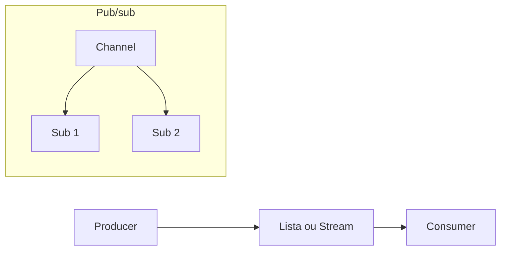
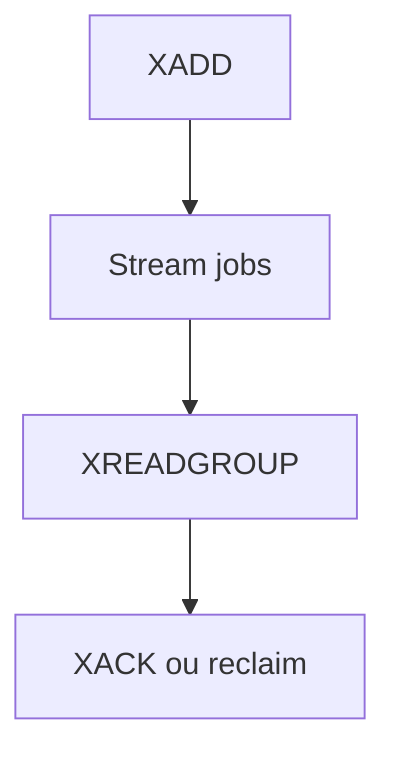

# Redis — filas leves e pub/sub

## Introdução

**Redis** é frequentemente usado como **cache**, mas também suporta **filas** (listas `LPUSH`/`BRPOP`, **Streams** com grupos de consumidores) e **pub/sub** canais simples (*fire-and-forget*). É uma opção **baixa latência** quando a perda de mensagens em crash extremo é aceitável ou quando há **persistência AOF/RDB** e desenho cuidadoso — muitas equipas preferem **BullMQ** (ver [BullMQ](./03-bullmq.md)) ou um **broker** dedicado para workloads críticos.



---

## Fila com lista (padrão simples)

```bash
redis-cli LPUSH fila:tarefas '{"id":1}'
redis-cli BRPOP fila:tarefas 30
```

- **BRPOP** bloqueia até timeout — eficiente para workers.
- Sem **ack** explícito como RabbitMQ; se o worker morrer após `BRPOP`, a mensagem já saiu da lista — use **RPOPLPUSH** para *reliable queue* pattern ou **Streams**.

### Node.js (`ioredis`)

```javascript
import Redis from "ioredis";

const redis = new Redis();

await redis.lpush("fila:tarefas", JSON.stringify({ id: 1 }));
const [, payload] = await redis.brpop("fila:tarefas", 30);
console.log(JSON.parse(payload));
```

### Python (`redis-py`)

```python
import json
import redis

r = redis.Redis(host="localhost", port=6379, decode_responses=True)
r.lpush("fila:tarefas", json.dumps({"id": 1}))
_, raw = r.brpop("fila:tarefas", timeout=30)
print(json.loads(raw))
```

---

## Streams (Redis 5+)

**Streams** oferecem IDs auto-incrementais, **consumer groups** e **pending entries** — mais próximo de uma fila com ack (`XACK`).

```bash
redis-cli XADD jobs * task send_email
redis-cli XREADGROUP GROUP workers consumer1 COUNT 1 STREAMS jobs >
```



---

## Pub/sub (não persiste)

```javascript
const sub = new Redis();
const pub = new Redis();
await sub.subscribe("events", (err, count) => {
  if (err) throw err;
});
sub.on("message", (channel, message) => console.log(channel, message));
await pub.publish("events", "hello");
```

Use quando perda de mensagens em desconexão for **aceitável** (invalidação de cache, *typing indicators*).

---

## Conteúdo detalhado neste repositório

O capítulo [DynamoDB e Redis — Redis como fila](../bancos-de-dados/09-dynamodb-redis.md) aprofunda listas, streams e comparação com uso como **cache**, com mais exemplos (incl. Clojure).

---

## Referências

- [Redis Lists](https://redis.io/docs/data-types/lists/)
- [Redis Streams](https://redis.io/docs/data-types/streams/)
- [BullMQ](./03-bullmq.md)

---

*Redis como fila é **pragmático**; documente o trade-off entre **simplicidade** e **garantias** frente a RabbitMQ/SQS/Kafka.*
