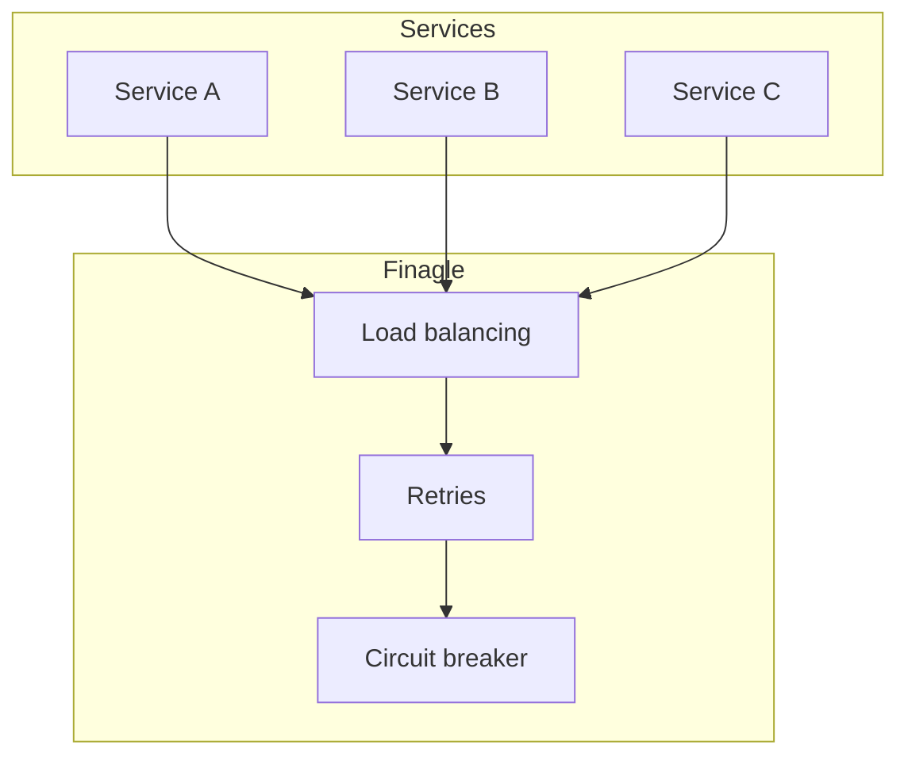
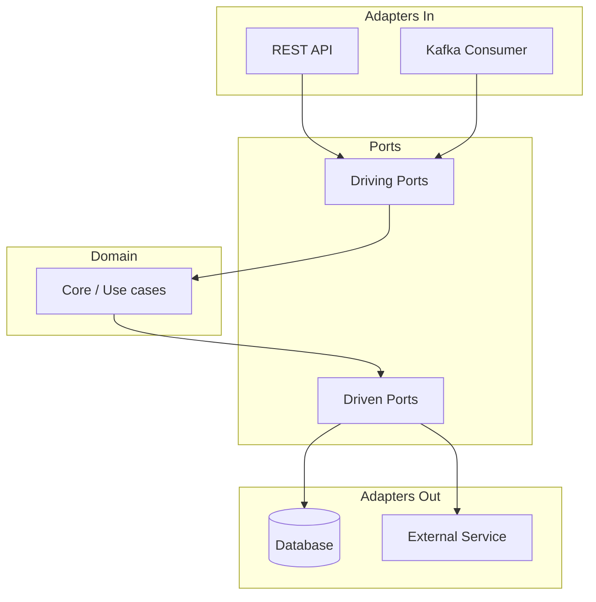

# Visão geral e arquitetura

## Por que microsserviços em Clojure?

Microsserviços permitem que times entreguem e escalem partes do sistema de forma independente. **Clojure** traz imutabilidade, expressividade e concorrência (core.async, átomos, agentes) que se encaixam bem em sistemas distribuídos: menos estado mutável significa menos surpresas em ambiente paralelo e em rede. A JVM garante desempenho e interoperabilidade com bibliotecas como **Finagle** (Twitter) para RPC, load balancing e resiliência.

## Escalabilidade horizontal

**Escalabilidade horizontal** (scale out) significa adicionar mais instâncias do mesmo serviço para aumentar capacidade, em vez de aumentar o tamanho da máquina (vertical). Para isso:

- **Stateless** – O serviço não guarda estado de sessão em memória; requisições podem ser atendidas por qualquer instância. Estado vai para cache (Redis), banco ou filas.
- **Load balancing** – Um balanceador (ou service mesh) distribui tráfego entre as instâncias; Finagle oferece balanceamento client-side (ex.: por partição ou round-robin).
- **Descoberta de serviços** – Instâncias se registram (ou são descobertas) em um registry (Consul, ZooKeeper, Kubernetes DNS); o cliente resolve o nome do serviço para uma lista de nós.
- **Graceful shutdown** – Ao desligar, o serviço para de aceitar novas requisições e espera as em andamento terminarem; o orquestrador (Kubernetes) usa readiness/liveness para controlar o tráfego.

## Programação funcional no contexto de microsserviços

- **Funções puras e imutabilidade** – Reduzem efeitos colaterais e facilitam testes e raciocínio; dados fluem por transformações em vez de mutação.
- **Composição** – Serviços podem ser compostos em pipelines (request → validação → enriquecimento → persistência) de forma declarativa.
- **Tratamento explícito de efeitos** – I/O, rede e tempo são tratados nas bordas (adapters); o núcleo do domínio permanece puro.
- **Concorrência** – core.async (canais), futures e promessas permitem lidar com múltiplas chamadas assíncronas sem bloquear; Finagle usa futures na JVM para chamadas entre serviços.

## Arquitetura hexagonal (ports and adapters)

Na **arquitetura hexagonal**, o **domínio** fica no centro; a aplicação expõe **ports** (interfaces) e os detalhes de infraestrutura são **adapters** que implementam essas interfaces.

- **Driving (inbound)** – Quem aciona a aplicação: API HTTP, consumidor Kafka, CLI. O port é a interface que o core expõe (ex.: “executar comando X”).
- **Driven (outbound)** – O que a aplicação usa: repositório de dados, cliente de outro serviço, fila. O port é a interface que o core define (ex.: “salvar pedido”); o adapter implementa (Datomic, DynamoDB, Finagle client).

Com isso, o núcleo não depende de framework web nem de biblioteca de banco; trocar HTTP por gRPC ou Datomic por DynamoDB não altera as regras de negócio.

## Resumo

| Tema | Contribuição para microsserviços escaláveis |
|------|---------------------------------------------|
| **Clojure** | Imutabilidade, concorrência, expressividade; boa integração com a JVM e Finagle. |
| **Finagle** | RPC, load balancing, retries, circuit breaker, integração com descoberta de serviços. |
| **Programação funcional** | Menos estado, mais composição e testes; efeitos nas bordas. |
| **Arquitetura hexagonal** | Domínio isolado; troca de adapters (HTTP, Kafka, DB) sem mudar o core. |

Nos próximos capítulos: Finagle na prática (client/servidor, resiliência) e implementação da hexagonal em Clojure (ports, adapters, exemplos).

---

*Próximo: [Finagle e comunicação entre serviços](./02-finagle-comunicacao.md).*
