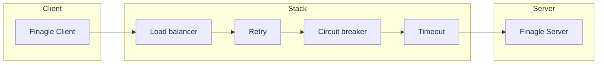

# Finagle e comunicação entre serviços

## O que é o Finagle?

**Finagle** é uma biblioteca da Twitter (JVM) para construção de clientes e servidores **RPC** resilientes. Oferece load balancing, retries, circuit breaker, timeouts e integração com descoberta de serviços. Em um ecossistema de microsserviços, cada serviço pode expor um servidor Finagle e consumir outros via clientes Finagle, com comportamento consistente e configurável.

## Modelo de cliente e servidor

- **Servidor** – Escuta em uma porta; para cada requisição, executa um handler (função que recebe a requisição e retorna uma Future com a resposta). O protocolo pode ser HTTP, Thrift, gRPC ou customizado.
- **Cliente** – Configurado com um destino (endereço ou nome de serviço no registry); envia requisições e recebe Futures. O stack (filtros) aplica load balancing, retry, timeout e circuit breaker antes de enviar ao servidor.

Em **Clojure**, você usa a interop com Java para construir clientes e servidores Finagle; há projetos que encapsulam isso em APIs mais idiomáticas (ex.: finagle-clojure, ou wrappers internos).

## Load balancing

O cliente Finagle mantém um pool de conexões (ou endpoints) para o serviço de destino. Estratégias comuns:

- **Round robin** – Distribui requisições em sequência entre os nós.
- **Least loaded** – Envia para o nó com menor número de requisições em voo.
- **P2C (Power of Two Choices)** – Amostra dois nós e escolhe o menos carregado; bom compromisso entre custo e distribuição.

O destino pode ser estático (lista de hosts) ou dinâmico (resolução via ZooKeeper, Consul, Kubernetes). A atualização da lista de nós permite que novos pods recebam tráfego e que nós caídos saiam do pool.

## Retries e timeouts

- **Timeout** – Limite de tempo para a requisição; evita que uma chamada lenta trave o cliente. Configurável por requisição ou globalmente.
- **Retry** – Em falhas consideradas retentáveis (ex.: erro de rede, 503), o cliente pode reenviar a requisição. É importante que a operação seja **idempotente** ou que o servidor trate duplicatas (idempotency key). Retries com backoff (exponential) reduzem pressão no servidor em caso de sobrecarga.

## Circuit breaker

O **circuit breaker** evita que o cliente insista em um serviço que está falhando repetidamente. Três estados:

- **Closed** – Requisições passam normalmente; falhas são contabilizadas.
- **Open** – Após um limiar de falhas, o circuito abre: requisições falham imediatamente (sem chamar o servidor) ou retornam fallback.
- **Half-open** – Após um intervalo, algumas requisições são permitidas para testar se o serviço recuperou; sucesso fecha o circuito, falha reabre.

Assim, um serviço downstream instável não derruba o chamador; o chamador pode retornar cache, default ou erro degradado.

## Uso em Clojure (conceitual)

Via interop Java, você tipicamente:

1. **Servidor** – Cria um `com.twitter.finagle.*` Server (ex.: Http.Server), define o handler (Clojure fn que retorna Future) e faz `bind`.
2. **Cliente** – Cria um `Client` apontando para o destino (nome ou endereço), aplica filtros (timeout, retry) e chama o serviço; o retorno é uma Future, que você pode bloquear (não recomendado em produção) ou compor com callbacks/core.async.
3. **Integração** – Em um adapter “driven” (porta de saída), o cliente Finagle é a implementação que chama o outro microsserviço; o core só conhece a interface (ex.: “obter preço do produto”) e não sabe que a implementação usa Finagle.

## Boas práticas

- **Timeouts em toda a cadeia** – Cada serviço deve ter timeout para chamadas a downstream; a soma dos timeouts não deve ser excessiva para o usuário final.
- **Métricas** – Instrumentar latência, taxa de erro e uso do circuit breaker; integração com Prometheus/StatsD para alertas.
- **Contrato e versão** – Definir contrato (Thrift, Protobuf, JSON) e estratégia de evolução (compatibilidade retroativa) para não quebrar clientes ao atualizar o servidor.
- **Graceful shutdown** – Ao desligar o servidor, parar de aceitar novas conexões e aguardar requisições em andamento; o cliente deve ter retry para falhas de conexão durante o rollout.

No próximo capítulo: como organizar ports e adapters em Clojure, com exemplos de core, API HTTP e cliente Finagle como adapter.

---

*Próximo: [Arquitetura hexagonal e implementação](./03-hexagonal-implementacao.md).*
