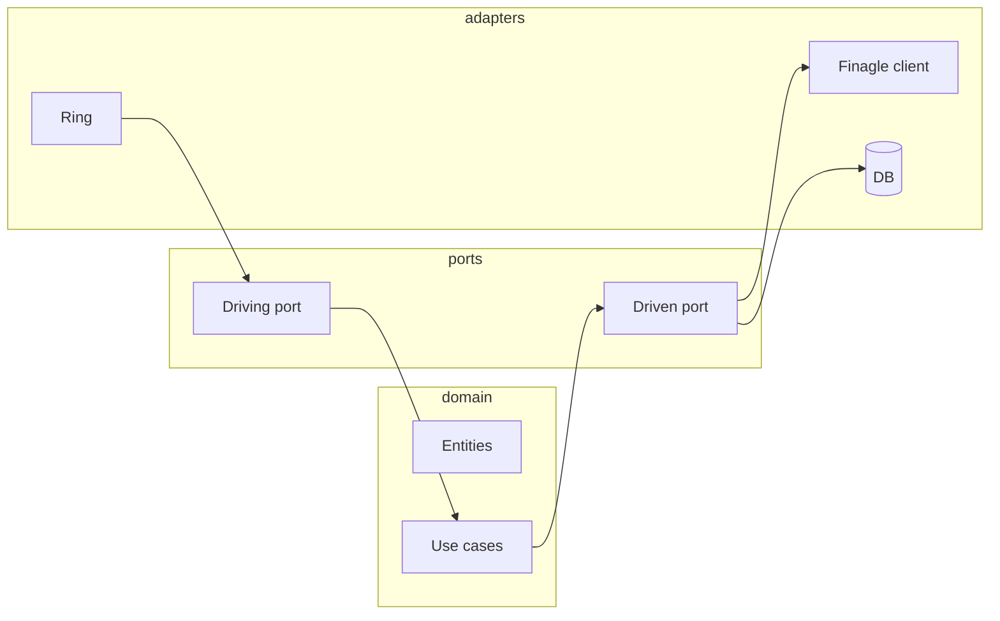

# Arquitetura hexagonal e implementação

## Organização do código

Em um microsserviço Clojure com arquitetura hexagonal, a estrutura de namespaces pode seguir:

- **`domain`** ou **`core`** – Entidades, valores, regras de negócio puras; sem I/O.
- **`ports`** ou **`application`** – Interfaces (protocols ou multimethods) que o core usa (driven) ou expõe (driving); orquestração de use cases.
- **`adapters`** ou **`infra`** – Implementações: REST (Ring), consumidor Kafka, repositório Datomic/DynamoDB, **cliente Finagle** para outro serviço.

O **core** não referencia Ring, Finagle nem o banco; apenas as interfaces (portas). Os adapters são injetados na “borda” (main ou sistema de injeção).

## Porta de entrada (driving): API HTTP

Um adapter de entrada recebe HTTP (Ring), parseia o corpo, chama a **porta de entrada** (ex.: “processar pedido”) e traduz o resultado em resposta HTTP. O use case vive no core e recebe apenas dados (maps); a decisão de status code e headers fica no adapter.

Exemplo de fluxo:

1. Ring handler recebe `request`.
2. Extrai corpo e parâmetros; valida formato.
3. Chama `(use-case/process-order! payload)`.
4. O use case usa as **portas de saída** (repositório, cliente de preço) injetadas; retorna resultado ou exceção de domínio.
5. O adapter traduz em 200/201/400/500 e corpo JSON.

Assim, trocar Ring por outro framework (ou adicionar um adapter Kafka que chama o mesmo use case) não altera o core.

## Porta de saída (driven): cliente Finagle

Uma **porta de saída** é uma interface que o core espera para obter dados ou efeitos externos, por exemplo “obter preço do produto” ou “reservar estoque”. O **adapter** implementa essa interface usando um **cliente Finagle** que chama o microsserviço de preço ou de estoque.

- O core chama `(get-product-price product-id)`; a implementação (adapter) usa o cliente Finagle, faz a chamada RPC, trata timeout/erro e retorna um mapa ou lança exceção de domínio.
- Em testes, você injeta um **stub** ou **mock** que retorna valores fixos; não precisa subir o Finagle nem o serviço real.
- Configuração (timeout, retries, endereço do serviço) fica no adapter ou em config; o core não conhece Finagle.

## Escalabilidade e estado

- **Stateless** – O serviço não guarda sessão em memória; cada requisição pode ser tratada por qualquer instância. Dados de sessão (se necessário) vão para Redis ou para um serviço de sessão.
- **Escala horizontal** – O orquestrador (Kubernetes) aumenta o número de réplicas; o load balancer (ou Finagle client-side) distribui o tráfego. Garanta que conexões (DB, Finagle, Kafka) sejam criadas por instância e liberadas no shutdown.
- **Concorrência** – Em Clojure, evite bloqueio nas threads; use futures, core.async ou chamadas assíncronas do Finagle e compondo resultados no adapter ou na orquestração.

## Testes

- **Core** – Testes unitários puros: entradas e saídas; portas de saída são mocks que retornam dados controlados.
- **Adapters** – Testes de integração: servidor HTTP real ou cliente Finagle contra um stub (ex.: WireMock, servidor de teste); validar que a tradução request/response está correta.
- **Contratos** – Testes de contrato (Pact, Spring Cloud Contract) garantem que o cliente e o servidor respeitam o mesmo protocolo.

## Resumo

| Aspecto | Prática |
|---------|---------|
| **Estrutura** | domain → ports → adapters; core sem dependência de framework. |
| **Entrada** | Adapter HTTP/Kafka chama a porta de entrada (use case). |
| **Saída** | Cliente Finagle (ou DB, Kafka producer) implementa a porta de saída. |
| **Escala** | Serviço stateless; várias réplicas atrás de load balancer. |
| **Testes** | Core com mocks; adapters com integração e contrato. |

Com isso, você tem uma base para microsserviços em Clojure, horizontalmente escaláveis, com Finagle na comunicação e arquitetura hexagonal organizando domínio e infraestrutura.

---

*Voltar ao [índice](./README.md).*
