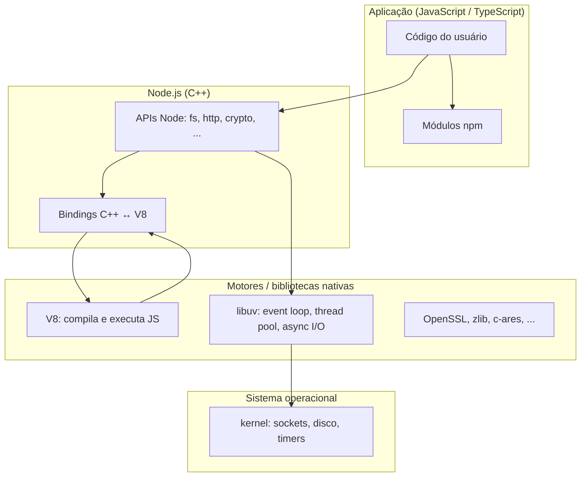
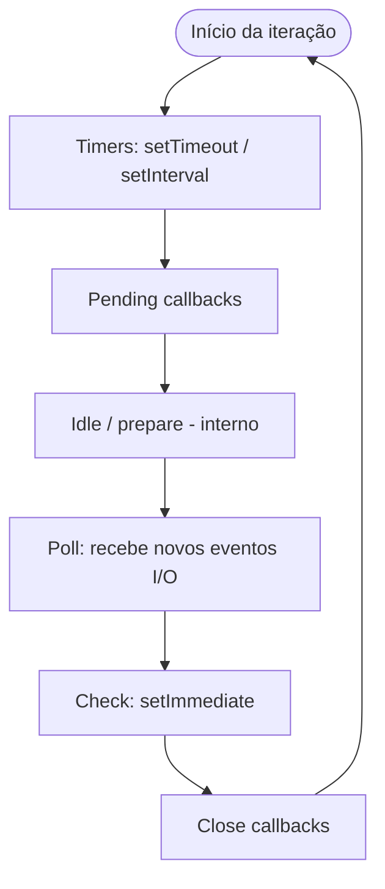
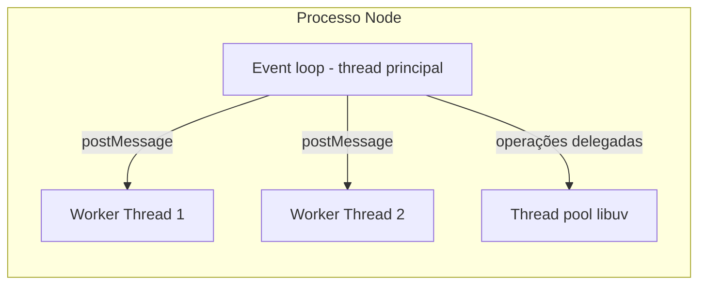
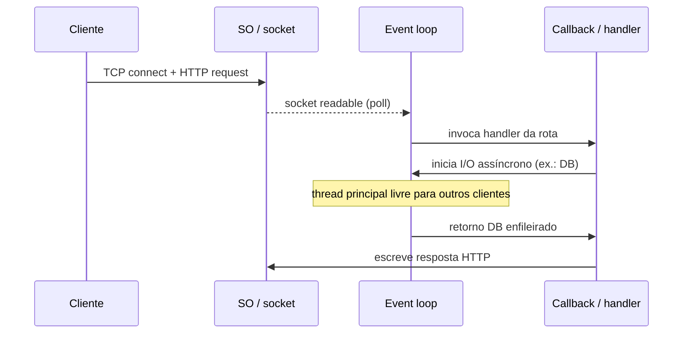

# Introdução, história e runtime interno

Este capítulo situa o **Node.js** no tempo, explica o que ele é (e o que não é) e descreve **como funciona por baixo dos panos**: motor JavaScript, *event loop*, I/O assíncrono e **onde** costuma rodar em produção.

---

## Introdução: Node.js em uma frase

**Node.js** é um **runtime** (ambiente de execução) que permite rodar **JavaScript** fora do navegador, tipicamente no **servidor** ou em ferramentas de linha de comando. Ele combina o motor **V8** (o mesmo núcleo que executa JS no Chrome) com APIs para sistema de arquivos, rede, processos e uma biblioteca **C** chamada **libuv**, responsável por operações assíncronas e pela abstração do *event loop* sobre o sistema operacional.

> **Importante:** Node.js **não** é uma linguagem. A linguagem é **JavaScript** (ou, na prática profissional, **TypeScript** transpilado para JS). Node é o **ambiente** que fornece `require`/`import`, `process`, `Buffer`, módulos `fs`, `http`, `crypto`, etc.

---

## Panorama histórico

### JavaScript no navegador (1995–2008)

**JavaScript** foi criado por **Brendan Eich** na **Netscape** em **1995**, com o objetivo de adicionar comportamento dinâmico às páginas web. Por muitos anos ficou associado a scripts leves no **browser**, enquanto o **servidor** era dominado por **Perl**, **PHP**, **Java**, **ASP**, etc.

### A ideia do servidor em JS (2009)

**Ryan Dahl** apresentou o **Node.js** em **2009**. A proposta central era usar o motor **V8** (open-sourced pelo Google) para I/O **não bloqueante** e **orientada a eventos**, adequada a muitas conexões simultâneas com poucos threads — um modelo diferente do “um thread por requisição” típico de servidores tradicionais.

A **Joyent** apoiou o projeto no início; depois a governança passou pela **Node.js Foundation** e, com a fusão com a **JS Foundation**, pelo ecossistema atual da **OpenJS Foundation** (Linux Foundation).

### npm, estabilidade e io.js (2010–2015)

- **2010:** nasce o **npm** (*Node Package Manager*), repositório e ferramenta de pacotes que virou central para o ecossistema.
- **2014–2015:** divergências de ritmo de evolução levaram ao **io.js**, um *fork* com releases mais rápidos. **io.js** e **Node.js** **reunificaram-se** em 2015 sob a Node.js Foundation, estabelecendo releases **LTS** (*Long Term Support*) e **Current**, modelo que permanece.

### Consolidação no mercado (2015–hoje)

Node.js tornou-se padrão para **APIs REST**, **BFFs** (*Backend for Frontend*), **ferramentas de build** (Webpack, Vite), **automação** e **microserviços**. **TypeScript** ganhou tração forte em APIs corporativas. **Deno** (também criado por Dahl) e **Bun** são runtimes alternativos que dialogam com o mesmo ecossistema em parte, mas **Node** permanece a referência de mercado em muitas empresas.

### Calendário de releases (LTS)

O projeto publica versões **Current** (recursos novos) e linhas **LTS** (*Active* e depois *Maintenance*). Em ambientes corporativos, fixar `"engines": { "node": ">=20 <21" }` no `package.json` e validar no CI reduz surpresas entre máquinas de desenvolvedores e produção. Consulte sempre [nodejs.org/en/about/previous-releases](https://nodejs.org/en/about/previous-releases) para datas de fim de suporte.

---

## Módulos, npm e o arquivo `package.json`

### CommonJS e ECMAScript Modules (ESM)

Historicamente, Node usou **`require()`** e `module.exports` (**CommonJS**). O padrão moderno da linguagem é **`import` / `export`** (**ESM**). Versões recentes do Node suportam ambos, com regras sobre extensão `.mjs`, campo `"type": "module"` no `package.json` e interoperabilidade limitada entre CJS e ESM. Projetos novos tendem a adotar **ESM** ou **TypeScript** compilando para um alvo explícito.

### npm e o registro de pacotes

O **npm** (empresa e CLI) mantém o maior registro de pacotes; alternativas de cliente como **yarn** e **pnpm** consomem o mesmo ecossistema na maior parte dos casos. **Semantic Versioning** (`major.minor.patch`) orienta atualizações: *major* pode quebrar API; *lockfile* (`package-lock.json`, `pnpm-lock.yaml`) garante **build reproduzível** em CI/CD.

---

## Arquitetura de alto nível

Node.js empilha camadas aproximadamente assim:

**Papel de cada peça:**

| Componente | Função |
|------------|--------|
| **V8** | Compila JavaScript para código de máquina (JIT), gerencia memória (*heap*) e *garbage collection*. |
| **libuv** | *Event loop*, filas de trabalho, **thread pool** padrão para algumas operações (ex.: DNS `lookup` em certos casos, `fs` em versões antigas), abstração de *polling* de I/O. |
| **Camada Node (C++)** | Liga V8 às APIs que você chama em JS (`http.createServer`, `fs.readFile`, etc.). |
| **Addons nativos** | Módulos `.node` (C/C++) podem estender o runtime para performance crítica ou integração com bibliotecas legadas. |

---

## Por baixo dos panos: *event loop* e I/O assíncrono

### Modelo mental: uma thread para JS, muitas operações pendentes

Na maior parte do tempo, **seu código JavaScript roda em uma única thread** (a “thread principal”). Operações de **rede** e **disco** delegadas às APIs assíncronas do Node **não travam** essa thread enquanto o kernel ou a libuv trabalham: quando o resultado está pronto, um **callback** (ou `Promise`/async) é enfileirado para execução.

Isso explica forças e limitações:

- **Bom para:** muitas conexões I/O-bound (APIs, *gateways*, *streaming* com backpressure cuidadoso).
- **Ruim para:** trabalho **CPU-intensivo** longo na thread principal (bloqueia tudo: timers, requisições, etc.).

### Fases do *event loop* (visão simplificada)

A documentação oficial descreve o *loop* em **fases** (timers, *pending callbacks*, *poll*, *check*, *close callbacks*). O diagrama abaixo resume o fluxo conceitual:

Em cada volta, o runtime executa **microtarefas** (`Promise.then`) entre macrotarefas, conforme as regras do ECMAScript e da implementação — por isso ordem entre `setTimeout(0)` e `Promise.resolve()` pode surpreender quem está começando.

### Thread pool e *Worker Threads*

- **libuv** usa um **conjunto limitado de threads** (padrão histórico: **4** threads em operações que não podem ser totalmente assíncronas no SO; o número pode ser ajustado com `UV_THREADPOOL_SIZE`).
- **Worker Threads** (`worker_threads`) permitem **paralelizar CPU** em threads separadas com isolamento e troca de mensagens.
- O módulo **`cluster`** (ou process managers + múltiplos processos) permite usar **vários núcleos** com **vários processos Node**, cada um com seu próprio V8 e *event loop*.

---

## Onde e como o Node.js roda

### Máquina local e servidores

- **Instalação direta** no Linux, macOS ou Windows (ou **WSL** no Windows para alinhar com produção Linux).
- **Process managers:** **PM2**, **systemd**, **Forever** — mantêm o processo vivo, reiniciam em falha e agregam logs.
- **Containers:** imagem oficial `node` no **Docker**; orquestração com **Kubernetes** (Deployments, HPA, probes de *liveness/readiness*).

### PaaS e nuvem

- **Heroku**, **Railway**, **Render**, **Fly.io**, etc.: *buildpack* ou Dockerfile detecta `package.json`, expõe `PORT`.
- **AWS Lambda**, **Azure Functions**, **Google Cloud Functions**: modelo **serverless** com *cold start*; limite de tempo e memória; frequentemente empaceta-se com frameworks como **Serverless Framework** ou **AWS SAM**.

### “Edge” e runtimes relacionados

**Vercel Edge Functions** e **Cloudflare Workers** usam isolados V8 ou runtimes específicos; **nem sempre** é o Node completo — APIs podem ser subconjuntos. Já **Vercel** para rotas Node tradicionais ou **AWS Lambda** com *runtime* `nodejs20.x` executam o **Node completo** (com limites de ambiente).

---

## Streams e backpressure

O Node expõe **Streams** (`Readable`, `Writable`, `Transform`) para processar dados **em pedaços** (arquivos grandes, HTTP, compressão). Isso liga-se diretamente ao *event loop*: ler um ficheiro inteiro na memória pode ser pior que `createReadStream` + pipe. **Backpressure** ocorre quando o consumidor é mais lento que o produtor; APIs corretamente usadas (`pipe` com tratamento de `drain`) evitam estourar memória ou filas.

---

## Diagrama: requisição HTTP simplificada

---

## Resumo do capítulo

| Tópico | Ideia-chave |
|--------|-------------|
| **História** | Node (2009) uniu V8 + I/O assíncrona; npm e LTS consolidaram o ecossistema. |
| **Arquitetura** | V8 executa JS; libuv + kernel fazem I/O; APIs Node ligam os dois mundos. |
| **Event loop** | Orquestra callbacks; evite CPU pesada na thread principal. |
| **Deploy** | Do bare metal ao Kubernetes e serverless; atenção a cold start e limites. |

---

*Próximo: [Arquitetura limpa, hexagonal e SOLID](./02-arquitetura-limpa-hexagonal-solid.md).*
