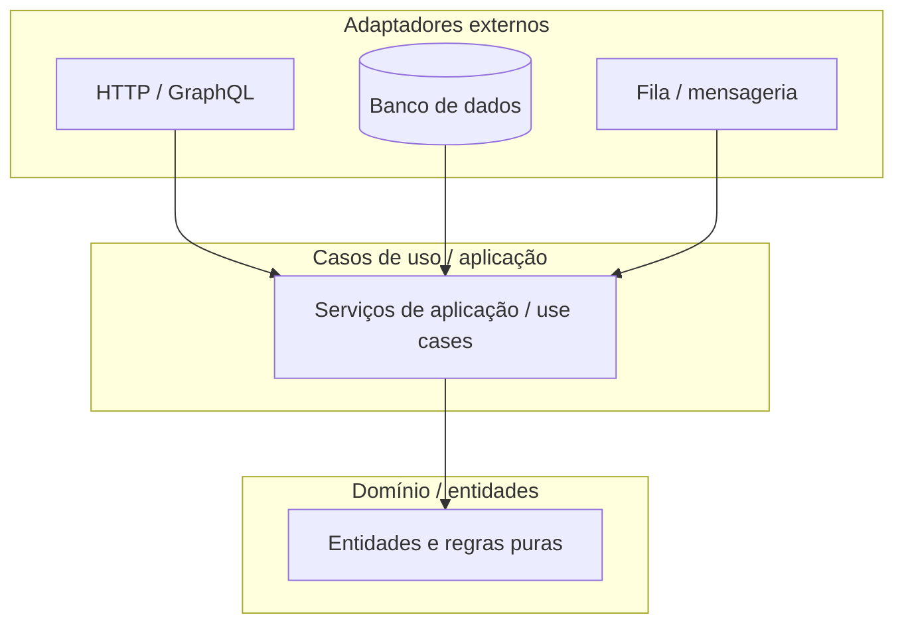
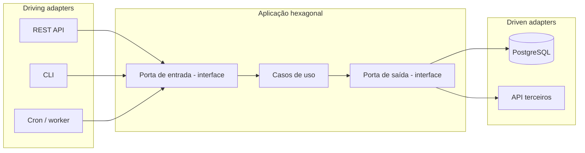
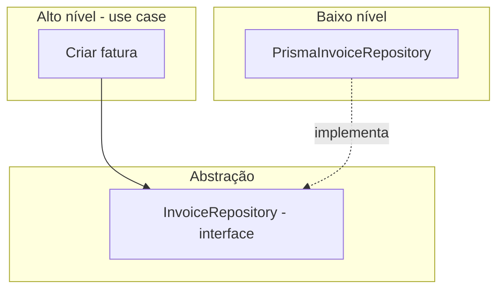

# Arquitetura limpa, hexagonal e SOLID

Este capítulo relaciona **princípios de design** amplamente usados em backend — **Clean Architecture**, **arquitetura hexagonal** e **SOLID** — ao desenvolvimento em **Node.js**, em geral com **TypeScript** para contratos e camadas mais explícitas.

> Nenhum framework **obriga** arquitetura limpa: **Express** é minimalista; **NestJS** já traz módulos, injeção de dependência e camadas que **facilitam** alinhar o código a esses princípios.

---

## Arquitetura limpa (Clean Architecture)

Robert C. Martin (“Uncle Bob”) descreve a **Clean Architecture** como uma forma de **isolar regras de negócio** de detalhes externos (UI, banco, frameworks, HTTP). O núcleo **não depende** de frameworks; são os **adaptadores** que dependem do núcleo.

### Anéis (visão conceitual)

**No Node.js, isso costuma se traduzir em pastas como:**

- **`domain/`** (ou `core/`) — entidades, *value objects*, erros de domínio; **sem** importar Express, Prisma ou `fs`.
- **`application/`** — casos de uso: “criar pedido”, “autenticar usuário”; orquestram portas; **sem** conhecer Express.
- **`infrastructure/`** — implementações: repositório Prisma/TypeORM, cliente HTTP, fila AMQP.
- **`interfaces/`** ou **`presentation/`** — controllers Express/Fastify, DTOs de entrada/saída, validação de *boundary*.

**Regra de dependência:** setas de import apontam **para dentro** (domínio no centro). Frameworks ficam na **borda**.

### Inversão na prática

Em Java, **interfaces** e injeção são naturais na cultura Spring. Em Node, você **define interfaces TypeScript** (ou classes abstratas) para “Repositório de Usuário” e implementa `PrismaUserRepository` na infraestrutura. O caso de uso recebe a interface no **construtor** ou *factory* (Nest: `@Injectable()` + token).

---

## Arquitetura hexagonal (Ports and Adapters)

Alistair Cockburn nomeou **hexagonal architecture** para enfatizar **simetria**: vários **drivers** (UI, CLI, teste) e vários **driven** (DB, API externa) plugam nas **portas** sem alterar o domínio.

| Porta | Papel em Node |
|-------|----------------|
| **Driving (entrada)** | Rota HTTP chama `CreateOrderUseCase.execute(dto)`; o use case não sabe se veio de Express ou Fastify. |
| **Driven (saída)** | `OrderRepository` interface; `SqlOrderRepository` usa Prisma ou `pg`. |

**Benefício:** trocar **Fastify** por **Nest** ou **PostgreSQL** por **MongoDB** afeta só **adapters**, não a regra “um pedido não pode ficar sem itens”.

---

## SOLID aplicado ao ecossistema Node

**SOLID** são cinco princípios OOP (úteis também com **módulos funcionais** e **composição**). Abaixo, o foco é **como Node costuma violar** e **como corrigir**.

### S — Single Responsibility Principle

**Uma razão para mudar por módulo.** Em projetos Express, é comum um arquivo gigante com rotas + SQL + validação. Separe: **router** só encaminha; **service** orquestra; **repository** persiste.

### O — Open/Closed Principle

**Aberto para extensão, fechado para modificação.** Ex.: middlewares encadeados (`app.use`), *strategy* para provedores de pagamento (Stripe, PagSeguro) atrás de uma interface comum.

### L — Liskov Substitution Principle

**Subtipos substituíveis sem quebrar contratos.** Se `CachedUserRepository` implementa `UserRepository`, não deve lançar erros inesperados nem exigir chamadas extras que a interface não documenta.

### I — Interface Segregation Principle

**Interfaces pequenas.** Evite um `GodRepository` com 40 métodos; prefira `ReadableOrderPort`, `WritableOrderPort` ou módulos por agregado.

### D — Dependency Inversion Principle

**Módulos de alto nível não dependem de baixo nível; ambos dependem de abstrações.** O caso de uso depende de `IClock`, não de `Date.now()` direto (facilita testes e tempo simulado). NestJS com **tokens de injeção** e **interfaces** encarna bem esse princípio.

---

## Onde TypeScript ajuda

- **Tipos** nas portas evitam “DTO genérico” que vaza detalhes do ORM.
- **Enums** e **union types** substituem *magic strings* em estados de domínio.
- **Discriminated unions** para resultados `Ok | Err` sem exceção para fluxo de negócio (padrão funcional comum em libs como **neverthrow**).

---

## Antipadrões comuns em Node

| Antipadrão | Problema | Direção melhor |
|------------|----------|----------------|
| **Callback hell** (pirâmide) | Legibilidade e erro frágeis | `async/await`, `Promise`, composição |
| **Lógica no controller** | Difícil testar e reutilizar | Use cases / services |
| **Importar ORM no domínio** | Acoplamento total ao banco | Repositório atrás de interface |
| **Singleton global mutável** | Estado compartilhado entre testes | Injeção de dependência, módulos puros |
| **CPU pesado na thread principal** | Latência para todos | Worker threads, fila (BullMQ), serviço separado |

---

## Resumo

| Conceito | No Node |
|----------|---------|
| **Clean Architecture** | Pastas domain / application / infrastructure; dependências para dentro. |
| **Hexagonal** | Portas de entrada (HTTP, CLI) e saída (DB, APIs); adapters plugáveis. |
| **SOLID** | Mesmos princípios que em Java/C#; exige disciplina porque o ecossistema é permissivo. |
| **TypeScript** | Fortalece contratos entre camadas e testes. |

---

*Próximo: [Ecossistema, instalação, comparações e referências](./03-ecossistema-instalacao-comparacoes.md).*
