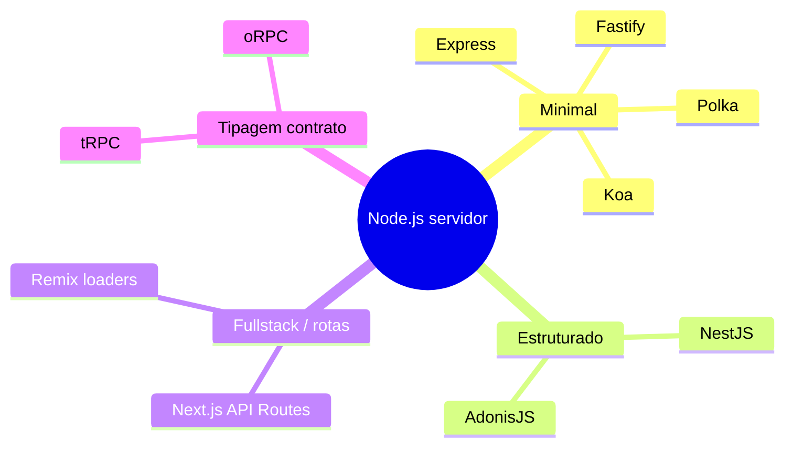
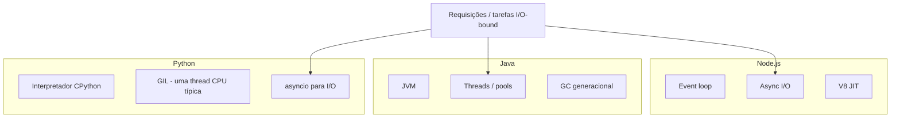

# Ecossistema, instalação, comparações e referências

Este capítulo cobre **como instalar** Node.js e gerenciar versões, um panorama dos **frameworks** HTTP e de API mais usados, **ORMs** e *query builders*, uma **comparação** com **Java** e **Python**, e uma **bibliografia** ampliada (livros, artigos, documentação e padrões).

> **Nota terminológica:** em bancos relacionais, costuma-se falar em **ORM** (*Object-Relational Mapping* — mapeamento objeto-relacional). “OMR” costuma ser um equívoco comum de digitação para **ORM**.

---

## Instalação do Node.js

### Opção recomendada: gerenciador de versões (nvm ou fnm)

Projetos diferentes exigem versões diferentes (LTS 18, 20, 22…). **nvm** (*Node Version Manager*) e **fnm** (*Fast Node Manager*) permitem trocar versão por diretório (`.nvmrc`).

**WSL / Ubuntu — nvm:**

```bash
curl -o- https://raw.githubusercontent.com/nvm-sh/nvm/v0.40.1/install.sh | bash
# Reinicie o shell ou: source ~/.bashrc
nvm install --lts
nvm use --lts
node -v
npm -v
```

**Instalação global alternativa — NodeSource / pacotes (Ubuntu):**

```bash
# Exemplo conceitual: siga a documentação atual em https://github.com/nodesource/distributions
curl -fsSL https://deb.nodesource.com/setup_lts.x | sudo -E bash -
sudo apt-get install -y nodejs
```

**macOS — Homebrew:**

```bash
brew install node@20
# ou: brew install fnm && fnm install --lts
```

**Windows:**

- Instalador oficial em [nodejs.org](https://nodejs.org/), ou **nvm-windows** ([coreybutler/nvm-windows](https://github.com/coreybutler/nvm-windows)).
- Para alinhar com produção Linux, **WSL2** + nvm costuma ser a opção mais próxima do servidor.

### Gerenciadores de pacote: npm, yarn, pnpm

| Ferramenta | Observação |
|------------|------------|
| **npm** | Vem com o Node; `package.json`, `package-lock.json`. |
| **yarn** | *Lockfile* próprio; *workspaces* para monorepos. |
| **pnpm** | *Store* de conteúdo endereçável; economiza disco; links simbólicos rigorosos. |

Verificação rápida após criar um projeto:

```bash
mkdir meu-app && cd meu-app
npm init -y
npm install express
node -e "console.log(require('express'))"
```

### Docker (produção e dev)

```dockerfile
# Exemplo mínimo - ajuste a tag LTS em https://hub.docker.com/_/node
FROM node:20-bookworm-slim
WORKDIR /app
COPY package*.json ./
RUN npm ci --omit=dev
COPY . .
ENV NODE_ENV=production
CMD ["node", "server.js"]
```

Use **multi-stage builds** para imagens menores (build com `node:20`, estágio final só com artefatos).

---

## Frameworks e bibliotecas HTTP (servidor e API)

Não há um único “framework oficial”; o mercado se divide entre **minimalistas** e **opinativos**.



| Projeto | Estilo | Quando considerar |
|---------|--------|-------------------|
| [**Express**](https://expressjs.com/) | Minimalista, middlewares | Maior base legada, prototipagem rápida, curva suave. |
| [**Fastify**](https://fastify.dev/) | Performance, *schema* JSON | APIs JSON com validação declarativa; *plugin* ecosystem. |
| [**Koa**](https://koajs.com/) | Middlewares “modernos” (async) | Controle fino do fluxo; menos “baterias inclusas” que Express. |
| [**Hapi**](https://hapi.dev/) | Configuração explícida | Validação e plugins em projetos enterprise históricos. |
| [**NestJS**](https://nestjs.com/) | Angular-like, DI, módulos | Times grandes, padrões próximos a **Java/Spring**. |
| [**AdonisJS**](https://adonisjs.com/) | MVC completo | Quem quer convenções tipo **Laravel** em JS. |
| [**tRPC**](https://trpc.io/) | RPC tipado end-to-end | Monorepo front+back com TypeScript; não é REST clássico. |
| [**Next.js**](https://nextjs.org/) | React + rotas servidor | *BFF* e SSR; API Routes ou Server Actions conforme versão. |

Para **GraphQL**, ecossistemas comuns incluem **Apollo Server**, **Mercurius** (Fastify) e **GraphQL Yoga**.

### Testes automatizados

| Ferramenta | Uso típico |
|------------|-------------|
| [**Jest**](https://jestjs.io/) | *Runner* + *matchers* + *mocking*; padrão histórico em muitos tutoriais. |
| [**Vitest**](https://vitest.dev/) | API compatível com Jest; muito rápido em projetos **Vite**. |
| [**Mocha**](https://mochajs.org/) + **Chai** | Composição manual de asserções e *reporters*. |
| [**node:test**](https://nodejs.org/api/test.html) | *Runner* nativo (a partir de versões recentes); reduz dependências. |
| [**Supertest**](https://github.com/ladjs/supertest) | Testes HTTP de integração sobre app Express/Fastify sem subir porta real. |

Arquitetura em camadas facilita **testes unitários** do domínio sem subir servidor nem banco; **testes de contrato** (ex.: **Pact**) validam integrações entre serviços.

---

## ORMs, ODMs e *query builders*

### Termos

- **ORM** — mapeia **tabelas** ↔ **classes/objetos** (SQL).
- **ODM** — análogo para **documentos** (ex.: Mongoose no MongoDB).
- **Query builder** — fluent API para SQL sem mapeamento completo de entidades (ex.: **Knex.js**, **Kysely**).

### Panorama no Node.js

| Ferramenta | Tipo | Destaques |
|------------|------|-----------|
| [**Prisma**](https://www.prisma.io/) | ORM + migrações + *client* gerado | *Schema* declarativo; forte em TypeScript; *Prisma Migrate*. |
| [**TypeORM**](https://typeorm.io/) | ORM decoradores / Data Mapper | Familiar a quem veio de **Hibernate**; Active Record opcional. |
| [**Sequelize**](https://sequelize.org/) | ORM maduro | Suporte amplo a dialetos SQL; API *promise-based*. |
| [**Drizzle**](https://orm.drizzle.team/) | ORM leve, SQL-like | Performance e tipagem; espírito próximo ao SQL explícito. |
| [**MikroORM**](https://mikro-orm.io/) | ORM com Unit of Work | Boa para domínios ricos e padrões DDD. |
| [**Objection.js**](https://vincit.github.io/objection.js/) | Camada sobre Knex | Relacionamentos e validação. |
| [**Mongoose**](https://mongoosejs.com/) | ODM MongoDB | *Schemas*, middlewares, índices no modelo. |

**Boas práticas com ORM em arquitetura limpa:** o **domínio** não deve importar o *client* Prisma diretamente; o **repositório** na infraestrutura isola chamadas e mapeia para entidades de domínio.

---

## Node.js vs Java vs Python

A comparação abaixo é **estatística e de ecossistema**, não uma lei: é possível construir qualquer estilo de sistema em qualquer linguagem com esforço adequado.

### Modelo de concorrência e runtime

| Aspecto | Node.js | Java (JVM) | Python (CPython típico) |
|---------|---------|------------|-------------------------|
| **Paradigma dominante** | *Event loop* + async I/O na thread principal | Threads + *thread pools* (Spring WebFlux também reativo) | GIL no CPython: paralelismo CPU com **multiprocessing** ou extensões nativas |
| **Tipagem** | Dinâmica (JS); estática opcional (**TS**) | Estática forte | Dinâmica; *type hints* + mypy |
| **Empacotamento deploy** | `node` + `node_modules` ou bundle; imagem Docker pequena possível | JAR/WAR; JVM no container | venv + interpretador; ou imagem slim |
| **Latência cold start (serverless)** | Moderada | Frequentemente **maior** (JVM) | Varia; pode ser menor que JVM em alguns casos |

### Quando o mercado tende a escolher cada um

- **Node.js:** APIs I/O intensivas, *real-time* (com **Socket.io** ou **ws**), *tooling* front (Vite, ESLint), **BFF** junto a equipes **React/Next**, microsserviços leves.
- **Java:** sistemas corporativos com **Spring**, ecossistema maduro de observabilidade, integração com legado JVM, times já centrados em OOP forte e padrões enterprise.
- **Python:** **data science**, **ML**, automação, **Django/FastAPI** para APIs; forte em scripts e *glue*; para CPU paralelo puro em CPython, cuidado com **GIL** (use **multiprocessing**, **Celery**, ou bibliotecas nativas).

### Diagrama comparativo (alto nível)



---

## Segurança e operação (lembrete breve)

- **Dependências:** `npm audit`, **Dependabot**, pinagem de versões; supply chain é crítico.
- **`NODE_ENV=production`** — otimizações e menos *noise* em várias libs.
- **Secrets:** nunca em repositório; use variáveis de ambiente, **Vault**, parâmetros do cloud provider.
- **Updates LTS:** planejar migração entre majors (breaking changes em APIs Node).

---

## Referências bibliográficas e leituras recomendadas

### Livros

1. **Casciaro, Mario; Mammino, Luciano.** *Node.js Design Patterns* (3rd ed.). Packt Publishing — padrões assíncronos, módulos, escalabilidade.
2. **Martin, Robert C.** *Clean Architecture: A Craftsman’s Guide to Software Structure and Design*. Prentice Hall — fundamentos teóricos das camadas e regra de dependência.
3. **Martin, Robert C.** *Clean Code* e *Agile Software Development, Principles, Patterns, and Practices* — **SOLID** e práticas de código.
4. **Evans, Eric.** *Domain-Driven Design* — contextos delimitados e modelagem rica (aplicável a serviços Node com TypeScript).
5. **Newman, Sam.** *Building Microservices* (2nd ed.) — implantação e limites de serviço, independente da linguagem.
6. **Fowler, Martin.** *Patterns of Enterprise Application Architecture* — repositório, *Unit of Work*, camadas (referência clássica).

### Artigos e autores originais

7. **Cockburn, Alistair.** [Hexagonal architecture](https://alistair.cockburn.us/hexagonal-architecture/) — definição das portas e adaptadores.
8. **Dahl, Ryan.** Apresentações e postagens históricas sobre o primeiro Node.js (contexto de I/O não bloqueante).
9. **Node.js Foundation / OpenJS** — [Technical Steering Committee (TSC)](https://github.com/nodejs/TSC) e repositório [nodejs/node](https://github.com/nodejs/node).

### Documentação oficial e técnicas

10. **Node.js Docs** — [Event loop](https://nodejs.org/en/learn/asynchronous-work/event-loop-timers-and-nexttick), [Worker threads](https://nodejs.org/api/worker_threads.html), [cluster](https://nodejs.org/api/cluster.html).
11. **V8** — [v8.dev](https://v8.dev/) — blog e explicações de JIT e *garbage collection*.
12. **libuv** — [documentation](http://docs.libuv.org/) — *event loop* e thread pool.
13. **ECMAScript** — especificação da linguagem JavaScript em [tc39.es](https://tc39.es/ecma262/).

### Comparação de linguagens e runtimes

14. **Oracle** — documentação **Java** e **JVM** em [docs.oracle.com](https://docs.oracle.com/en/java/).
15. **Python Software Foundation** — [Python docs](https://docs.python.org/3/) — modelo de execução, `asyncio`, GIL (discussões em PEPs e *FAQ*).

### ORMs e dados (aprofundamento no mesmo repositório)

16. Estudo **Bancos de dados** — capítulo [ORMs: C#, Node.js, Clojure, Python, Java](../bancos-de-dados/10-orms.md).

---

## Resumo final

| Tema | Takeaway |
|------|----------|
| **Instalação** | Prefira **nvm/fnm** + **LTS**; alinhe dev (WSL) com produção Linux. |
| **Frameworks** | Express/Fastify para APIs leves; **Nest** para estrutura enterprise; **Next** quando o produto é fullstack React. |
| **ORMs** | **Prisma**, **TypeORM**, **Sequelize**, **Drizzle**, **MikroORM** — escolha conforme modelo mental (SQL-like vs decoradores vs *schema* central). |
| **vs Java/Python** | Node brilha em **I/O concorrente** com um modelo assíncrono único; Java em ecossistema **JVM**; Python em **dados** e produtividade scriptável. |

---

*Volte ao [README do estudo Node.js](./README.md).*
