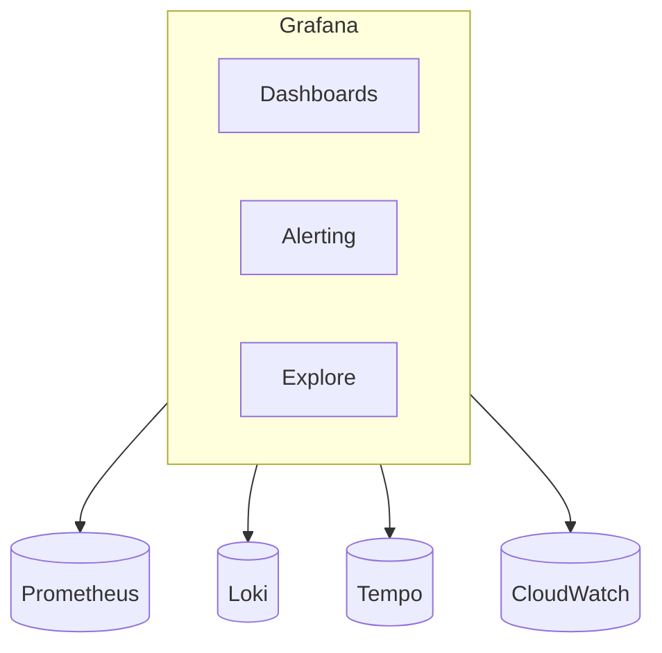
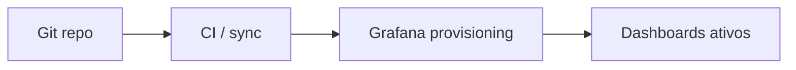

# Grafana — dashboards, datasources e alertas

## Introdução

**Grafana** é uma plataforma **open source** (e oferta **Grafana Cloud**) para **visualizar métricas, logs e traces** a partir de múltiplas fontes de dados. Complementa o estudo [Prometheus e observabilidade](../prometheus-observabilidade/README.md): em muitos ambientes, o **Prometheus** coleta e armazena séries temporais e o **Grafana** consulta via **PromQL** e renderiza painéis; o mesmo Grafana agrega **Loki** (logs), **Tempo** (traces) e bancos como **PostgreSQL**, **CloudWatch**, **Azure Monitor**.



---

## Conceitos principais

| Conceito | Descrição |
|----------|-----------|
| **Data source** | Conexão a um backend (URL, credenciais, *timeout*) |
| **Dashboard** | Coleção de painéis; JSON exportável (GitOps) |
| **Panel** | Query + visualização (time series, stat, table, heatmap) |
| **Variable** | Filtro dinâmico (`$instance`, `$namespace`) |
| **Folder / RBAC** | Organização e permissões (Grafana OSS vs Enterprise) |

---

## Provisionamento como código

Evite configurar tudo só pela UI em produção: use **provisioning** com arquivos YAML apontando para dashboards em disco ou URLs, e **datasources** versionados. Isso permite **review** em PR e **rollback** previsível.

```yaml
# excerpt: provisioning/dashboards/dashboards.yaml
apiVersion: 1
providers:
  - name: default
    folder: Services
    type: file
    options:
      path: /var/lib/grafana/dashboards
```



---

## Alerting (Grafana 8+)

O motor unificado de alertas permite regras **baseadas em dados Grafana** (Prometheus, Loki, etc.) com **rotas** para **Contact points** (Slack, PagerDuty, webhook). Separe:

- **Threshold** em painel (rápido para protótipo) vs **alert rule** centralizada (melhor governança).
- **For** (*pending period*) para reduzir flapping.

Para stacks só Prometheus, muitos times ainda usam **Alertmanager** para roteamento e **Grafana** só para visualização — as duas abordagens coexistem; documente qual é **fonte da verdade** para *silence* e *on-call*.

---

## Boas práticas de dashboard

- **Poucos painéis críticos** por tela SLO; detalhe em *drill-down*.
- **Unidades e legendas** explícitas (`s`, `req/s`, `%`).
- **Templates** por ambiente (`dev`/`stg`/`prod`) via variáveis.
- **Performance:** limite *time range* padrão; evite `high cardinality` em labels usados em legendas.

---

## API HTTP do Grafana

Automatize importação de dashboards ou gestão de pastas com a **HTTP API** (token de serviço ou API key).

### JavaScript (Node — fetch)

```javascript
import fs from "fs";

const BASE = process.env.GRAFANA_URL;
const KEY = process.env.GRAFANA_TOKEN;

async function importDashboard(jsonPath) {
  const body = JSON.parse(fs.readFileSync(jsonPath, "utf8"));
  const res = await fetch(`${BASE}/api/dashboards/db`, {
    method: "POST",
    headers: {
      Authorization: `Bearer ${KEY}`,
      "Content-Type": "application/json",
    },
    body: JSON.stringify({ dashboard: body, overwrite: true }),
  });
  if (!res.ok) throw new Error(await res.text());
}

await importDashboard("./dashboards/api-overview.json");
```

### Python

```python
import json
import os
import urllib.request

def import_dashboard(path: str) -> None:
    base = os.environ["GRAFANA_URL"].rstrip("/")
    token = os.environ["GRAFANA_TOKEN"]
    payload = {"dashboard": json.load(open(path)), "overwrite": True}
    req = urllib.request.Request(
        f"{base}/api/dashboards/db",
        data=json.dumps(payload).encode(),
        headers={"Authorization": f"Bearer {token}", "Content-Type": "application/json"},
        method="POST",
    )
    with urllib.request.urlopen(req) as r:
        assert r.status == 200

import_dashboard("dashboards/api-overview.json")
```

### C# (HttpClient)

```csharp
using System.Net.Http.Headers;
using System.Text;
using System.Text.Json;

await using var fs = File.OpenRead("dashboards/api-overview.json");
var dash = JsonDocument.Parse(fs).RootElement;
var payload = JsonSerializer.Serialize(new { dashboard = dash, overwrite = true });
using var client = new HttpClient { BaseAddress = new Uri(Environment.GetEnvironmentVariable("GRAFANA_URL")!) };
client.DefaultRequestHeaders.Authorization =
    new AuthenticationHeaderValue("Bearer", Environment.GetEnvironmentVariable("GRAFANA_TOKEN"));
var res = await client.PostAsync("/api/dashboards/db", new StringContent(payload, Encoding.UTF8, "application/json"));
res.EnsureSuccessStatusCode();
```

### Spring Boot (WebClient — cliente administrativo)

```java
@Service
public class GrafanaAdminClient {
  private final WebClient webClient;

  public GrafanaAdminClient(
      @Value("${grafana.url}") String base,
      @Value("${grafana.token}") String token) {
    this.webClient = WebClient.builder()
        .baseUrl(base)
        .defaultHeader(HttpHeaders.AUTHORIZATION, "Bearer " + token)
        .build();
  }

  public Mono<String> importDashboard(JsonNode dashboard) {
    var body = Map.of("dashboard", dashboard, "overwrite", true);
    return webClient.post()
        .uri("/api/dashboards/db")
        .contentType(MediaType.APPLICATION_JSON)
        .bodyValue(body)
        .retrieve()
        .bodyToMono(String.class);
  }
}
```

---

## Explore e correlação

O modo **Explore** permite testar **PromQL**, **LogQL** (Loki) e consultar **traces** sem fixar painel — útil em incidentes. Combine **trace_id** nos logs da aplicação (ver [Logs de aplicação](../logs-aplicacao/01-levels-e-boas-praticas.md)) com **Tempo** ou backend equivalente para saltar de métrica → log → trace.

---

## Segurança

- **OAuth2 / SSO** para acesso humano; **API keys** com escopo mínimo para automação.
- **Datasource credentials** em Secret Manager / Vault, não em texto no JSON do dashboard.
- **Network policies** em Kubernetes entre Grafana e Prometheus/Loki.

---

## Referências

- Grafana: *Provisioning*, *Alerting*, *HTTP API*.
- Estudos relacionados neste repositório: Prometheus, logs de aplicação.

---

*Grafana é **camada de consumo** da observabilidade: investir em **datasources confiáveis** e **alertas com contexto** vale mais que dezenas de gráficos redundantes.*
