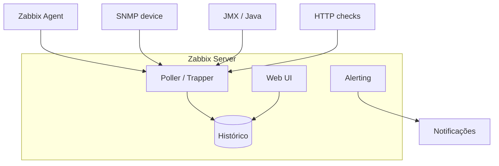
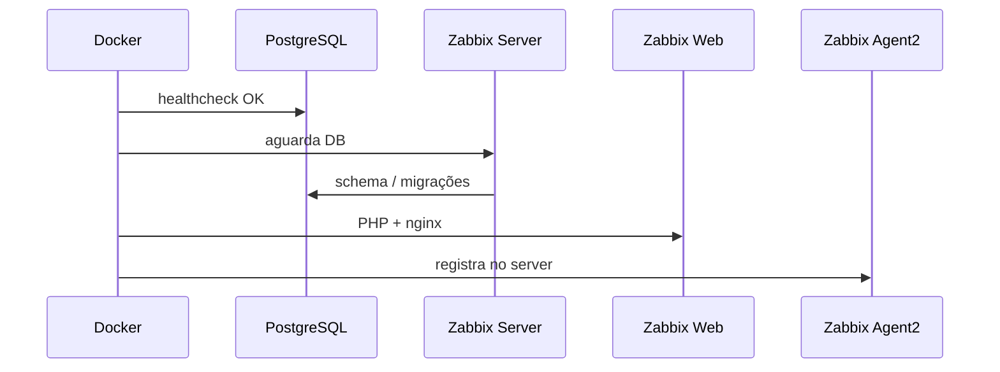
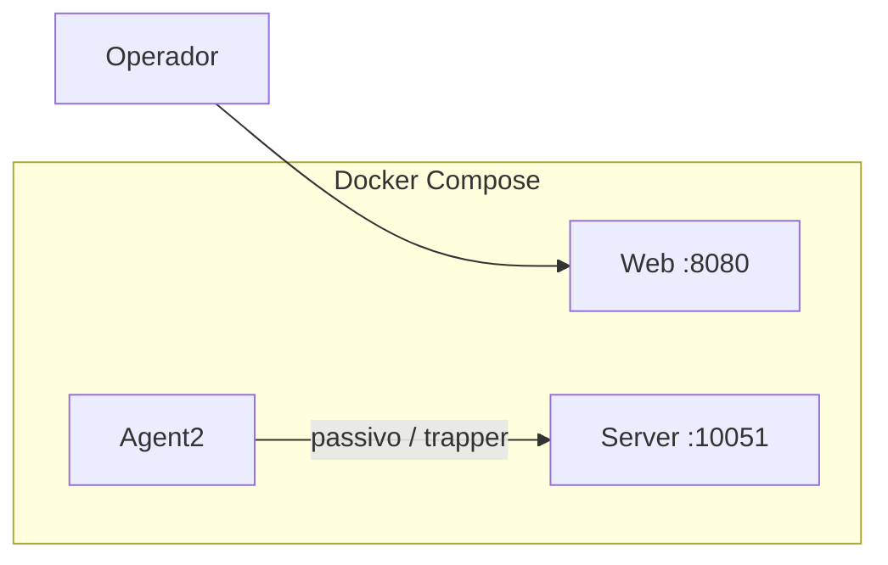
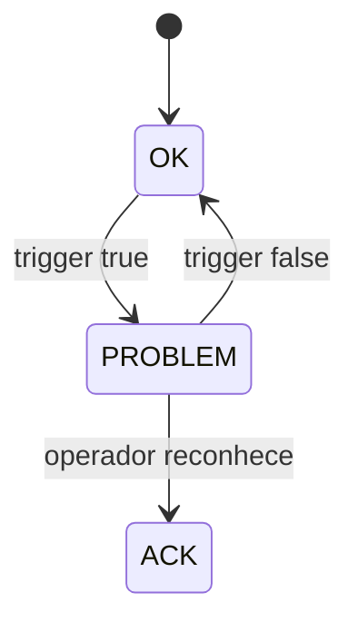
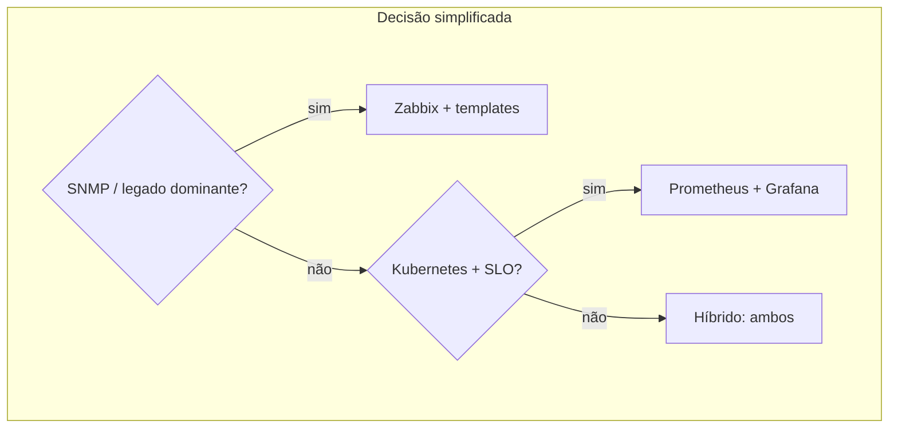

# Zabbix — monitoramento de infraestrutura, agentes e projeto com Docker

## Introdução

**Zabbix** é uma plataforma **open source** de monitoramento para **redes, servidores, aplicações e nuvem**, com **coleta por agente**, **SNMP**, **JMX**, **checks sem agente** (HTTP, TCP, ICMP) e **auto-discovery**. Diferente de stacks só métricas (Prometheus + Grafana), o Zabbix tradicionalmente integra **coleta**, **armazenamento histórico**, **gráficos nativos**, **mapas**, **inventário** e **alertas** em um único produto — útil em NOCs e ambientes híbridos.

Este capítulo inclui um **laboratório com Docker Compose** (server + banco + web + agente) para você praticar **hosts**, **itens** e **triggers** sem instalar pacotes `.deb` no host, além de exemplos de integração com aplicações em várias linguagens.



---

## Componentes

| Componente | Função |
|------------|--------|
| **Zabbix Server** | Motor de coleta, avaliação de triggers, alertas |
| **Database** | MySQL / MariaDB / PostgreSQL / TimescaleDB |
| **Frontend** | Interface web (PHP) |
| **Zabbix Agent** | Métricas no SO (Linux, Windows) |
| **Zabbix Agent 2** | Go, plugins extensíveis |
| **Proxy** | Coleta distribuída (WAN, isolamento) |

Em **Kubernetes**, o *Helm chart* oficial ou operadores comunitários implantam server + frontend; hosts podem ser **pods** descobertos via API ou checks HTTP nos *services*.

---

## Laboratório: Docker Compose (Zabbix 6.4+)

Para **estudo**, um *stack* com **PostgreSQL** + **server** + **web** + **agent** acelera o onboarding. A imagem oficial documenta variáveis como `DB_SERVER_HOST`, `POSTGRES_USER`, etc. Ajuste senhas antes de qualquer ambiente que não seja descartável.

### Visão do fluxo de subida



### `docker-compose.yml` (referência de laboratório)

```yaml
services:
  postgres:
    image: postgres:16-alpine
    environment:
      POSTGRES_USER: zabbix
      POSTGRES_PASSWORD: zabbix
      POSTGRES_DB: zabbix
    volumes:
      - pgdata:/var/lib/postgresql/data
    healthcheck:
      test: ["CMD-SHELL", "pg_isready -U zabbix -d zabbix"]
      interval: 10s
      timeout: 5s
      retries: 5
    networks: [zbx]

  zabbix-server:
    image: zabbix/zabbix-server-pgsql:ubuntu-6.4-latest
    depends_on:
      postgres:
        condition: service_healthy
    environment:
      DB_SERVER_HOST: postgres
      POSTGRES_USER: zabbix
      POSTGRES_PASSWORD: zabbix
      POSTGRES_DB: zabbix
    ports:
      - "10051:10051"
    networks: [zbx]

  zabbix-web:
    image: zabbix/zabbix-web-nginx-pgsql:ubuntu-6.4-latest
    depends_on: [zabbix-server]
    environment:
      ZBX_SERVER_HOST: zabbix-server
      DB_SERVER_HOST: postgres
      POSTGRES_USER: zabbix
      POSTGRES_PASSWORD: zabbix
      POSTGRES_DB: zabbix
      PHP_TZ: UTC
    ports:
      - "8080:8080"
    networks: [zbx]

  zabbix-agent:
    image: zabbix/zabbix-agent2:ubuntu-6.4-latest
    depends_on: [zabbix-server]
    environment:
      ZBX_HOSTNAME: lab-docker-agent
      ZBX_SERVER_HOST: zabbix-server
      ZBX_SERVER_PORT: 10051
      ZBX_PASSIVE_ALLOW: "true"
    networks: [zbx]

volumes:
  pgdata:

networks:
  zbx:
    driver: bridge
```

Após `docker compose up -d`, abra **http://localhost:8080** (credenciais padrão do laboratório Zabbix costumam ser `Admin` / `zabbix` — **altere** em qualquer uso além de demo). No **frontend**, confirme o host **lab-docker-agent** (pode exigir *link* manual ao template **Linux by Zabbix agent** conforme versão).



---

## Itens, triggers e ações

- **Item** — o que medir (chave `system.cpu.util`, `vfs.fs.size[/,pfree]`, `web.test.rspcode`).
- **Trigger** — expressão sobre histórico (`{host:item.last()}>90`) com severidade.
- **Action** — envio de e-mail, Slack, script de remediação quando trigger dispara.
- **Template** — pacote reutilizável de itens/triggers para “Linux by Zabbix agent”, “MySQL”, etc.



**Histerese** e **macros** (`{$THRESHOLD}`) reduzem *flapping*; use **dependencies** entre triggers para não inundar o time com sintomas da mesma causa raiz.

---

## Low-Level Discovery (LLD)

**LLD** descobre automaticamente **discos**, **interfaces de rede**, **bancos**, filas — criando itens e triggers por instância. Essencial em ambientes dinâmicos; revise **filtros** para não explodir cardinalidade no banco histórico.

---

## Integração com aplicações

### Java (JMX)

Expor MBeans e registrar o host no Zabbix com template JMX; útil para heap, GC, pools — alinhado a métricas que você também pode expor via **Micrometer → Prometheus** (estratégias complementares).

### HTTP / API checks

**Web scenarios** simulam login e fluxo; **HTTP agent** puxa JSON de health endpoints.

### Exemplo — payload de trapper (conceito)

Aplicações podem enviar dados com `zabbix_sender` ou HTTP **trapper**:

```bash
zabbix_sender -z zabbix.example.com -s "app-prod-1" -k custom.orders.rate -o 142
```

### Python (envio via zabbix_sender subprocess — ilustrativo)

```python
import subprocess

def send_trap(host: str, key: str, value: str) -> None:
    subprocess.run(
        ["zabbix_sender", "-z", "zabbix.example.com", "-s", host, "-k", key, "-o", value],
        check=True,
    )

send_trap("api-prod-1", "custom.queue.depth", "37")
```

### JavaScript (Node — HTTP API Zabbix 6.0+ JSON-RPC)

Muitos times preferem **agent** ou **Prometheus remote_write** para apps; para **automação** (criar host, item), use a API JSON-RPC com **token** após `user.login`:

```javascript
async function zbxCall(url, auth, method, params) {
  const body = { jsonrpc: "2.0", method, params, id: 1, auth };
  const res = await fetch(url, {
    method: "POST",
    headers: { "Content-Type": "application/json" },
    body: JSON.stringify(body),
  });
  const data = await res.json();
  if (data.error) throw new Error(JSON.stringify(data.error));
  return data.result;
}

async function main() {
  const url = process.env.ZABBIX_API_URL;
  const user = process.env.ZABBIX_USER;
  const password = process.env.ZABBIX_PASSWORD;
  const token = await zbxCall(url, null, "user.login", { username: user, password });
  const hosts = await zbxCall(url, token, "host.get", { output: ["hostid", "host"], limit: 10 });
  console.log(hosts);
}

main().catch(console.error);
```

### C# — health check exposto para Zabbix HTTP

```csharp
app.MapGet("/zabbix/ready", () =>
    Results.Text(
        Monitoring.HealthChecksReady() ? "1" : "0",
        "text/plain"));
```

### Spring Boot — endpoint simples consumível por *web scenario*

```java
@RestController
public class ZabbixProbeController {
  @GetMapping(value = "/internal/zabbix/ping", produces = MediaType.TEXT_PLAIN_VALUE)
  public String ping() {
    return "1";
  }
}
```

### Go — métrica simples para HTTP check ou trapper

```go
package main

import (
	"fmt"
	"net/http"
	"os"
	"strconv"
	"time"
)

func main() {
	start := time.Now()
	http.HandleFunc("/metrics/custom/uptime_seconds", func(w http.ResponseWriter, r *http.Request) {
		sec := int(time.Since(start).Seconds())
		fmt.Fprintf(w, "%d", sec)
	})
	http.HandleFunc("/health/zabbix", func(w http.ResponseWriter, r *http.Request) {
		w.Header().Set("Content-Type", "text/plain")
		w.Write([]byte("1"))
	})
	port := os.Getenv("PORT")
	if port == "" {
		port = "8080"
	}
	if _, err := strconv.Atoi(port); err != nil {
		panic(err)
	}
	if err := http.ListenAndServe(":"+port, nil); err != nil {
		panic(err)
	}
}
```

---

## Capacidade e retenção

O crescimento do banco é função de **novos itens × frequência × retenção**. Planeje **housekeeping**, **particionamento** (PostgreSQL) ou **TimescaleDB**; proxies aliviam CPU do server em muitos agentes remotos.

---

## Zabbix vs Prometheus (quando usar o quê)

| Cenário | Tendência |
|---------|-----------|
| Infra legada, SNMP, NOC único | Zabbix forte |
| Cloud-native, SLOs com PromQL, CNCF | Prometheus + Grafana |
| Híbrido | Coexistência: exportadores ou *integrations* |



---

## Checklist do projeto de estudo

| Etapa | Resultado esperado |
|-------|---------------------|
| 1 | `docker compose ps` mostra serviços *healthy* |
| 2 | Login na UI web |
| 3 | Host do agente visível e recebendo dados |
| 4 | Pelo menos um gráfico de CPU ou carga |
| 5 | (Opcional) `zabbix_sender` de métrica customizada |

---

## Referências

- [Zabbix Manual](https://www.zabbix.com/documentation/current/en/manual)
- Templates oficiais e comunitários no *Zabbix share*

---

*Zabbix premia **modelagem cuidadosa de templates** e **governança de triggers** — sem isso, o ruído de alerta destrói a confiança no sistema.*
