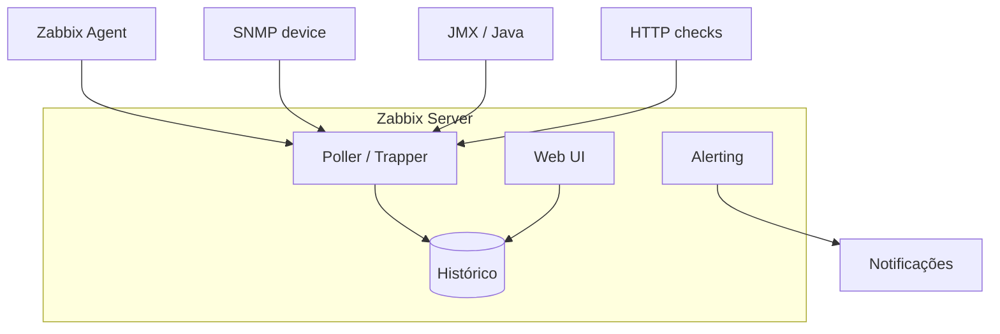
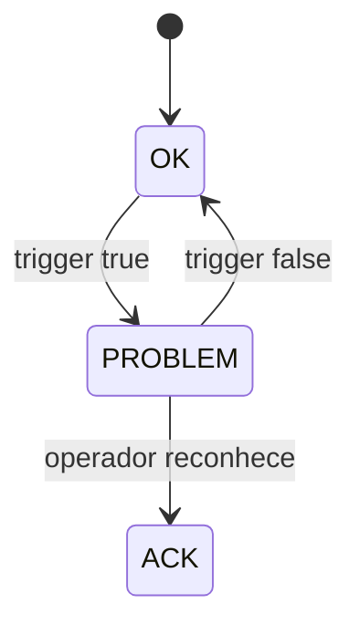

# Zabbix — monitoramento de infraestrutura, agentes e triggers

## Introdução

**Zabbix** é uma plataforma **open source** de monitoramento para **redes, servidores, aplicações e nuvem**, com **coleta por agente**, **SNMP**, **JMX**, **checks sem agente** (HTTP, TCP, ICMP) e **auto-discovery**. Diferente de stacks só métricas (Prometheus + Grafana), o Zabbix tradicionalmente integra **coleta**, **armazenamento histórico**, **gráficos nativos**, **mapas**, **inventário** e **alertas** em um único produto — útil em NOCs e ambientes híbridos.



---

## Componentes

| Componente | Função |
|------------|--------|
| **Zabbix Server** | Motor de coleta, avaliação de triggers, alertas |
| **Database** | MySQL / MariaDB / PostgreSQL / TimescaleDB |
| **Frontend** | Interface web (PHP) |
| **Zabbix Agent** | Métricas no SO (Linux, Windows) |
| **Zabbix Agent 2** | Go, plugins extensíveis |
| **Proxy** | Coleta distribuída (WAN, isolamento) |

Em **Kubernetes**, o *Helm chart* oficial ou operadores comunitários implantam server + frontend; hosts podem ser **pods** descobertos via API ou checks HTTP nos *services*.

---

## Itens, triggers e ações

- **Item** — o que medir (chave `system.cpu.util`, `vfs.fs.size[/,pfree]`, `web.test.rspcode`).
- **Trigger** — expressão sobre histórico (`{host:item.last()}>90`) com severidade.
- **Action** — envio de e-mail, Slack, script de remediação quando trigger dispara.
- **Template** — pacote reutilizável de itens/triggers para “Linux by Zabbix agent”, “MySQL”, etc.



**Histerese** e **macros** (`{$THRESHOLD}`) reduzem *flapping*; use **dependencies** entre triggers para não inundar o time com sintomas da mesma causa raiz.

---

## Low-Level Discovery (LLD)

**LLD** descobre automaticamente **discos**, **interfaces de rede**, **bancos**, filas — criando itens e triggers por instância. Essencial em ambientes dinâmicos; revise **filtros** para não explodir cardinalidade no banco histórico.

---

## Integração com aplicações

### Java (JMX)

Expor MBeans e registrar o host no Zabbix com template JMX; útil para heap, GC, pools — alinhado a métricas que você também pode expor via **Micrometer → Prometheus** (estratégias complementares).

### HTTP / API checks

**Web scenarios** simulam login e fluxo; **HTTP agent** puxa JSON de health endpoints.

### Exemplo — payload de trapper (conceito)

Aplicações podem enviar dados com `zabbix_sender` ou HTTP **trapper**:

```bash
zabbix_sender -z zabbix.example.com -s "app-prod-1" -k custom.orders.rate -o 142
```

### Python (envio via zabbix_sender subprocess — ilustrativo)

```python
import subprocess

def send_trap(host: str, key: str, value: str) -> None:
    subprocess.run(
        ["zabbix_sender", "-z", "zabbix.example.com", "-s", host, "-k", key, "-o", value],
        check=True,
    )

send_trap("api-prod-1", "custom.queue.depth", "37")
```

### JavaScript (Node — HTTP API Zabbix 6.0+ *history.push* conceito)

Muitos times preferem **agent** ou **Prometheus remote_write** para apps; para Zabbix API JSON-RPC:

```javascript
async function apiRequest(method, params) {
  const body = { jsonrpc: "2.0", method, params, id: 1 };
  const res = await fetch("https://zabbix.example.com/api_jsonrpc.php", {
    method: "POST",
    headers: { "Content-Type": "application/json" },
    body: JSON.stringify(body),
  });
  return res.json();
}
// Autenticação: user.login + token em chamadas subsequentes
```

### C# — health check exposto para Zabbix HTTP

```csharp
app.MapGet("/zabbix/ready", () =>
    Results.Text(
        Monitoring.HealthChecksReady() ? "1" : "0",
        "text/plain"));
```

### Spring Boot — endpoint simples consumível por *web scenario*

```java
@RestController
public class ZabbixProbeController {
  @GetMapping(value = "/internal/zabbix/ping", produces = MediaType.TEXT_PLAIN_VALUE)
  public String ping() {
    return "1";
  }
}
```

---

## Capacidade e retenção

O crescimento do banco é função de **novos itens × frequência × retenção**. Planeje **housekeeping**, **particionamento** (PostgreSQL) ou **TimescaleDB**; proxies aliviam CPU do server em muitos agentes remotos.

---

## Zabbix vs Prometheus (quando usar o quê)

| Cenário | Tendência |
|---------|-----------|
| Infra legada, SNMP, NOC único | Zabbix forte |
| Cloud-native, SLOs com PromQL, CNCF | Prometheus + Grafana |
| Híbrido | Coexistência: exportadores ou *integrations* |

---

## Referências

- [Zabbix Manual](https://www.zabbix.com/documentation/current/en/manual)
- Templates oficiais e comunitários no *Zabbix share*

---

*Zabbix premia **modelagem cuidadosa de templates** e **governança de triggers** — sem isso, o ruído de alerta destrói a confiança no sistema.*
