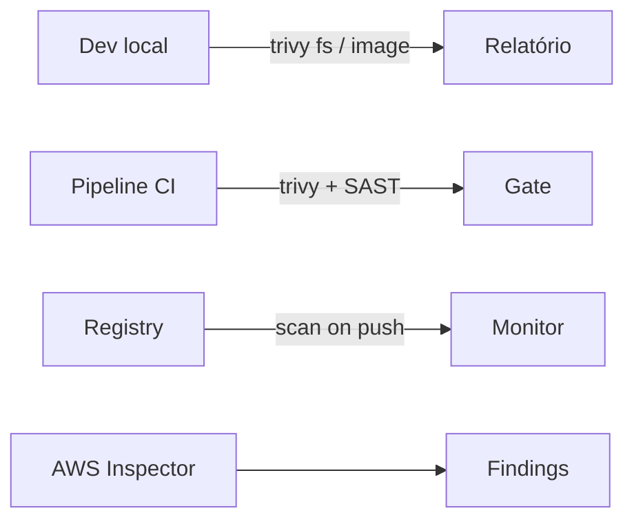
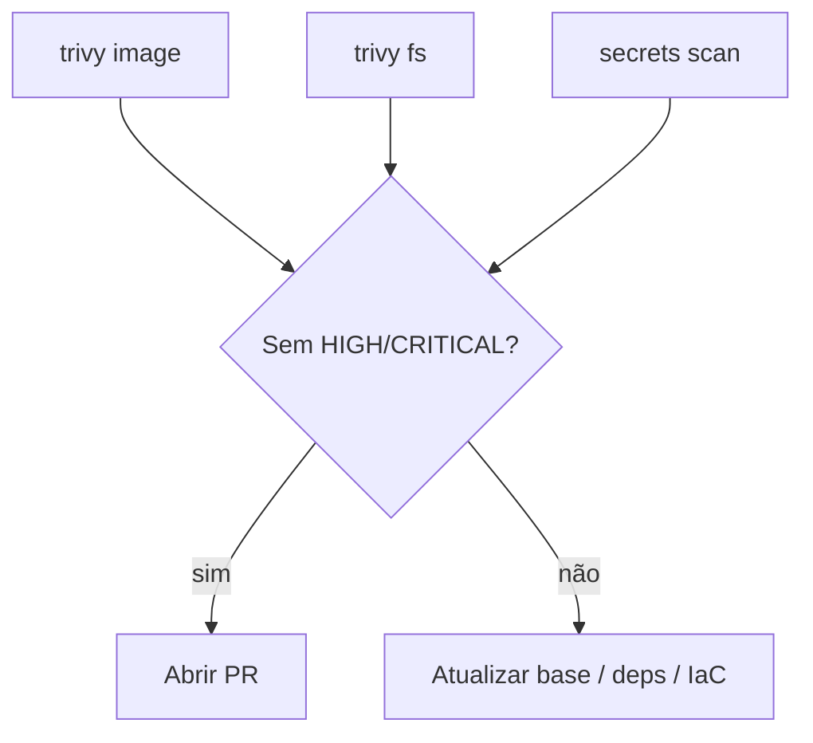

# Prevenção e detecção de vulnerabilidades — Trivy, AWS Inspector, Datadog e validação local

## Introdução

**Shift-left security** significa encontrar **CVEs**, **misconfigurations** e **secrets** o mais cedo possível: na **máquina do desenvolvedor**, no **CI** e na **nuvem**. Este artigo resume **Trivy** (scanner OSS muito usado), **AWS Inspector** (workloads AWS), **Datadog** (postura e runtime na plataforma comercial) e um **fluxo mínimo** para **validar localmente** antes do merge — sem substituir políticas da sua organização.



---

## Trivy — imagens, filesystem e IaC

**Trivy** (Aqua Security) escaneia:

- **Imagens OCI** (pacotes OS + dependências de linguagem quando presentes).
- **Filesystem** e **repositório** (`trivy fs .`).
- **Kubernetes** manifests, **Terraform**, **CloudFormation** (*misconfiguration*).

### Instalação local (Linux/WSL/macOS)

```bash
# Exemplo: binário via GitHub releases ou package manager
trivy --version
```

### Validar imagem antes do push

```bash
docker build -t myapp:local .
trivy image --severity HIGH,CRITICAL --exit-code 1 myapp:local
```

`--exit-code 1` falha o comando se houver achados no nível pedido — padrão para **CI**.

### Escanear repositório (dependências + IaC)

```bash
trivy fs --scanners vuln,config,misconfig --severity HIGH,CRITICAL .
```

### Ignorar falso positivo (com critério)

Use `.trivyignore` ou flags documentadas; **registre justificativa** no PR para auditoria.

---

## Validação local “checklist” do desenvolvedor

1. **Imagem** que você vai subir: `trivy image` na tag local.
2. **Lockfiles** (`package-lock.json`, `poetry.lock`, etc.) commitados; rode `trivy fs` na raiz.
3. **Secrets:** `trivy fs --scanners secret` ou **gitleaks** / **trufflehog** em *pre-commit*.
4. **IaC** do seu PR: pasta `infra/` com `trivy config` (ou `fs` com scanners *config*).
5. **Containerfile** — usuário não-root, `COPY` mínimo, pin de versões base.



---

## AWS Inspector

**Amazon Inspector** avalia **EC2**, **ECR**, **Lambda** e **imagens** com **CVEs** e, em conjunto com outros serviços, **reachability** e postura. **Findings** vão para **Security Hub** e EventBridge — integre com **SNS**, **Jira** ou **Slack**.

### Validação “local” em relação à AWS

Não há Inspector no laptop; o equivalente pragmático é:

1. Escanear a **mesma imagem** localmente com **Trivy** antes do `docker push` para ECR.
2. Usar **Inspector scan on push** no ECR e tratar **FAILED** no pipeline.
3. Para **IaC**, `trivy` + **cdk-nag** / **cfn-guard** / **Checkov** antes do `terraform apply` / deploy CDK.

```bash
# Exemplo: política típica em CI — falha se ECR reportar critical (via AWS CLI em job)
# aws ecr describe-image-scan-findings ... (automação específica da conta)
```

---

## Datadog (Security)

No ecossistema **Datadog**, áreas relevantes incluem:

- **Vulnerability Management** — inventário de libs em serviços instrumentados.
- **Cloud Security Posture Management (CSPM)** — *misconfigs* em contas cloud.
- **Workload Security** — runtime (onde licenciado).

**Validação local** continua sendo: **testes de integração** com agent em *staging*, mais scanners OSS no **CI**; Datadog complementa com **visão centralizada** e **correlação** com APM/logs — não duplique política sem alinhar com *Security*.

---

## Integração em CI (exemplos mínimos)

### GitHub Actions (YAML)

```yaml
jobs:
  trivy:
    runs-on: ubuntu-latest
    steps:
      - uses: actions/checkout@v4
      - uses: aquasecurity/trivy-action@master
        with:
          scan-type: fs
          severity: CRITICAL,HIGH
          exit-code: 1
```

### Python — wrapper para time uniformizar flags

```python
import subprocess
import sys

def main() -> None:
    r = subprocess.run(
        ["trivy", "fs", ".", "--severity", "HIGH,CRITICAL", "--exit-code", "1"],
        check=False,
    )
    sys.exit(r.returncode)

if __name__ == "__main__":
    main()
```

### JavaScript — script npm

```json
{
  "scripts": {
    "security:scan": "trivy fs . --severity HIGH,CRITICAL --exit-code 1"
  }
}
```

### Spring Boot / C# no CI

Não substituem scanner de **imagem** e **deps**: em pipeline .NET rode `dotnet list package --vulnerable` + Trivy no **container** publicado; em Java **OWASP Dependency-Check** ou **Snyk** + Trivy na imagem **distroless**/JRE.

---

## Outras ferramentas (referência rápida)

| Ferramenta | Foco |
|------------|------|
| **Grype** | Imagem/fs, similar ao Trivy |
| **Snyk** | Deps + container (comercial) |
| **Clair** | Camadas de imagem |
| **Checkov / KICS** | IaC |
| **Syft + Grype** | SBOM + scan |

Gere **SBOM** (`syft packages`) para **rastreabilidade** e resposta a incidentes (*log4j*-style).

---

## Referências

- [Trivy documentation](https://trivy.dev/)
- [AWS Inspector](https://docs.aws.amazon.com/inspector/)
- [Datadog Security](https://docs.datadoghq.com/security/)
- OWASP — *DevSecOps*, *ASVS*

---

*Validação local **reduz surpresas no pipeline**; o **gate em CI** e a **política em produção** são o que sustentam o risco aceitável.*
