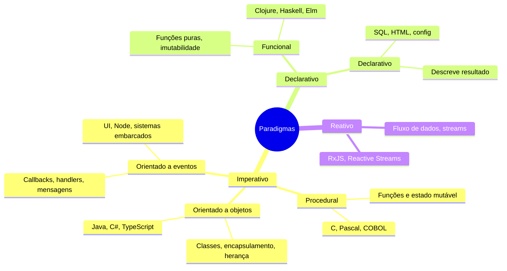

# Visão geral – Paradigmas de programação

## O que é um paradigma?

Um **paradigma de programação** é um modelo ou estilo de pensar e estruturar o código. Ele define quais conceitos estão no centro (funções, objetos, eventos, fluxo de dados) e quais formas de expressão são privilegiadas (comandos sequenciais, mensagens entre objetos, transformações imutáveis). Linguagens e frameworks costumam encorajar um ou mais paradigmas; o desenvolvedor escolhe o paradigma conforme o problema, a equipe e o ecossistema.

Neste estudo tratamos de seis paradigmas de uso corrente em software comercial e acadêmico: **procedural**, **orientado a objetos**, **orientado a eventos**, **funcional**, **declarativo** e **reativo**. Cada um será detalhado em um capítulo próprio, com exemplos e diagramas.

---

## Mapa dos paradigmas

O diagrama abaixo agrupa os paradigmas por eixo conceitual: **imperativo vs declarativo** (quem diz “como” vs “o quê”) e **estrutura em torno de** quê (procedimentos, objetos, eventos, fluxo de dados).

---

## Imperativo x declarativo

| Aspecto | Imperativo | Declarativo |
|--------|------------|-------------|
| **Foco** | Sequência de passos (“como” fazer) | Resultado ou regras (“o quê” obter) |
| **Estado** | Mutação explícita de variáveis e estruturas | Muitas vezes imutável ou implícito |
| **Exemplos** | C, Java, Python (estilo procedural/OO) | SQL, HTML, React (UI declarativa), Prolog |

Na prática, linguagens híbridas (JavaScript, Python, C#) permitem misturar estilos. O importante é reconhecer o paradigma dominante em um módulo ou base de código para manter consistência e legibilidade.

---

## Quando usar cada paradigma

| Paradigma | Pontos fortes | Contextos típicos |
|-----------|----------------|-------------------|
| **Procedural** | Simples, direto, fácil de debugar em fluxos lineares | Scripts, algoritmos numéricos, protótipos, C/legado |
| **Orientado a objetos** | Encapsulamento, modelagem de domínio, reuso por herança e composição | Sistemas de negócio, APIs, frameworks (Java, C#, .NET) |
| **Orientado a eventos** | Desacoplamento entre produtores e consumidores, resposta a entradas assíncronas | UIs, servidores de I/O, drivers, IoT |
| **Funcional** | Menos efeitos colaterais, composição e testes previsíveis | Processamento de dados, concorrência, Clojure, React (estado/efeitos) |
| **Declarativo** | Código curto, foco em resultado, menos “como” | Consultas (SQL), UI (JSX), pipelines (GitHub Actions), infra (Terraform) |
| **Reativo** | Fluxos contínuos, backpressure, composição de streams | Dashboards, telemetria, front-ends com muitos eventos, integração de sistemas |

Nenhum paradigma resolve todos os problemas; projetos reais costumam combinar vários (por exemplo: backend OO, front-end declarativo/reativo, scripts procedural).

---

## Relação entre paradigmas

- **Procedural** e **OO** são imperativos: você descreve passos e mutações; OO adiciona estrutura (classes, objetos, mensagens).
- **Eventos** podem ser usados em qualquer linguagem; o paradigma “orientado a eventos” coloca o fluxo de controle em callbacks/handlers em vez de uma sequência linear.
- **Funcional** enfatiza funções como valores, imutabilidade e composição; em React, isso aparece em componentes e hooks; em Clojure, em dados imutáveis e funções puras.
- **Declarativo** descreve o resultado (consultas, telas, configuração); muitas vezes a implementação por baixo é imperativa ou funcional.
- **Reativo** modela o tempo e fluxos de dados (streams); em geral usa conceitos funcionais (map, filter, reduce) sobre sequências assíncronas.

Nos próximos capítulos, cada paradigma será tratado em profundidade: conceitos, diagramas e exemplos de código em linguagens representativas.

---

## Referências rápidas

- [Wikipedia – Programming paradigm](https://en.wikipedia.org/wiki/Programming_paradigm)
- [MDN – Paradigms and runtimes](https://developer.mozilla.org/en-US/docs/Web/JavaScript/Guide/Overview)
