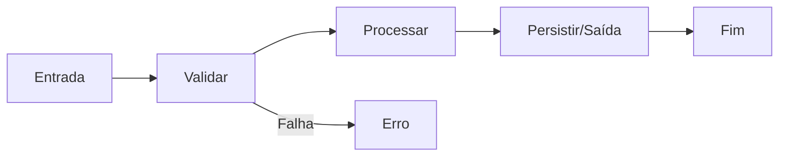

# Programação procedural

## Definição e características

Na **programação procedural**, o programa é organizado em **procedimentos** (funções ou sub-rotinas) que operam sobre **dados**. O fluxo de execução é explícito: uma rotina chama outra, e o estado do programa muda por meio de variáveis compartilhadas ou passadas como argumento. Não há noção central de “objeto” com comportamento encapsulado; há estruturas de dados (structs, records) e funções que as manipulam.

Principais características:

- **Sequência, seleção e iteração** como blocos de construção (estruturas de controle clássicas).
- **Funções** como unidades reutilizáveis que recebem parâmetros e podem retornar um valor.
- **Estado** em variáveis (globais ou locais), mutável ao longo da execução.
- **Organização** por rotinas que quebram o problema em etapas menores.

Linguagens representativas: **C**, **Pascal**, **COBOL**, **Fortran** e, em estilo procedural, **Python** e **JavaScript** quando o código é escrito como sequência de funções sobre dados.

---

## Quando usar

A programação procedural é adequada quando:

- O problema tem um **fluxo linear ou bem definido** (cálculos, transformações em sequência, scripts).
- A base de código é **pequena ou de domínio restrito** (ferramentas de linha de comando, scripts de deploy).
- Há **legado** em C ou Pascal e a equipe mantém o mesmo estilo.
- Você precisa de **máximo controle** sobre memória e desempenho (sistemas embarcados, drivers).

Ela tende a ficar difícil quando o número de procedimentos e variáveis globais cresce demais; aí entram técnicas modulares (módulos, namespaces) ou a migração para OO/funcional para dar estrutura.

---

## Fluxo típico

O diagrama abaixo ilustra um fluxo procedural clássico: entrada → validação → processamento → saída. Cada etapa pode ser uma função.



O estado (dados) é passado entre funções ou acessado via escopo global; não há “objeto” que encapsule dados e comportamento.

---

## Exemplo em C

C é a linguagem procedural por excelência: funções, structs, ponteiros, sem classes.

```c
#include <stdio.h>
#include <string.h>

#define MAX_ITEMS 100

typedef struct {
    int id;
    char name[64];
    double price;
} Product;

typedef struct {
    Product items[MAX_ITEMS];
    int count;
} Cart;

void cart_add(Cart* cart, Product p) {
    if (cart->count >= MAX_ITEMS) return;
    cart->items[cart->count] = p;
    cart->count++;
}

double cart_total(Cart* cart) {
    double sum = 0.0;
    for (int i = 0; i < cart->count; i++) {
        sum += cart->items[i].price;
    }
    return sum;
}

int main(void) {
    Cart cart = { .count = 0 };
    Product a = { .id = 1, .price = 10.50 };
    strcpy(a.name, "Item A");
    cart_add(&cart, a);
    cart_add(&cart, (Product){ .id = 2, .price = 5.25, .name = "Item B" });
    printf("Total: %.2f\n", cart_total(&cart));
    return 0;
}
```

As estruturas `Product` e `Cart` só guardam dados; o comportamento está nas funções `cart_add` e `cart_total`, que recebem o `Cart*` e o modificam ou leem. Não há encapsulamento: qualquer função que tenha um `Cart*` pode alterar `count` ou `items`.

---

## Exemplo em Python (estilo procedural)

O mesmo padrão em Python, usando listas e dicionários, sem classes:

```python
def cart_add(cart, product):
    if len(cart["items"]) >= cart["max_items"]:
        return
    cart["items"].append(product)

def cart_total(cart):
    return sum(p["price"] for p in cart["items"])

def main():
    cart = {"items": [], "max_items": 100}
    cart_add(cart, {"id": 1, "name": "Item A", "price": 10.50})
    cart_add(cart, {"id": 2, "name": "Item B", "price": 5.25})
    print("Total:", cart_total(cart))

if __name__ == "__main__":
    main()
```

O “estado” é o dicionário `cart`; as funções o recebem e mutam. Em projetos maiores, esse estilo tende a espalhar a responsabilidade; aí entram módulos ou OO.

---

## Exemplo em C#

Em C# é possível escrever em estilo procedural com structs e funções estáticas (ou métodos em uma classe estática):

```csharp
using System;
using System.Collections.Generic;

struct Product { public int Id; public string Name; public double Price; }

static class CartOps
{
    public static void Add(List<Product> items, Product p, int max = 100)
    {
        if (items.Count >= max) return;
        items.Add(p);
    }
    public static double Total(List<Product> items)
    {
        double sum = 0;
        foreach (var p in items) sum += p.Price;
        return sum;
    }
}

class Program
{
    static void Main()
    {
        var items = new List<Product>();
        CartOps.Add(items, new Product { Id = 1, Name = "Item A", Price = 10.50 });
        CartOps.Add(items, new Product { Id = 2, Name = "Item B", Price = 5.25 });
        Console.WriteLine("Total: {0:F2}", CartOps.Total(items));
    }
}
```

Os dados estão em structs e listas; o comportamento em funções estáticas. Sem classes de domínio com encapsulamento, o estilo é procedural.

---

## Exemplo em JavaScript (puro)

O mesmo padrão em JavaScript sem frameworks: objeto para o carrinho e funções que o manipulam.

```javascript
function cartAdd(cart, product) {
  if (cart.items.length >= cart.maxItems) return;
  cart.items.push(product);
}

function cartTotal(cart) {
  return cart.items.reduce((sum, p) => sum + p.price, 0);
}

const cart = { items: [], maxItems: 100 };
cartAdd(cart, { id: 1, name: "Item A", price: 10.5 });
cartAdd(cart, { id: 2, name: "Item B", price: 5.25 });
console.log("Total:", cartTotal(cart));
```

Em Node.js ou no navegador, scripts de automação e ferramentas CLI costumam seguir esse estilo.

---

## Vantagens e desvantagens

| Vantagens | Desvantagens |
|-----------|--------------|
| Fácil de entender para fluxos lineares | Estado global ou passado por muitos níveis dificulta manutenção |
| Depuração simples (pilha de chamadas, variáveis locais) | Reuso depende de funções soltas; pouca estrutura de “domínio” |
| Performance previsível (C, compilação nativa) | Dados e comportamento separados podem gerar acoplamento implícito |
| Linguagens maduras e ecossistemas estáveis | Escala mal sem disciplina modular ou migração para OO/funcional |

---

## Resumo

A programação procedural coloca **procedimentos** no centro e **dados** como algo que as funções recebem ou alteram. É o paradigma base de C e de muitos scripts; continua relevante para algoritmos, ferramentas e legado. Em sistemas grandes, costuma ser combinada com modularização ou com outros paradigmas (OO, funcional) para manter o código organizado.

---

*Próximo: [Programação orientada a objetos](./03-programacao-orientada-a-objetos.md).*
